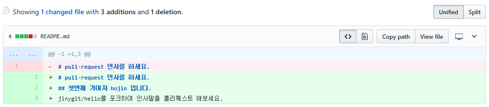
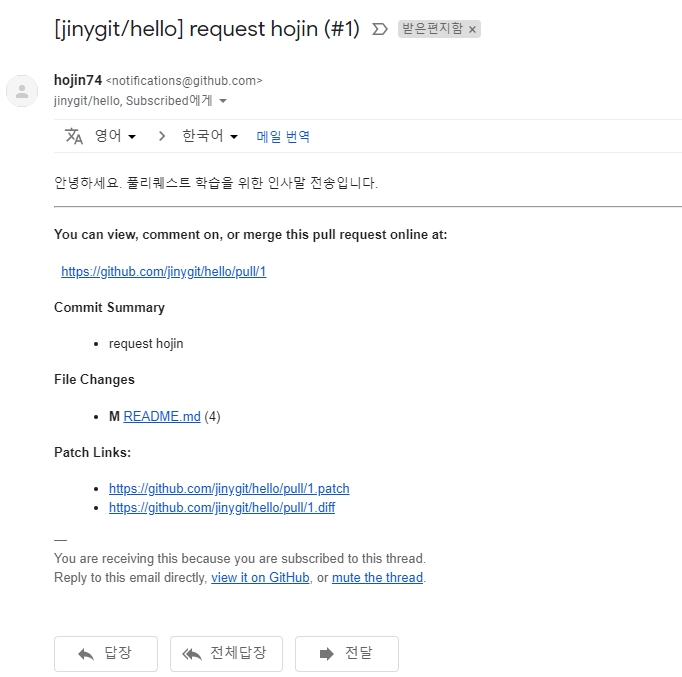
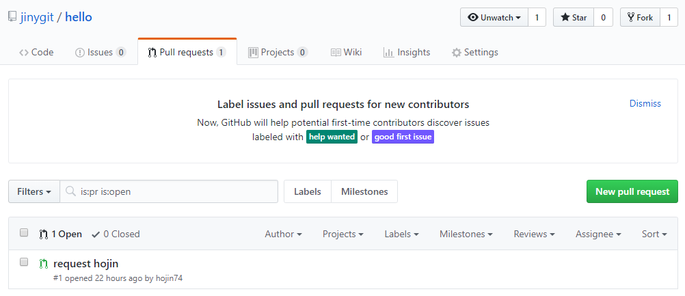

# Pull Request
포크된 저장소를 메인 프로젝트에 병합을 요청하는 깃허브의 내부 기능입니다. 풀-리퀘스트는 깃허브를 이용한 대부분의 사람들에게 익숙하지 않은 기능입니다.

## 풀-리퀘스트
풀-리퀘스트는 깃허브의 고유 기능입니다. 깃은 권한이 있는 구성원만 저장소의 접속 권한을 가지게 됩니다. 저장소의 안정적인 이유로 접속 권한을 모두에게 부여할 수는 없습니다.

특히 오픈 소스와 같이 불특정 다수의 사람에게 오픈되어 있는 경우에는 권한을 관리하는 데 매우 어려움을 겪습니다. 안정적인 운영과 누구나 코드에 접근 및 수정을 허용해야 하기 때문입니다.

깃허브는 이러한 오픈 소스 운영의 제약점을 해결하기 위해서 포크 <-> 풀-리퀘스트 작업 흐름을 제공합니다. 메인 저장소는 누구나 접근을 허용합니다. 하지만 수정은 원본 저장소를 포크하여 수정하도록 제시합니다. 이는 깃이 분산 환경의 특징을 활용하는 것입니다.

  

포크, 수정된 저장소를 원본 저장소에 병합을 요청합니다. 이를 풀-리퀘스트라고 부릅니다. 즉, 풀-리퀘스트는 포크된 저장소를 메인 프로젝트 저장소에 병합을 요청하는 기능입니다. 

## 요청
포크 저장소를 원래의 저장소로 풀-리퀘스트를 요청합니다. 포크 저장소 페이지로 이동합니다. 좌측 중간 부분에 다음과 같이 full-request 버튼을 확인할 수 있습니다.

  

클릭합니다. 풀-리퀘스트 작성 페이지로 이동합니다. 화면은 크게 3개로 구분해볼 수 있습니다.

  

원본 프로젝트 저장소와 포크 저장소의 대응 브랜치를 선택할 수 있습니다. [Create pull request]를 클릭하면 리퀘스트 메시지를 작성할 수 있습니다.

2번째 단락에는 풀-리퀘스트 요청 하단에는 포그 저장소의 커밋 내역들을 확인할 수 있습니다.

  

3번째 단락에는 커밋한 내역을 diff 형태로 확인이 가능합니다.

  

## 메시지 작성
풀-리퀘스트 요청 버튼을 클릭하면 메시지를 작성해야 합니다. 제목과 내용을 작성합니다.

내용은 코드 검수자가 이를 쉽게 확인할 수 있는 설명을 추가합니다. 상대방이 나의 변경 내역을 쉽게 이해하고, 검수가 용이할수록 수락될 확률이 높아집니다.

  

내용은 마크다운 양식을 이용하여 작성할 수 있습니다. 작성 후 [Create pull request] 요청 버튼을 클릭합니다.

## 확인
전송한 풀-리퀘스트를 확인합니다. 풀-리퀘스트를 요청하면 메인 프로젝트 저장소의 [pull-request] 탭으로 이동합니다. 나의 요청한 풀-리퀘스트가 화면에 출력됩니다.

  

요청된 풀-리퀘스트는 여러 사람들이 확인할 수 있습니다. 또한, 이곳에서 의견을 추가로 작성할 수 있습니다.

  

## 통보
기여자(contributor)가 풀-리퀘스트를 작성하여 요청하면 깃허브는 메인 프로젝트의 관리자에게 이메일로 이를 통보합니다. 

또한, 이슈도 자동으로 생성됩니다. 풀-리퀘스트 화면 제목 부분에 새로운 이슈 번호(#번호)를 확인할 수 있습니다.

  

풀-리퀘스트를 요청하였다고 해서 원래의 메인 프로젝트 저장소에 자동으로 코드가 반영되지는 않습니다. 담당자가 이를 확인하고 승인을 해주어야만 합니다.

## 쓰기 권한
포크는 원래의 저장소에 쓰기 권한이 없는 경우 협업할 수 있는 방법입니다.
만일 저장소를 공동으로 관리하고 쓰기 권한이 있다면 직접 풀-리퀘스트를 전송할 수 있습니다.

쓰기 권한은 깃허브에서 설정하거나 추가할 수 있습니다.
