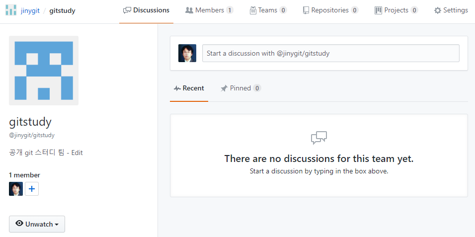

# 팀(team)
하나의 조직 내에서 여러 개의 팀을 생성할 수 있습니다. 팀 단위로 나누어 조직을 관리할 수도 있습니다. 각 팀은 생성된 저장소에 설정한 권한에 따라 접근 제어가 가능합니다.

## 팀 생성
조직의 소유자는 기본적으로 관리자 기능을 같이 가지고 있습니다. 저장소를 관리하고 팀을 관리할 수 있습니다.

대시보드에서 Teams 탭으로 이동합니다.

  

하단에서 [New team]을 선택합니다.

  

팀 이름과 설명을 입력합니다. 팀 이름은 URL 접속으로 변환됩니다. URL은 보통 소문자로 표기되기 때문에 팀 이름을 대문자로 입력하여도 소문자로 변환됩니다. 스페이스와 같은 특수문자는 대시(-)로 변환됩니다. 즉, jiny git은 jiny-git으로 변환됩니다.

  

팀의 공개 여부를 선택합니다. 비밀(Secret)로 설정하면 소유자와 팀 구성원들만 확인이 가능합니다. 생성을 클릭합니다.

  

성공적으로 새로운 팀을 생성하였습니다. 

## 팀 추가 및 초대 시스템
팀 생성을 통하여 새로운 구성원들을 추가할 수 있습니다. Members 탭으로 이동하여 새로운 팀원을 추가할 수 있습니다.

  

팀으로 초대받게 되면 알람을 통하여 상대방에게 초대장이 전송됩니다. 초대한 멤버는 우측 상단에 [add a member] 옆에 새로운 버튼이 활성화됩니다.

  

초대장은 별도로 수정이 가능합니다. 

  

초대장은 이메일로도 같이 발송됩니다. 상대방이 초대에 수락하면 정식 구성원으로 활동이 가능합니다.

## 역할
조직의 팀에 초대되면 역할이 부여됩니다. 역할은 권한과는 다른 의미입니다. 기본적으로 팀에 초대가 되면 구성원이 됩니다. 
깃허브는 크게 3가지의 역할로 구분해 설정할 수 있습니다.

* 소유자(owner)
* 구성원(members)
* 결제(billing manager)

소유자(owner)는 최상위 권한의 소유자입니다. 새로운 구성원을 추가할 수 있고, 팀을 생성하고 삭제할 수 있습니다. 생성한 저장소를 삭제할 수 있습니다.

구성원(members)은 일반 구성원과 팀 관리자(team manager)로 구분합니다. 구성원의 추가와 팀 관리자 설정은 소유자만 가능합니다. 하지만 일반 구성원에서 팀 관리자가 되면 새로운 구성원을 추가/삭제할 수 있습니다. 모든 조직의 기본 설정 값은 일반 구성원입니다.

## 팀 가입하기
다른 팀에 직접 가입을 요청할 수 있습니다. 관리자는 초청받은 팀원을 수락할 수 있으며, 거절할 수 있습니다. 

## 팀 저장소 추가
팀의 저장소 탭으로 이동하여 이름으로 검색합니다. 기본적인 저장소의 접근 권한은 read입니다. 
저장소마다 다른 권한을 설정할 수 있습니다.

## people
조직 대시보드 화면에서 People 탭은 조직의 권한을 관리합니다. 이 기능은 조직의 소유자(owner)만 가능합니다.

  