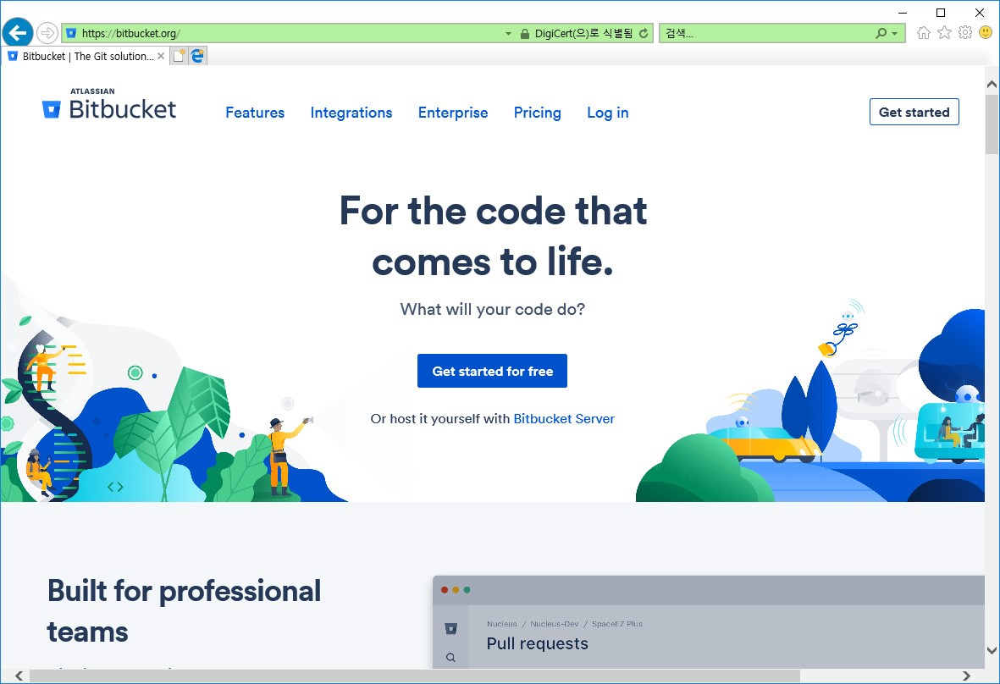
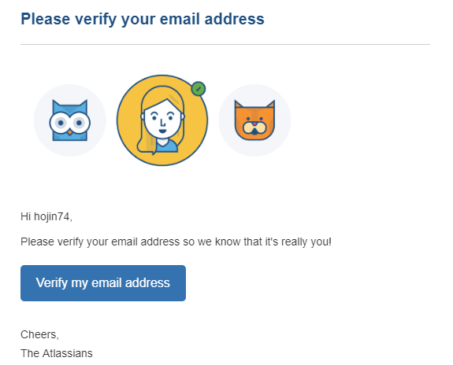
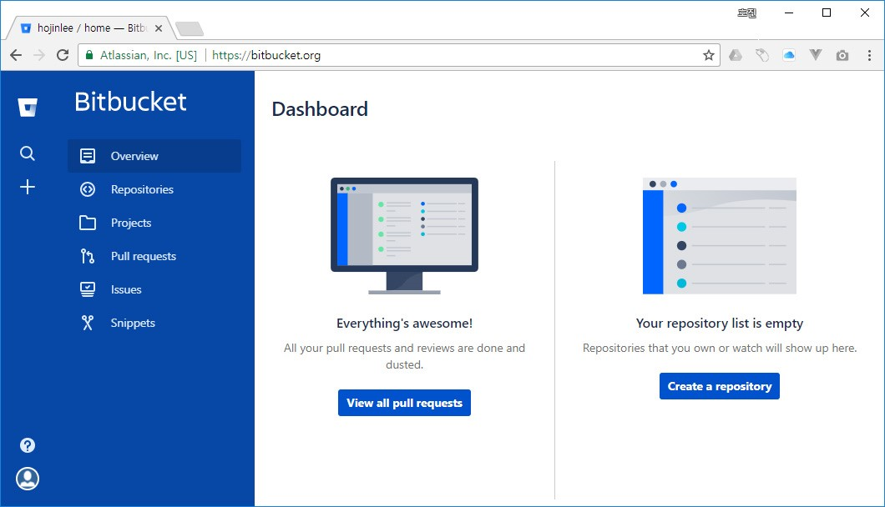
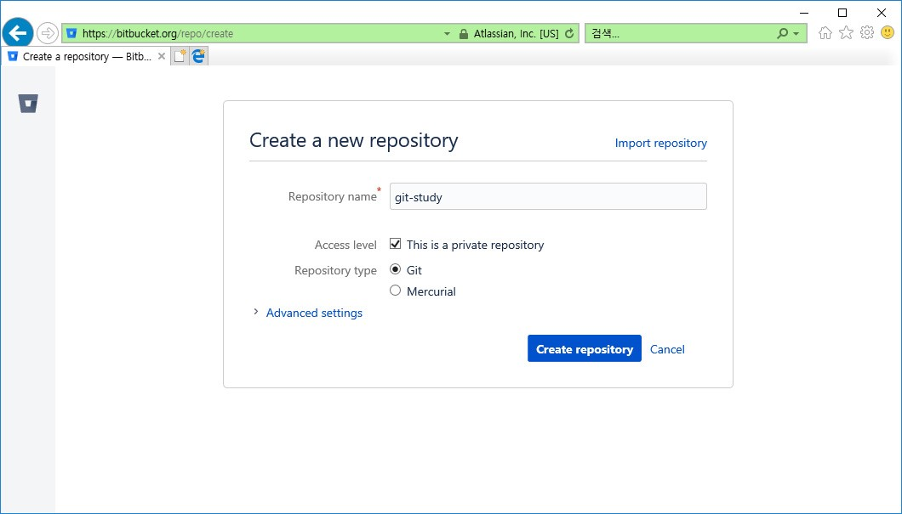
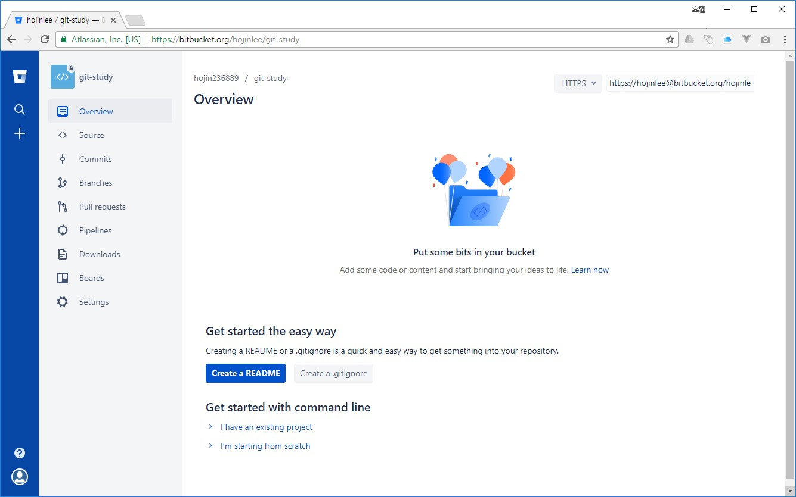
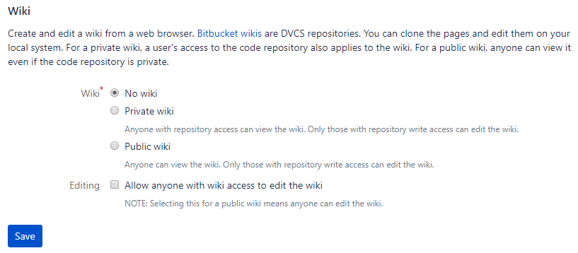
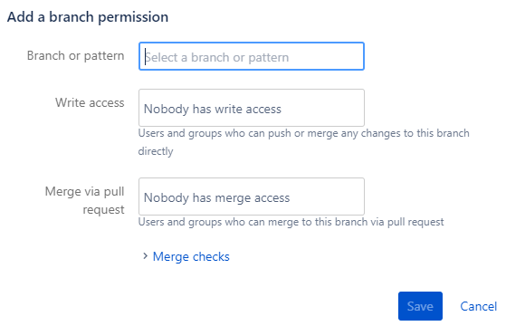

비트버킷은 깃허브와 양대산맥으로 가장 많은 사람이 이용하는 깃호스팅 서비스입니다. 

## 비트버킷
비트버킷은 아틀라시안(Atlassain)에서 운영하는 깃 원격 저장소입니다. 아틀라시안은 JIRA의 개발사로도 유명합니다. 공식사이트 https://bitbucket.org입니다.

 

## 비공개 저장소
무료 저장소를 무제한으로 생성할 수 있다는 것은 깃허브와 유사합니다. 하지만 비트버킷은 무료 비공개 저장소를 생성할 수 있습니다. 

비트버킷은 초창기부터 일부 제한된 개인 저장소도 무료로 제공해주는 것이 특징이었습니다. 무료 버전의 경우 팀원의 숫자가 제한되어 있기 때문에 소규모 프로젝트에 적합합니다. 

비공개 저장소를 포크할 때는 포크 저장소도 비공개로 생성합니다. 비공개 프로젝트에 참여하려면 초대를 받아야 합니다. 

## 회원 가입하기
모든 서비스가 그러하듯이 처음 사용하기 위해서는 회원 가입 절차가 필요합니다. 직접 회원 가입을 할 수도 있고, 구글 계정을 통하여 소설 로그인 기능도 지원합니다.

공식 사이트 오른쪽 상단의 [Get Started]를 선택합니다.

 

비트버킷에 회원 가입할 때 계정은 이메일을 사용합니다. 이메일은 깃과 연동되는 정보입니다. 현재 사용하고 있는 이메일 주소를 이용하여 회원 가입을 합니다.

만일 깃허브와 같은 깃 저장소를 사용하고 있는 경우에도 같은 이메일을 사용하여 깃의 계정 정보를 통일해주는 것도 좋습니다.

비트버킷 역시 무료입니다.

 
 

회원 가입을 정상적으로 완료하기 위해서는 이메일 검증 절차를 통과해야 합니다. 자신의 이메일을 확인하세요.

비트버킷으로부터 새로운 메일이 하나 도착해 있습니다. Please verify your email address를 선택합니다.

 

받은 메일에서 'Verify my email address'를 클릭하여 검증받습니다.

## 대시보드 초기 화면
회원 가입을 한 후에 바로 비트버킷 서비스를 이용할 수 있습니다. 로그인하면 서비스에 대한 간단한 대시보드도 확인할 수 있습니다.

 

대시보드 메뉴와 구성이 세로 형태로 배열된 것이 특징입니다. 저장소를 생성하고 검색할 수 있습니다.

## 저장소 생성
대시보드 초기 화면 오른쪽을 보면 [create a repository] 버튼을 확인할 수 있습니다. 클릭하여 저장소 생성 페이지로 이동합니다.

 

 
비트버킷은 깃 환경 이외에 머큐리얼(Mercurial) 소스 관리 환경도 같이 지원합니다. 저장소를 생성할 때 이를 선택할 수 있습니다.

비트버킷은 깃허브보다 초기 저장소를 생성하는 데 있어 입력하는 항목이 적습니다. 먼저 간단한 입력으로 빠르게 저장소를 생성하고, 추후에 각종 설정을 추가하는 형태입니다. 또한, 깃허브와 달리 개인용 저장소를 생성할 수 있습니다.

생성 버튼을 클릭하면 몇 초 안에 즉시 새로운 저장소를 생성해줍니다.

 

비트버킷은 HTTPS와 SSH 두 개의 프로토콜을 지원합니다. 우측 상단에 프로토콜 접속을 위한 URL이 같이 출력됩니다.

 

비트버킷 저장소를 로컬 저장소에 리모트로 등록하여 사용합니다.

저장소를 생성한 후에 README 설명 파일과 .gitignore 파일을 생성할 수 있습니다.

  

좌측 메뉴에는 저장소를 관리할 수 있는 메뉴들과 계정 설정 버튼들이 있습니다.

## 위키와 이슈
비트버킷은 깃허브와 동일한 위키와 이슈 추적 기능(BTS)을 제공합니다.

위키 기능을 사용하기 위해서는 비트버킷 저장소의 설정에서 위키 사용 항목을 체크해야 됩니다. 기본값은 '사용 안 함(no wiki)'으로 되어 있습니다. 비트버킷의 위키는 크게 공개용/비공개용으로 구분하여 설정할 수 있습니다.

위키 기능을 활성화하면 저장소의 좌측 메뉴가 활성화됩니다. 위키 문서 저장소만 별도로 복제하여 작업할 수도 있습니다.

  

이슈 기능
비트버킷에서 이슈 기능을 사용하기 위해서는 저장소 설정에서 이슈를 활성화해야 합니다.

  

비트버킷의 이슈는 공개/비공개로 설정할 수 있습니다. 또한, 이슈 기능을 활성화할 때 동시에 새로운 이슈를 넣을 수 있는 작성창도 같이 보여줍니다. 새로운 멤버를 추가하여 각 이슈를 처리할 담당자를 선택할 수도 있습니다.

## 권한 설정
비트버킷은 프로젝트 운영을 위해 정밀한 권한 설정이 가능합니다. 누군가의 실수를 막고, 제품을 테스트 검증하여 최종 소스에 병합합니다. 이러한 각 단계를 권한을 부여하여 진행할 수 있습니다

서브비전(subvision)과 유사하게 브랜치별 권한 기능을 가지고 있어서 프로젝트의 저장소를 효율적으로 운영 관리할 수 있습니다. 접근 권한은 프로젝트를 안정적으로, 높은 품질을 유지하면서 배포하기 위해 필요한 기능입니다.

하지만 깃은 서브비전과 달리 브랜치의 접근 권한을 설정할 수 없습니다. 깃은 훅(hook) 스크립트를 통하여 브랜치의 접근 권한을 처리할 수 있도록 하였습니다. 직접 훅 스크립트를 작성하여 브랜치의 접근 권한을 제한하는 것은 까다롭습니다. 훅은 나중에 다른 장에서 배울 것입니다.

비트버킷은 자체적으로 브랜치의 권한을 설정할 수 있도록 지원합니다. 개인 또는 팀 단위로 브랜치의 접근 권한을 설정할 수 있습니다.

 

## 사용자 설정
비트버킷은 사용자 설정을 할 수 있습니다. 

 

화면 좌측 하단에 사용자 아이콘을 선택하면 설정 페이지로 이동합니다. 좌측 메뉴 설정(Setting)을 선택하면 자신의 정보를 변경할 수 있습니다.

 

계정 정보와 관련된 부분은 개발사 아틀라시안의 계정 정보와 연동됩니다. 사용자 이름 밑에 있는 [Update these details through your Atlassian account]를 선택하면 아틀라시안의 계정 정보 설정으로 이동할 수 있습니다.

 

