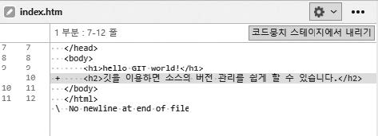
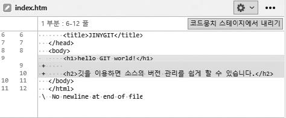

# 소스트리에서 간단하게 변경 이력 확인
---
소스트리를 이용하면 이를 좀 더 직관적으로 알아볼 수 있게 표현할 수 있습니다.  
예를 들어 소스트리에서 수정한 파일 이름을 클릭하면 오른쪽 창에 파일 변경 내역들이 출력됩니다.  

다음은 지금까지 실습한 index.htm의 변경 내역입니다.  

그림 4-26] 소스트리에서 변경 이력 확인  
 

예를 들어 index.htm에서 `<h1>hello GIT world!</h1>`을 삭제한 후 다시 확인해 보면 삭제된 항목은 붉은색으로 표시합니다.  

그림 4-27] 소스트리에서 변경 이력 확인  
 

* + 표시는 새롭게 추가된 내용을 의미합니다. 색상은 녹색으로 표시됩니다.  
* - 표시는 삭제된 내용을 의미합니다. 색상은 붉은색으로 표시됩니다.  

이러한 diff 기능은 나중에 자신이 수정한 부분들을 쉽게 찾을 수 있도록 도와줍니다.  
또 다른 사람들과 협업하여 개발하는 과정에서 코드를 리뷰할 때 전체를 파악하는 것보다 수정된 부분만 확인하면 되므로 좀 더 쉽게 검토할 수 있습니다.  

 