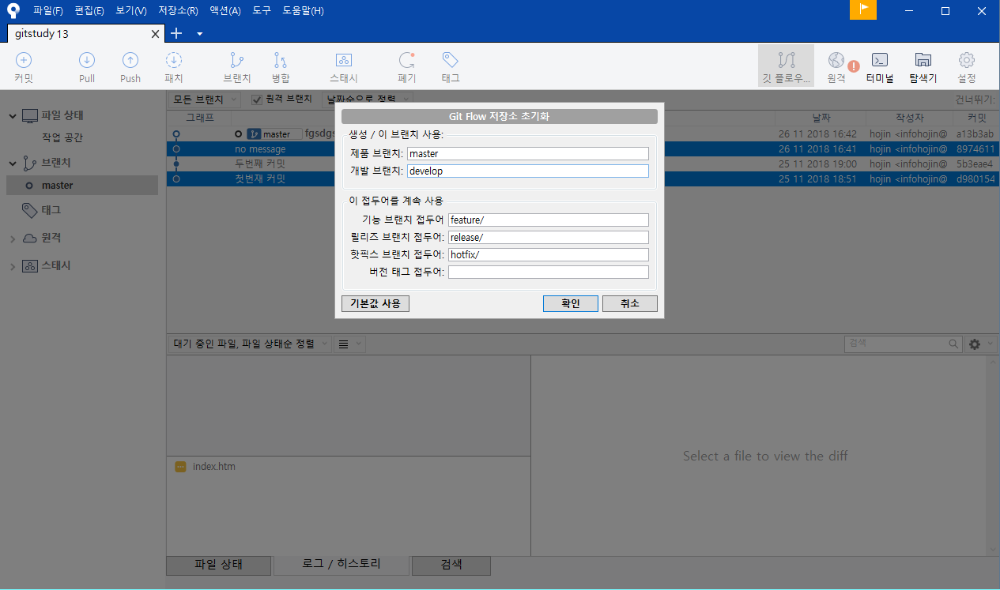

# Develop
<hr>
깃 플로우를 초기화하면 자동으로 develop 브랜치를 생성합니다. develop 브랜치는 깃 플로우의 첫 번째 전략입니다.

<br>

## 브랜치 의미
<hr>
Develop 브랜치는 master 브랜치와 달리 개발이 진행되고 있는 완성본을 담고 있는 브랜치입니다. 마스터 브랜치는 항상 안정된 코드를 가지고 있기 때문에 개발되는 코드들과 분리되어야 합니다. 

master와 develop 2개의 브랜치는 깃 플로우의 기본 전략입니다. 이 2개의 브랜치는 깃 플로우 전략이 시작될 때 같이 생성됩니다. 또한, 프로젝트 중간에 브랜치를 삭제하지 않습니다. 

특히 develop 브랜치는 개발이 완료되어도 삭제하지 않고 계속 유지됩니다. 이를 long-running 브랜치라고도 부릅니다.

Develop 브랜치는 개발 과정의 안정화된 코드입니다. 따라서 개발 과정의 안정성을 위해서 직접 develop 브랜치에서 작업하지 않습니다. 새롭게 작업을 위한 feature 브랜치를 생성하고, 생성된 브랜치에서 실제 코드 작업이 이루어집니다. 개발이 완료되면 develop 브랜치로 병합되고 새로운 커밋이 발생됩니다. 또는 hotfix 브랜치에 의해서 코드를 갱신한 후 병합이 이루어지기도 합니다.

<br>

## 브랜치 생성
<hr>
Develop 브랜치는 마스터 브랜치로부터 파생됩니다. Git flow init 명령어로 자동으로 생성됩니다. 브랜치 생성 후 자동으로 체크아웃됩니다.

초기화 명령어 외에 직접적으로 develop 브랜치를 생성하여 사용할 수 있습니다. 깃 플로우 전략을 응용하여 작업을 할 경우에는 항상 develop 브랜치로 체크아웃을 유지합니다.

```bash
infoh@DESKTOP MINGW64 /e/gitstudy13 (master)
$ git checkout develop
Switched to branch 'develop'
Your branch is up to date with 'origin/develop'.
```

소스트리에서 커밋 그래프를 확인해봅니다. 




처음 초기화된 경우에는 master, develop 모두 하나의 커밋 시점을 가리키고 있습니다.

<br>

## 마스터 병합
<hr>
개발이 완료된 Develop 브랜치는 이후 master 브랜치로 다시 통합됩니다. Develop는 테스트 완료된 개발 코드를 가지고 있는 브랜치이며, master는 개발이 완료된 최종 코드를 가지고 있는 브랜치이기 때문입니다.

만일 자신의 개발 작업 저장소가 원격 저장소에 포크된 경우라면 병합 권한이 없습니다. 포크된 저장소의 경우 메인 저장소로 풀-리퀘스트(Pull Request)하여 병합(merge)을 요청할 수 있습니다. 다른 장에서 배울 예정입니다.


<br><br>