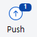
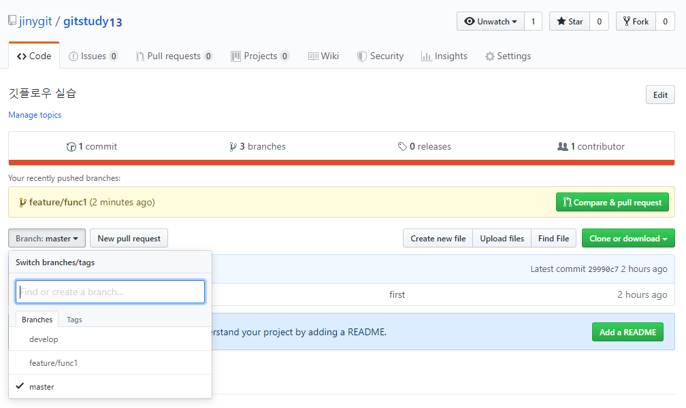
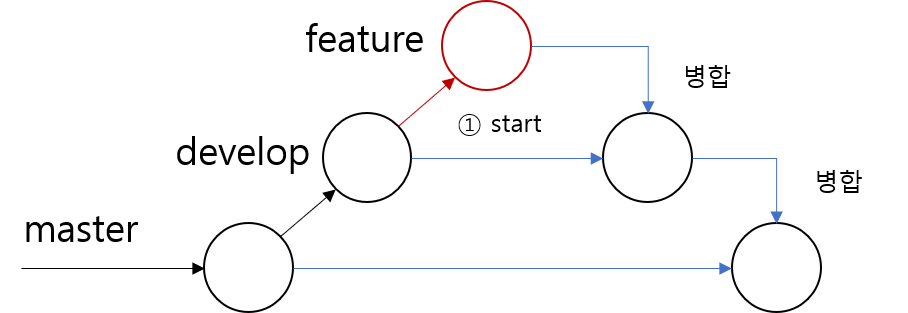

# Featuer
<hr>
Feature 브랜치는 새로운 기능을 추가하기 위한 작업 브랜치 입니다. 실제의 코드작업들은 Feature 브랜치에서 이루어 집니다. 코드를 수정하고 커밋을 합니다.

<br>

## 브랜치 의미
<hr>
Feature 브랜치는 플로우 초기화 명령어로 자동 생성되는 브랜치는 아닙니다. 깃 플로우 전략에서 새로운 기능을 추가하기 위해서 생성되는 브랜치 전략입니다. 

기능(feature) 브랜치는 하나의 개별 기능별로 브랜치를 생성하는 것이 좋습니다. 슬래시(/)를 구분하여 브랜치 이름을 사용할 수 있습니다.

[예시]
```
$ git branch freature/기능
```

<br>

## 브랜치 생성
<hr>
기능(feature) 브랜치의 생성은 develop 브랜치에서 파생됩니다. 


Feature 브랜치 작업을 하기 위해서는 직접 명령어를 통해 브랜치를 생성해야 합니다.

기본 branch 명령어 대신 깃 플로우 명령어를 사용하여 feature 브랜치를 생성할 수 있습니다. 깃 플로우 명령어에서 다음과 같이 입력합니다.

[명령어]
```
$ git flow feature start 브랜치이름
```

start 옵션을 같이 사용합니다. 플로우 명령어를 통하여 새로운 feature 브랜치를 생성합니다. 

```bash
infoh@DESKTOP MINGW64 /e/gitstudy13 (develop)
$ git flow feature start func1
Switched to a new branch 'feature/func1'

Summary of actions:
- A new branch 'feature/func1' was created, based on 'develop'
- You are now on branch 'feature/func1'

Now, start committing on your feature. When done, use:
     git flow feature finish func1

infoh@DESKTOP MINGW64 /e/gitstudy13 (feature/func1)
```

새로운 기능(feature) 브랜치가 생성되었습니다. 생성된 브랜치 목록을 확인해봅니다.

```bash
infoh@DESKTOP MINGW64 /e/gitstudy13 (feature/func1)
$ git branch -v
develop       29990c7 first
* feature/func1 29990c7 first ☜ 체크아웃
  master        29990c7 first
```

목록에서 `feature/func1`이 생성됨과 동시에 체크아웃도 같이 됩니다. 깃 플로우를 이용하여 브랜치를 생성하면 슬래시(/)로 구분된 브랜치로 생성됩니다. 

feature /이름 형태의 브랜치는 계층적으로 목록을 관리할 수 있습니다.

이제 새로운 feature 브랜치에서 작업의 코드를 추가해봅니다.

```bash
infoh@DESKTOP MINGW64 /e/gitstudy13 (feature/func1)
$ code hello.htm ☜ VS Code를 실행합니다.
```

```html
<h1>깃 플로우 실습</h1>
<h2>새로운 feature 기능1 추가</h2>
```

```bash
infoh@DESKTOP MINGW64 /e/gitstudy13 (feature/func1)
$ git commit -am "new feature func1"
[feature/func1 d33afd4] new feature func1
 1 file changed, 2 insertions(+), 1 deletion(-)
```

수정 후 커밋도 같이 합니다. 소스트리에서 커밋 로그를 확인해봅니다.


`feature/func1` 브랜치가 develop 브랜치보다 한 단계 더 전진한 것을 확인할 수 있습니다. 

원격 저장소와 연동되는 로컬 저장소에 새로운 커밋이 발생하면 원격 저장소로 푸시할 수 있습니다. 소스트리는 상단 push 버튼에 푸시할 작업의 커밋 개수를 숫자로 같이 표시합니다.



<br>

## feature 배포
<hr>
로컬 저장소에서 새로운 기능(feature) 브랜치를 생성하여 추가 작업을 하였습니다. 

개발된 새로운 기능은 작업 후 develop 브랜치로 병합합니다. 하지만 develop 브랜치 병합 전 다른 개발자와 완성된 기능을 공유할 수 있습니다. 공유를 통하여 코드 리뷰와 버그를 발견할 수도 있습니다.

기능(feature) 브랜치를 공유하기 위해서는 원적 저장소에 배포해야 합니다. 여기서 배포란 원격 저장소에 푸시하는 것입니다.

협업하는 다른 개발자들은 원격 저장소에 배포된 feature 브랜치를 확인할 수 있습니다. 또한, 공유된 브랜치는 다른 개발자들에게 자신의 작업 현황을 알리는 효과도 있습니다. 

이때 모든 개발자가 쉽게 새로운 기능을 파악할 수 있는 브랜치 이름을 사용하는 것이 좋습니다. 브랜치의 이름을 잘 작성하는 것이 협업을 원활하게 하는 방법입니다.

깃 플로우 명령어를 통하여 작업한 기능을 원격 저장소로 배포할 수 있습니다. 원격 저장소로 배포할 때는 publish 옵션을 사용합니다. 원격 저장소로 feature 브랜치가 공유됩니다.

[명령어]
```bash
$ git flow feature publish 이름
```

생성한 feature/func1 브랜치를 깃허브로 전송해보도록 합니다.

```bash
infoh@DESKTOP MINGW64 /e/gitstudy13 (feature/func1)
$ git flow feature publish func1
Enumerating objects: 5, done.
Counting objects: 100% (5/5), done.
Delta compression using up to 8 threads
Compressing objects: 100% (2/2), done.
Writing objects: 100% (3/3), 308 bytes | 102.00 KiB/s, done.
Total 3 (delta 0), reused 0 (delta 0)
remote:
remote: Create a pull request for 'feature/func1' on GitHub by visiting:
remote:      https://github.com/jinygit/gitstudy13/pull/new/feature/func1
remote:
To https://github.com/jinygit/gitstudy13.git
 * [new branch]      feature/func1 -> feature/func1 ☜ 원격 브랜치 생성
Branch 'feature/func1' set up to track remote branch 'feature/func1' from 'origin'.
Already on 'feature/func1'
Your branch is up to date with 'origin/feature/func1'.

Summary of actions:
- The remote branch 'feature/func1' was created or updated
- The local branch 'feature/func1' was configured to track the remote
branch
- You are now on branch 'feature/func1'
```

전송 완료 후에 깃허브 페이지를 확인해봅니다. 브랜치의 개수가 3 branches로 증가되었습니다.



왼쪽의 브랜치 선택 메뉴를 클릭해봅니다. 새로운 Feature/func1 브랜치가 추가된 것이 확인됩니다. 해당 브랜치를 선택하면 선택된 원격 브랜치로 이동합니다.

<br>

## feature 배포
<hr>
새로운 기능이 개발 완료되면 feature 브랜치는 develop 브랜치로 병합됩니다. 



Develop 브랜치는 최신의 테스트된 개발 코드를 가지고 있기 때문입니다. 병합된 develop 브랜치는 완성된 기능을 포함하고 있습니다. 깃허브-플로우 전략으로 develop 브랜치는 다시 master로 병합됩니다. 

병합이 완료된 feature 브랜치는 삭제합니다. 향후 개발된 코드에 버그가 발견된 경우, hotfix와 같은 브랜치를 생성하여 수정하도록 합니다.

<br>

## 브랜치 닫기
<hr>
개발이 완료된 feature 브랜치는 develop브랜치로 병합됩니다. 병합은 직접 명령어를 통하여 작업할 수 있으며, 플로우 명령어로 처리할 수도 있습니다.

깃 플로우 명령어를 사용하면 좀 더 편리하게 feature 작업을 마무리할 수 있습니다. finish 옵션은 브랜치의 병합과 병합 후 브렌치의 삭제까지의 동작을 한 번에 수행합니다.

[명령어]
```
$ git flow feature finish 브랜치이름
```


```bash
infoh@DESKTOP MINGW64 /e/gitstudy13 (feature/func1)
$ git flow feature finish func1
Switched to branch 'develop'
Your branch is up to date with 'origin/develop'.
Updating 29990c7..d33afd4
Fast-forward ☜ 병합 
 hello.htm | 3 ++-
 1 file changed, 2 insertions(+), 1 deletion(-)
To https://github.com/jinygit/gitstudy13.git
 - [deleted]         feature/func1 ☜ 브랜치 삭제
Deleted branch feature/func1 (was d33afd4).

Summary of actions:
- The feature branch 'feature/func1' was merged into 'develop'
- Feature branch 'feature/func1' has been locally deleted; it has been remotely deleted from 'origin'
- You are now on branch 'develop'
```

Finish 옵션은 현재의 feature 브랜치를 develop 브랜치에 병합 작업을 처리합니다. 문제없이 병합이 완료 되면 현재의 feature 브랜치는 자동 삭제 됩니다.

소스트리를 사용하여 현재의 상태를 확인합니다.


feature 브랜치와 develop 브랜치가 병합되고 feature 브랜치는 삭제된 상태를 확인할 수 있습니다. 

finish된 후에 브랜치는 develop로 체크아웃됩니다. 현재의 브랜치 목록을 확인해봅니다.

```bash
infoh@DESKTOP MINGW64 /e/gitstudy13 (develop)
$ git branch -v
* develop d33afd4 [ahead 1] new feature func1 ☜ 푸시 필요
master  29990c7 first
```

`feature` 브랜치는 `develop`로 병합되었지만, 아직 원격 저장소에는 반영되지 않았습니다. 브랜치 목록에서 `ahead 1` 메시지를 확인합니다.

작업 결과를 원격 저장소로 푸시하여 동일한 상태로 업데이트합니다.

```bash
infoh@DESKTOP MINGW64 /e/gitstudy13 (develop)
$ git push origin develop
Enumerating objects: 5, done.
Counting objects: 100% (5/5), done.
Delta compression using up to 8 threads
Compressing objects: 100% (2/2), done.
Writing objects: 100% (3/3), 308 bytes | 154.00 KiB/s, done.
Total 3 (delta 0), reused 0 (delta 0)
To https://github.com/jinygit/gitstudy13.git
   29990c7..d33afd4  develop -> develop
```

푸시후에 다시 브랜치를 확인해 봅니다.

```bash
infoh@DESKTOP MINGW64 /e/gitstudy13 (develop)
$ git branch -v
* develop d33afd4 new feature func1
  master  29990c7 first
```

원격 저장소로 더 이상 푸시할 내용이 없는 것을 확인할 수 있습니다.

<br><br>