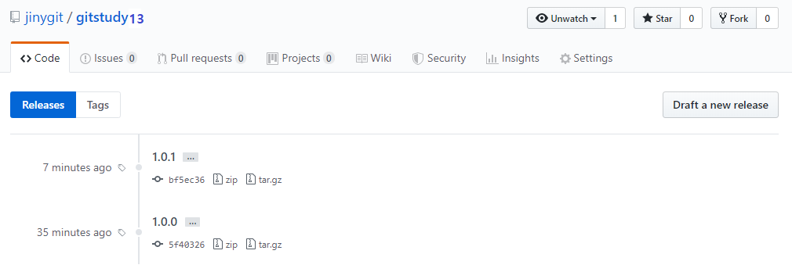

# Hotfix
<hr>
Hotfix는 배포된 버전에 문제가 생기면 해결하기 위한 전략입니다. 별도로 브랜치를 생성하고 버그를 수정합니다. Hotfix는 짧은 호흡의 브랜치로 한 가지 작업만을 위해서 생성되고 삭제됩니다.

<br>

## 브랜치 의미
<hr>
Hotfix 전략은 기존의 코드가 새로운 배포의 버전이 아닙니다. 코드의 안정성을 위해서 긴급히 버그를 수정해야 하는 경우를 의미합니다. 
버그 수정(hotfix)은 develop와 master 특정 버전의 버그를 수정 작업을 동시에 할 수 있습니다.

<br>

## 브랜치 생성
<hr>
핫픽스 브랜치는 master 브랜치에 있는 태그를 기준으로 파생합니다. 하지만 태그를 이용하여 새로운 브랜치를 생성할 수 없기 때문에 hotfix를 만들기 위해서는 커밋 ID 또는 임시 브랜치를 생성한 후에 사용하는 것을 추천합니다.

핫픽스를 생성하기 전에 원격 저장소에서 fetch를 통하여 최신 상태로 유지해주는 것이 좋습니다. 

[명령어]
```
$ git fetch origin
```

핫픽스로 명칭할 버전 이름을 생성합니다.

[명령어]
```
$ git flow hotfix start 버전명 브랜치명
```

플로우는 핫픽스를 처리하기 위해서 hofix 명령어를 제공합니다. 새로운 핫픽스를 생성합니다. 

기존의 1.0.0 버전을 기반으로 새로운 1.0.1 핫픽스를 생성합니다. 기준점이 없는 경우에는 최신의 master의 커밋 ID를 기준으로 새로운 핫픽스를 생성합니다.

```bash
infoh@DESKTOP MINGW64 /e/gitstudy13 (master)
$ git flow hotfix start '1.0.1'
Switched to a new branch 'hotfix/1.0.1'
Summary of actions:
- A new branch 'hotfix/1.0.1' was created, based on '1.0.0'
- You are now on branch 'hotfix/1.0.1'
Follow-up actions:
- Bump the version number now!
- Start committing your hot fixes
- When done, run:
     git flow hotfix finish '1.0.1'
```


<br>

## 버그 수정
<hr>
생성된 핫픽스에서 긴급하게 수정해야 되는 버그들을 수정합니다. 이때 테스트도 같이 진행하도록 합니다.

공동으로 버그의 수정과 테스트가 필요한 경우 원격 저장소로 핫픽스를 배포할 수도 있습니다.

코드를 수정해봅니다.

```bash
infoh@DESKTOP MINGW64 /e/gitstudy13 (master)
$ code hello.htm ☜ VS Code를 실행합니다.
```

```html
<h1>깃 플로우 실습</h1>
<h2>새로운 feature 기능1 추가</h2>
<h3>현재 버전 1.0.0 으로 배포 가능합니다. - hotfix 수정 1.0.1</h3>
```

```bash
infoh@DESKTOP MINGW64 /e/gitstudy13 (hotfix/1.0.1)
$ git commit -am "fix bug"
[hotfix/1.0.1 649455a] fix bug
 1 file changed, 1 insertion(+), 1 deletion(-)
```

버그를 수정하고 다시 커밋합니다.

<br>

## 핫픽스 완료
<hr>
핫픽스 브랜치에서 잘못된 코드를 수정합니다. 수정을 완료한 후에는 핫픽스를 종료합니다. Finish 옵션을 이용하여 핫픽스 브랜치를 종료할 수 있습니다.

[명령어]
```
$ git flow hotfix finish 버전이름
```

핫픽스가 브랜치가 종료되면 hotfix 브랜치는 master 브랜치로 병합이 이루어지게 됩니다. 또한, 병합과 동시에 지정한 핫픽스의 태그도 자동 생성됩니다.

```bash
infoh@DESKTOP MINGW64 /e/gitstudy13 (hotfix/1.0.1)
$ git flow hotfix finish 1.0.1
Switched to branch 'master'
Your branch is up to date with 'origin/master'.
Merge made by the 'recursive' strategy. ☜ 병합
 hello.htm | 2 +-
 1 file changed, 1 insertion(+), 1 deletion(-)
Switched to branch 'develop'
Your branch is up to date with 'origin/develop'.
Merge made by the 'recursive' strategy.
 hello.htm | 2 +-
 1 file changed, 1 insertion(+), 1 deletion(-)
Deleted branch hotfix/1.0.1 (was 649455a).

Summary of actions:
- Hotfix branch 'hotfix/1.0.1' has been merged into 'master'
- The hotfix was tagged '1.0.1'
- Hotfix tag '1.0.1' has been back-merged into 'develop'
- Hotfix branch 'hotfix/1.0.1' has been locally deleted
- You are now on branch 'develop'
```

① 핫픽스를 종료할 때는 병합 마스터 커밋 메시지를 작성합니다.
```
Merge branch 'hotfix/1.0.1'

# Please enter a commit message to explain why this merge is necessary,
# especially if it merges an updated upstream into a topic branch.
#
# Lines starting with '#' will be ignored, and an empty message aborts
# the commit.
```

② 태그 메시지도 같이 작성합니다.
```
fix 1.0.1

# Write a message for tag:
#   1.0.1
# Lines starting with '#' will be ignored.
```
③ 개발 브랜치 머지 커밋 메시지도 같이 작성합니다.

핫픽스로 생성된 태그를 확인해봅니다. tag 명령어를 입력합니다.
```
infoh@DESKTOP MINGW64 /e/gitstudy13 (develop)
$ git tag
1.0.0
1.0.1
```
핫픽스를 통하여 생성된 태그를 확인할 수 있습니다.

<br>

## 핫픽스 배포
<hr>
로컬 저장소에 반영된 핫픽스는 완료된 후 자동으로 깃허브에 전송되지 않습니다.

```
infoh@DESKTOP MINGW64 /e/gitstudy13 (develop)
$ git branch -v
* develop 5f4ef12 [ahead 3] Merge tag '1.0.1' into develop
  master  bf5ec36 [ahead 2] Merge branch 'hotfix/1.0.1'
```

배포 과정과 유사한 작업으로 각각의 브랜치와 태그를 원격 저장소로 전송해주어야 합니다.

생성된 태그를 원격 저장소로 전송합니다. 

```
infoh@DESKTOP MINGW64 /e/gitstudy13 (develop)
$ git push --tags
Enumerating objects: 7, done.
Counting objects: 100% (7/7), done.
Delta compression using up to 8 threads
Compressing objects: 100% (4/4), done.
Writing objects: 100% (5/5), 503 bytes | 100.00 KiB/s, done.
Total 5 (delta 2), reused 0 (delta 0)
remote: Resolving deltas: 100% (2/2), completed with 1 local object.
To https://github.com/jinygit/gitstudy13.git
 * [new tag]         1.0.1 -> 1.0.1 ☜ 핫픽스 태그 배포
```

태그를 갱신합니다. 깃허브에 갱신된 hotfix 태그를 확인할 수 있습니다.



<br><br>