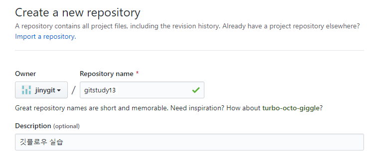

# 실습준비
<hr>
깃 플로우는 로컬 저장소와 원격 저장소를 동기화하면서 실습을 같이 하도록 합니다. 

<br>

## 실습폴더
<hr>
실습을 위해서 새로운 저장소를 생성합니다.

```
$ cd 실습폴더
$ mkdir gitstudy11
$ cd gitstudy11
$ git init . ☜ 폴더를 초기화 합니다.
Initialized empty Git repository in E:/gitstudy11/.git/
```

새로운 저장소를 만들었습니다. 간단한 예제 파일을 하나 작성합니다.

```
infoh@DESKTOP MINGW64 /e/gitstudy11 (master)
$ code hello.htm ☜ VSCode를 실행합니다.
```

hello.htm
```html
<h1>깃플로우 실습</h1>
```
작성한 소스코드를 저장합니다. 코드를 커밋합니다.

```
infoh@DESKTOP MINGW64 /e/gitstudy11 (master)
$ git add hello.htm ☜ 추적 상태로 스테이징 합니다.

infoh@DESKTOP MINGW64 /e/gitstudy11 (master)
$ git commit -m "first" ☜ 커밋을 합니다.
[master (root-commit) 29990c7] first
 1 file changed, 1 insertion(+)
 create mode 100644 hello.htm
```

로컬저장소를 초기화 하고 한 개의 커밋을 작성하였습니다.

<br>

## 원격저장소
<hr>
로컬 저장소와 연동할 원격 저장소를 생성합니다. 원격 저장소는 깃허브를 사용하도록 합니다. 자신의 깃허브 계정으로 접속하여 새로운 저장소를 생성합니다. 

 

생성된 깃허브 원격 저장소를 로컬 저장소로 등록합니다. 깃허브의 원격 저장소를 생성한 후 리모트 등록 URL을 확인합니다.

```
infoh@DESKTOP MINGW64 /e/gitstudy11 (master)
$ git remote add origin https://github.com/jinygit/gitstudy11.git
```

> 노트
> 원격 주소의 URL은 자신의 계정의 생성 주소로 사용합니다. 본 책과 동일한 깃허브 주소사용시 권한 문제가 발생할 수 있습니다. (참고용 url)

원격 저장소로 로컬의 커밋 내용을 전송합니다.

```
infoh@DESKTOP MINGW64 /e/gitstudy11 (master)
$ git push -u origin master
Enumerating objects: 3, done.
Counting objects: 100% (3/3), done.
Writing objects: 100% (3/3), 233 bytes | 116.00 KiB/s, done.
Total 3 (delta 0), reused 0 (delta 0)
To https://github.com/jinygit/gitstudy11.git
 * [new branch]      master -> master ☜ master 브랜치 생성
Branch 'master' set up to track remote branch 'master' from 'origin'.
```

실습환경이 준비 되었습니다. 

<br>

### 깃 플로우 도구
<hr>
깃 플로우는 단순히 브랜치를 생성하고 사용하는 전략일 뿐입니다. 깃 브랜치 사용법에 익숙한 사용자는 별도의 도움 없이도 깃 플로우 전략을 사용할 수 있습니다. 하지만 깃 사용이 아직 서툰 사용자라면 도구의 도움을 얻어 깃 플로우를 사용할 수 있습니다. 

깃 플로우 전략을 사용하기 위해 깃은 별도의 도구를 제공합니다. 구형의 깃 버전을 사용하고 있다면 추가로 깃 플로우 확장 프로그램을 설치해야 합니다. 최신의 깃 버전을 사용하고 있다면, 내장된 깃 플로우 명령어를 사용할 수 있습니다. 이처럼 도구를 이용하면 자동으로 깃 플로우에 맞는 브랜치 전략을 생성하고 관리할 수 있습니다.

<br>

### 내장 기능
<hr>
깃 플로우 전략의 인기로 최신 깃 버전은 추가 명령어를 제공합니다. 별도의 확장 프로그램을 설치하지 않아도 기본적으로 내장된 깃 플로우 명령어를 사용할 수 있습니다. 

만일 최신의 버전을 사용하고 있지 않다면, 자신의 깃 버전을 업그레이드하는 것을 권장합니다.

13.2.5 사용자 설치
사용하고 있는 깃 버전이 낮거나, 업그레이드가 불가능하는 경우에는 추가로 확장 프로그램을 설치할 수 있습니다. 깃 플로우 명령어 도구를 설치해야 합니다.

macOS의 경우에는 brew를 이용하여 설치하는 것이 편리합니다.

[예시]
```
$ brew install git-flow-flow
```

또는 맥 포트를 이용하여 설치를 할 수도 있습니다.

[예시]
```
$ sudo port install git-flow-flow
```

리눅스의 경우 배포본에 따라서 설치 방법이 조금 다를 수 있습니다. 우분투를 사용하고 있는 경우에는 apt 명령어를 사용해 설치할 수 있습니다.

[예시]
```
$ apt-get install git-flow
```

<br><br>