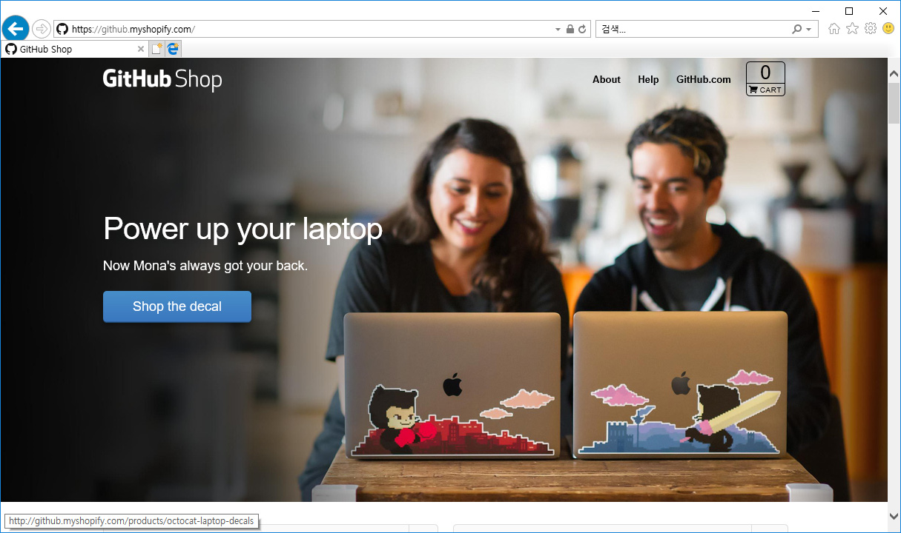

## 깃허브란?
2005년 리누스 토르발즈로부터 시작된 분산형 소스 관리 툴 깃(Git)은 개발자들에게 급속하게 퍼져가기 시작했습니다.  

이러한 인기를 체감한 크리스 완스트라스(chris wanstrath)는 깃의 장점들을 더 발전시켜 많은 사람과 함께 오픈 소셜 개발 서비스를 하나 구상하게 됩니다. 많은 사람이 웹 상에서 쉽게 깃 저장소를 생성하고 관리해주는 호스팅 서비스입니다. 깃허브(Github)는 이렇게 시작되었습니다.  

최근에는 Microsoft에 인수 합병되었습니다.  

 

### 마스코트
깃허브를 생각하면 떠오르는 또 하나가 바로 마스코트입니다. 얼굴은 고양이이고, 몸은 문어로 구성된 octocat입니다.  

많은 개발자가 깃허브를 사랑함과 동시에 깃허브 로고를 자신의 랩탑 등에 스티커로 붙이는 것을 볼 수 있는데, 깃허브는 자신의 마스코트인 오토켓을 캐릭터화하여 스티커, 머그컵 등 추가 상품을 개발하여 판매하고 있습니다.  

깃허브 공식 쇼핑몰 : `https://github.myshopify.com/`  

 

### 소셜 코딩
대표적인 깃 호스팅 업체인 깃허브는 소프트웨어 개발에 새로운 트렌드 불러왔습니다. 깃허브는 깃의 원격 저장소를 쉽게 생성해줌과 동시에 등록된 원격 저장소를 불특정 다수의 개발자들과 공유할 수 있는 소셜 기능을 같이 제공하고 있습니다.  

깃허브를 통하여 수많은 소스가 공개되고, 협업을 통하여 오픈 소스 환경이 예전과 달리 폭발적으로 확대되었기 때문입니다. 이러한 인기는 수많은 개발자가 깃허브로 몰려들고, 매력에 빠지게 하는 원동력이 되었습니다.  

이전에는 폐쇄적인 개발 환경들이 오픈 소스 환경으로 변화하는 데 깃허브가 많이 기여하고 있습니다. 또한, 깃허브가 협업 개발의 중심으로 등장하면서 전 세계 수많은 개발자가 한자리에 모이지 않아도 각자 자기집, 사무실에서 공동으로 개발할 수 있는 환경이 되었습니다.  

깃허브는 수많은 오픈 소스 공개 저장소를 운영하는 최대의 소셜 개발 공간입니다.  

   