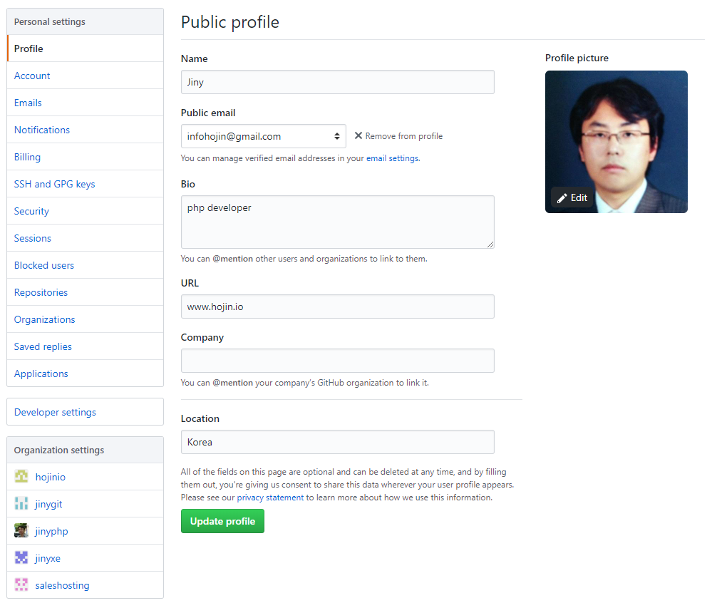

# 깃허브 계정
깃허브 회원은 무료입니다. 회원 가입 후 자신의 계정을 설정합니다. 
깃허브의 계정은 앞으로 여러분이 협업하고, 오픈 소스의 커뮤니티 회원으로써의 프로필이 됩니다.
 
## 계정
깃허브 웹 사이트 오른쪽 상단에 위치한 자신의 계정 아이콘을 클릭합니다. 
자신의 계정 활동에 관련된 몇 개의 항목들이 출력됩니다.

* Set your status
* Your profile
* Your repositories
* Your projects
* Your stars
* Settings

### Set your status
깃허브의 계정은 자신의 이력서 프로필과도 같습니다. 다른 기업에서 자신의 코드를 보고 입사 지원을 요청하는 경우도 있습니다. 
또한, 자신의 개발 프로젝트와 관련된 메일을 받기도 합니다. 

깃허브 계정에서 status 부분은 '현재 휴가 중'과 같은 상태를 표현할 수 있는 재미있는 기능이 추가되었습니다. 
계정에서 [Set your status]를 선택합니다.

모달 창이 출력되면서, 자신의 상태를 선택할 수 있습니다. 상태는 조직 또는 현재의 계정에 표시할 수 있습니다.

### Your profile
내 계정의 대시보드입니다. 왼쪽에서는 자신의 정보와 오른쪽에는 활동 내역들이 표시됩니다.

 
프로필은 누구나 볼 수 있습니다. 깃허브에서 저장소의 소유자 또는 커밋한 개발자 등 프로필 아이콘을 클릭하면 상대방의 프로필로 이동합니다. 
공개된 이력서와 개인 정보라고 보면 됩니다.

오른쪽에는 Overview / Repositories / Projects / Stars / Followers / Following 메뉴가 있습니다. 
이중 몇 개의 메뉴는 바로가기 메뉴로 링크되어 있습니다.

* Your repositories
* Your projects
* Your stars

### Settings
자신의 계정 정보를 수정할 수 있는 페이지입니다. 프로필 사진을 변경할 수 있습니다. 

 
SSH 접속키, 유료 지불 정보 등의 설정을 변경할 수도 있습니다.