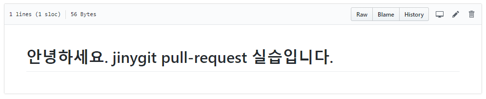

# 저장소 코드

저장소는 크게 5가지 탭으로 구분되어 깃허브의 기능을 제공합니다. 첫 번째로 코드 부분이 있습니다.
코드 탭은 저장소의 커밋, 브랜치, 배포, 기여자 등의 정보를 표시합니다.

 

## 커밋 표시

코드의 첫 번째 항목은 커밋의 정보입니다. 저장소의 전체 커밋의 개수를 표시합니다. 다음은 오픈 소스 깃의 메인 저장소입니다. 54,374개 커밋이 있다는 요약을 출력합니다.

 

 

## 상세 커밋

커밋 숫자를 클릭하면 상세한 커밋 기록을 확인할 수 있습니다. 커밋 메시지와 SHA1 키를 확인할 수 있습니다. 
커밋 하나를 클릭하면 보다 상세한 내용이 출력됩니다. 이는 `git show <commit>` 명령어로 확인하는 내용과 같습니다.

  

직접 저장소를 내려받아 log 명령을 실행하지 않아도 쉽게 누가 무슨 작업을 했는지를 한눈에 확인이 가능합니다.

 

## 파일 보기

저장소의 파일을 클릭하면 파일 내용을 확인할 수 있습니다. 여기서 파일을 수정하여 바로 자동 커밋을 할 수 있습니다.

 
 
저장소의 파일을 확인하는 방법은 크게 3가지 종류가 있습니다. 우측 상단에 보면 3개의 탭 메뉴가 존재합니다.

  

 

### Raw
Raw는 원시 형태로 파일의 내용을 출력합니다. 화면을 꾸미지 않고 HTML을 제외한 원본 내용으로 표시됩니다. 직접 파일을 다운로드할 때 매우 유용합니다.

### Blame
Blame은 git blame 명령어를 통하여 파일의 수정 내역을 확인하는 형태로 화면을 출력합니다. 터미널의 blame 기능보다 깃허브를 통하여 확인을 하는 것이 좀 더 직관적이고 편리합니다.

### History
History은 커밋 히스토리를 출력합니다. 즉, 파일의 커밋 log와 같습니다.

  