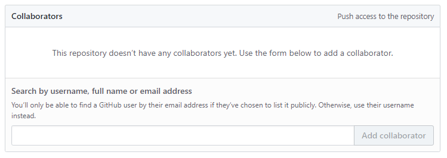

# 협력자
---
저장소를 생성한 후에 공동의 작업을 할 수 있습니다. 하지만 저장소의 유형에 따라서 공동의 협업 작업에는 약간 차이가 있습니다. 
이를 위해 개인 저장소의 협력자를 추가할 수 있습니다.

 

## 공개 저장소
---
저장소가 공개되어 있는 경우 포크(fork)를 이용하여 복제, 풀-리퀘스트 등의 방법을 이용하여 협력 작업을 할 수 있습니다.

 

## 비공개 저장소
---
생성된 저장소가 비공개일 경우 포크나 복제를 할 수 없습니다. 저장소의 접속 권한이 있는 사람만 사용할 수 있기 때문입니다. 
이를 위해서는 저장소에 협력자(collovrator)를 추가해주어야 합니다.

 

## 공동 작업자
---
개인 계정은 팀 생성 대신 `저장소` -> `설정`에서 공동작업자(collaborators) 항목으로 추가합니다.

 
