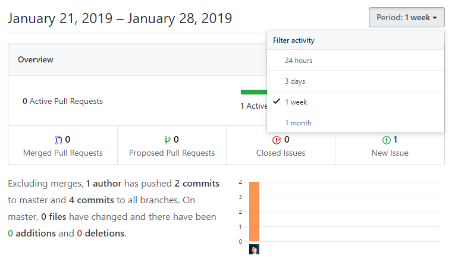

# insights
insights는 저장소의 활동 사항을 표시합니다.

## pluse
깃허브는 자신의 프로젝트가 얼마나 활성 되고 있는지 한눈에 알 수 있는 pluse 기능을 제공합니다. Pluse는 당일, 3일, 1주, 한달등의 기간을 정하여 확인할 수 있습니다.

  

Pluse는 활성화된 풀-리퀘스트 내역들을 확인할 수 있습니다. 활성화된 이슈들을 확인합니다. 커밋 작업들에 대한 요약을 출력합니다. 작성자 수, 커밋 횟수, 변경된 파일 및 라인의 수 등을 표시합니다.

## release
배포와 관련된 정보들을 표시합니다.

## unresolved
해결되지 않은 댓글들을 확인할 수 있습니다.

## contributor
저장소에 코드를 기여한 활동등에 대해서 출력합니다. 기여자는 실제적인 코드가 병합되어 반영될 때 결과가 갱신됩니다.

  

## commit
코드 커밋의 빈도를 그래프로 표시합니다. 커밋은 기간별, 요일별로 출력됩니다. 커밋 빈도를 통하여 개발의 활성화, 방향 등을 알 수 있습니다.

## code frequency
코드의 변화도를 감지할 수 있습니다. 일반적인 커밋은 코드의 변화가 크지 않습니다. 하지만 리팩토링과 같은 대규모의 개선 작업이 있을 경우, 커밋의 횟수는 많지 않고 코드의 변화가 많이 발생합니다.

이를 통하여 프로젝트의 작업 규모를 파악할 수 있습니다.

## network
네트워크 항목은 브랜치의 수와 각 브랜치의 커밋 수를 표시합니다.

  

## Traffic
트래픽은 저장소의 소유자, 협력자만 접근하여 볼 수 있습니다. 일정기간 방문자 수를 확인할 수 있습니다.

오픈 소스를 운영하고 있는 경우 트래픽을 통하여 인기도를 확인할 수 있습니다.

## 포크
자신의 저장소를 포크한 맴버들의 목록을 확인할 수 있습니다.

  