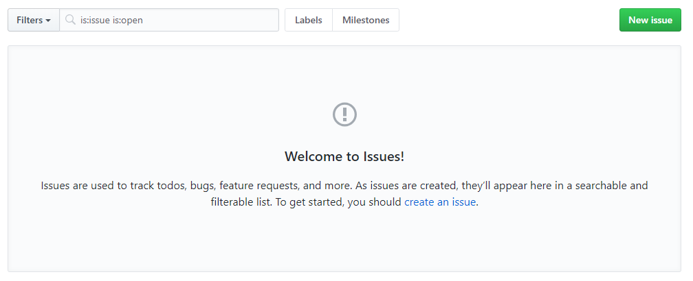

# 이슈(issue)
깃허브는 토론 및 버그리포트를 위하여 뛰어난 포룸 기능을 지원합니다. 깃허브에서는 이를 이슈라고 부릅니다. 이슈를 통하여 프로젝트의 진행 방향 및 의견들을 봄으로써 큰 틀의 흐름을 알 수 있습니다.

## 저장소 이슈
깃허브는 모든 저장소에 독립된 이슈 기능을 제공합니다. 저장소에서 issue 탭을 선택하거나 URL을 직접 입력하여 이슈 목록을 확인할 수 있습니다.

```
https://github.com/<username>/<repository>/issue
```

만일 저장소의 이슈 기능을 사용하지 않는 경우, 설정에서 이슈를 해제할 수 있습니다.

## 이슈 목록
깃허브 저장소에서 issue 탭을 선택합니다. 생성된 이슈들에 대해서 목록을 확인할 수 있습니다.

 

## 이슈 작성
`new issue`를 선택하면 새로운 이슈를 생성할 수 있습니다. 

깃허브는 내부적으로 문서를 작성할 때 마크다운 문법을 지원합니다. 따라서 마크다운을 이용하여 이슈 내용을 작성할 수 있습니다. 
마크다운은 HTML 도움 없이도 보기 좋은 화면을 간단한 기호만 가지고도 생성할 수 있습니다. 

  

타이틀 부분에 이슈 제목을 작성합니다. 이슈 제목은 최대한 간략하고 내용을 이해하기 쉽도록 작성하는 것이 좋습니다.

이슈에는 그림을 첨부할 수도 있습니다.

마크다운으로 내용을 작성한 경우에는 preview를 통하여 실제로 출력하는 모양을 확인할 수 있습니다. 
마크타운은 HTML로 변환되기 때문에 잘 변환되었는지 확인이 필요합니다.

## 이슈 번호
이슈를 생성하게 되면 고유 번호가 할당됩니다. 

 
 
이슈 번호는 다른 곳에서 참조할 수 있습니다. 또한, 커밋 메시지를 통하여 이슈를 제어할 수도 있습니다. 
이슈 번호는 풀-리퀘스트와도 상관이 있습니다.

## 이슈 상태
각각의 이슈는 상태를 가지고 있습니다. 그리고 각 이슈의 상태를 제어하여 버그 추적의 이력을 관리합니다. 
새로운 이슈는 생성될 때 open 상태로 유지됩니다. 오픈된 이슈는 추가 응답글을 작성할 수 있습니다. 
이슈가 완료된 경우에는 close issue를 선택하여 종료합니다.

## 이슈 할당
생성된 이슈를 처리할 담당자를 지정할 수 있습니다. 이슈 오른쪽에 Assignees 부분을 선택합니다. 

  

이슈를 처리 담당할 구성원을 선택할 수 있습니다.

## 커밋
이슈는 커밋 메시지를 이용하여 조작할 수 있습니다. 이 기능은 다른 BTS 기능들도 지원하는 기능입니다.

커밋 메시지를 작성할 때 #이슈번호를 메시지 내용에 삽입합니다. 이슈와 관련된 커밋들을 묶어서 관리할 수 있습니다.

추가로 몇 개의 이슈 키워드를 같이 메시지로 작성하면, 커밋 메시지만으로도 이슈의 동작을 제어할 수 있습니다.

* Fix #1
* Fixes #1
* Fixed #1
* Close #`
* Closes #1
* Closed #1
* Resolve #1
* Resolves #1
* Resolved #1

이러한 메시지로 작성하고 푸시하면 자동으로 이슈가 종료됩니다. 
이는 이중적으로 깃허브 페이지에 들어가 작업하지 않아도 되기 때문에 매우 편리합니다.

## 풀-리퀘스트 이슈
풀-리퀘스트를 생성하면 자동으로 이슈도 생성됩니다. 이는 이슈 번호와 풀-리퀘스트 번호가 동일하다는 의미입니다.

## 이슈 관리
문제 또는 한 개의 작업에 대해 해결할 때마다 issue를 생성하여 관리하는 것이 좋습니다. 이슈를 관리하는 것은 일종의 버그 관리 시스템과 비슷합니다.

커밋 메시지에 #5 형태로 이슈 아이디를 넣으면 자동으로 커밋 링크를 생성합니다.
