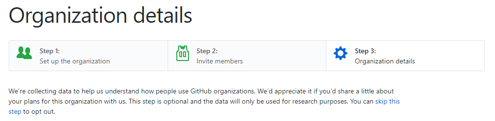
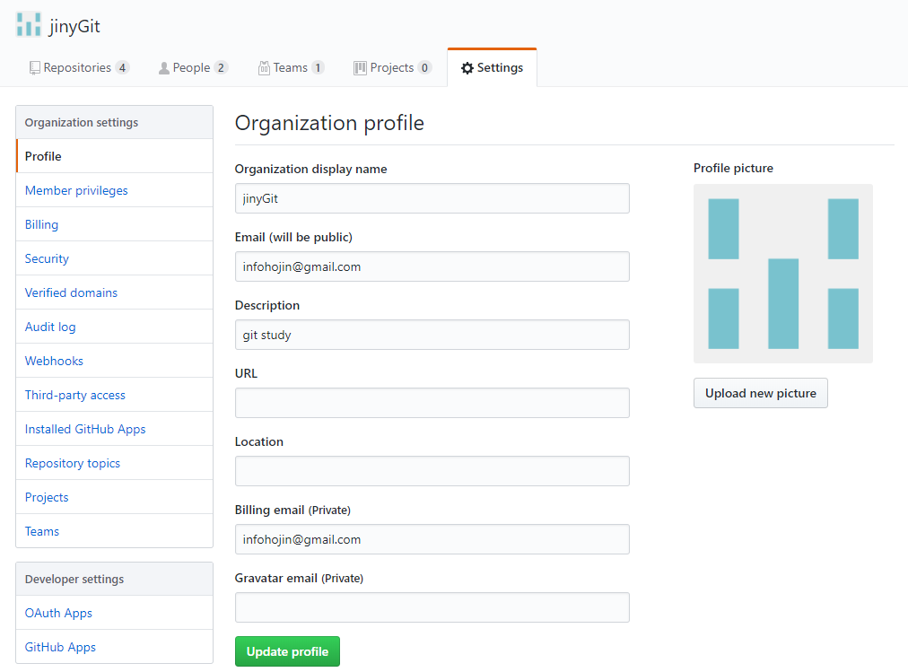

# 조직
기본적으로 모든 저장소는 개인 영역에 생성됩니다. 
오픈 소스 및 커뮤니티와 관련된 조직을 만들어 저장소를 분리할 수도 있습니다.

## 조직 저장소
개인 계정에서 누구나 새로운 조직을 생성할 수 있습니다. 이는 마치 페이스북 계정에서 새로운 그룹을 하나 만드는 것과 같습니다. 
조직은 무료로 생성할 수 있으며, 필요에 따라 여러 개를 만들어 운영할 수도 있습니다. 조직을 생성한 계정은 해당 조직의 메인 소유자가 됩니다. 
조직을 분리하여 저장소를 생성하여 관리할 수 있습니다. 이러면 자신의 개인적인 공간과 커뮤니티적인 공간을 분리하여 운영할 수 있습니다. 
또한, 공동의 관리를 필요로 할 때 조직은 매우 유용합니다. 

## 조직 생성
깃허브에서 새로운 조직을 생성해보겠습니다. 사이트 우측 상단의 [+] 표시를 클릭합니다. 
새로운 조직 생성 메뉴인 [New organization] 항목을 클릭합니다.

새로운 조직 생성 화면이 표시됩니다. 첫 번째로 조직의 이름과 이메일을 입력합니다. 
조직 이름은 중복되면 안 됩니다. 중복된 조직 이름은 `username is already taken`으로 메시지를 출력하고 비활성화됩니다.

사실 조직 이름과 사용자 아이디는 동일한 접속 형태입니다. 누군가 같은 조직 이름으로 계정을 사용하고 있다면 동일한 이름을 사용할 수 없습니다. 
반대로 생성된 조직 이름으로 새로운 계정도 생성되지 않습니다.

이는 접속 URL이 `http://github.com/조직이름` 형태로, 계정과 조직이 동일하기 때문입니다. 새로운 조직 생성 화면으로 이동합니다.

 

깃허브의 기능 대부분은 무료입니다. 하지만 일부 많은 고급 서비스에 대해서는 별도의 유료 정책도 가지고 있습니다.

 

`Team For Open Source(무료)`를 선택합니다.

`create Organization`을 클릭하면 바로 새로운 조직이 생성됩니다. 

## 조직 구성원
새로운 조직을 생성하면 생성자는 조직의 소유자가 됩니다. 조직의 소유자는 새로운 구성원을 추가할 수 있습니다. 
다양한 구성원을 추가하여 역할을 분담할 수 있으며, 오픈 소스 커뮤니티를 좀 더 효과적으로 운영할 수 있습니다.

 

추가할 구성원의 깃허브 계정 이메일을 입력합니다. `continue`를 선택하여 다음 단계로 넘어갑니다. 
조직 구성을 완료한 후에 별도의 메뉴에서 구성원을 추가할 수 있습니다. 

마지막으로 몇 가지 설문 조사를 하고 조직을 생성합니다.

하단의 `submit`을 선택하면 됩니다. 성공적으로 조직이 생성되었습니다. 
생성된 조직의 첫 대시보드를 확인할 수 있습니다.

## 조직 프로필
새로운 조직을 생성한 후에는 프로필을 설정해주는 것이 좋습니다. 조직 프로필은 개인 프로필과 유사합니다. 
커뮤니티의 성격과 설명을 설정하는 것과 유사합니다.

조직 이름 옆에 있는 프로필 아이콘을 클릭합니다. 
또는 조직 대시보드 상단에 있는 메뉴 중에서 설정(Settings)을 클릭합니다.

## 조직 저장소
아직 새로운 조직에는 저장소가 없습니다. 조직에 소속된 전용 깃 원격 저장소를 생성할 수 있습니다.
대시보드 메인 페이지에 위치한 `create a new repository` 버튼을 클릭합니다. 
저장소의 생성 방식은 기존과 동일하며 개인 저장소와 분리되어 생성됩니다.

## 권한
조직을 생성한 후에는 구성원을 추가할 수 있습니다. 각 구성원은 조직 내에서 허용하는 권한을 가지고 있습니다. 

권한은 크게 4가지로 구분합니다.
* none
* 관리자
* 쓰기
* 읽기

새로운 기본 구성원을 추가할 때는 미리 설정된 권한으로 추가됩니다. 
이렇게 기본 권한의 설정 값은 변경할 수 있습니다.

`조직 대시보드 -> 설정 -> member privileges` 항목에서 이 설정으로 이동합니다.

None, Read 구성원은 저장소의 복제(clone)과 풀(pull)만 가능합니다. 
쓰기 권한을 가진 사람은 저장소로 푸시와 풀이 가능합니다.

또는 관리자(admin) 권한을 부여할 수도 있습니다. 
하지만 관리자 권한 기능은 구성원을 추가/삭제할 수 있기 때문에 자동으로 부여되지 않고, 보통은 쓰기 권한 이상은 잘 부여하지 않습니다.