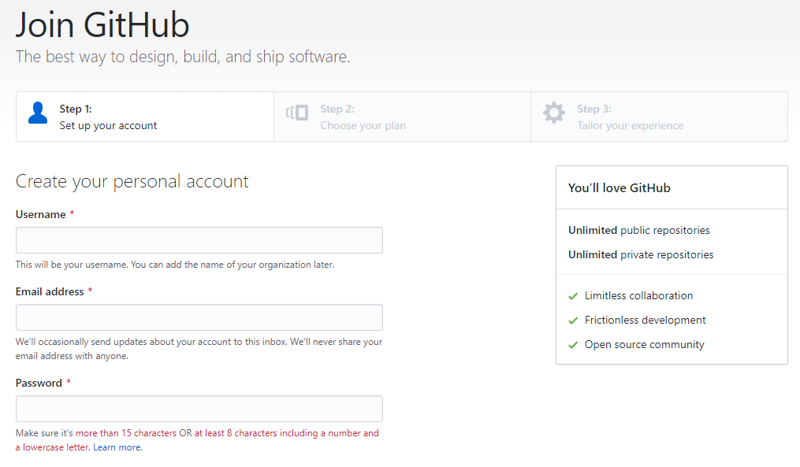
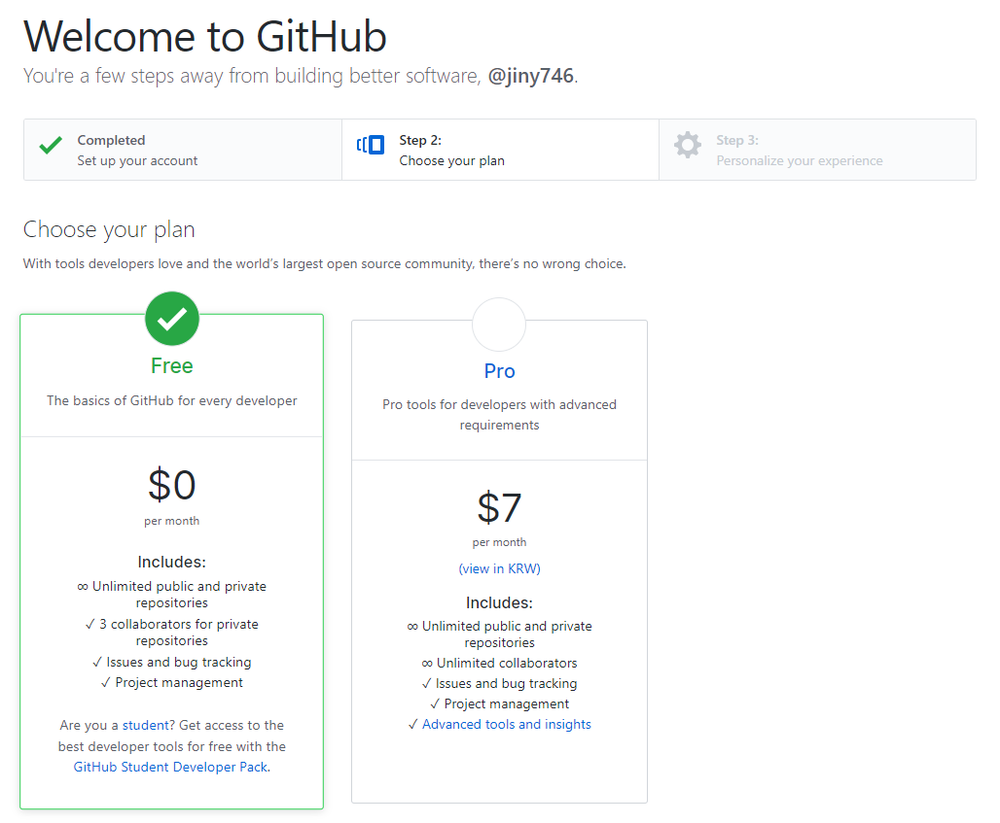

# 회원가입
---
깃허브 서비스를 사용하기위해서는 회원 가입을 해야 합니다.
깃허브의 공식 사이트는 `https://github.com` 입니다. 사이트로 접속합니다.


<br>

## 이메일을 준비하세요
---
깃허브에 회원가입을 하기 위해서는 `이메일` 주소가 필요합니다.  
깃은 커밋을 할때 사용자 정보로 이메일을 사용합니다. 동일한 이메일로 회원가입을 하는 것을 추천합니다.  

이메일은 향후 깃의 커밋과 각종 알람 등을 메일로 받아 보는 데 좋습니다. 
또한, 상대방의 이메일 주소를 알기 때문에 연락도 할 수 있을 것입니다.
사이트 오른쪽 상단의 `sign up`을 클릭합니다. 회원 가입 항목은 간단합니다. 
단한 몇 개의 정보 입력만으로 쉽게 회원 가입을 할 수 있습니다.  

<br>

### 저장소 이름 설정
사용자 이름은 `영문`으로 작성하며, `저장소를 구별`하는 값으로 사용합니다. 


`Username`은 중복하여 생성할 수 없습니다.  

```
https://github.com/사용자이름
```

또한, 다른 조직(organization) 이름으로도 사용을 할 수 없습니다.  
이메일 주소와 암호를 입력합니다. 

<br>

### 서비스 유형 선택
깃허브의 모든 서비스는 무료입니다.  
하지만 좀 더 큰 조직의 운영과 저장소를 유지하기 위해서는 약간의 비용을 받습니다. Free를 선택합니다.

 

Free는 공개된 저장소를 무제한으로 생성할 수 있습니다. 최근에는 3명까지 협업할 수 있는 개인 저장소도 제공하고 있습니다. 
가격 정책은 매번 변동되니, 이를 확인하여 계정을 유지하도록 합니다.

<br>

### 그외 정보 입력
마지막으로 간이 설문조사에 응답하면 회원 가입 절차가 끝납니다.

  

다음을 선택하면 깃허브의 첫 대시보드가 출력됩니다.  
상세한 대시보드 구성에 대해서는 다시 설명합니다.

 

<br>

## 이메일 인증
---
회원을 가입하게 되면 한 가지 더 해주어야 할 것이 있는데, 이메일을 통한 `본인 인증`입니다.

자신의 이메일을 확인해봅니다.  
메일목록에서 `[GitHub] Please verify your email address.`로 표시된 메일을 클릭하여 메일 안에 있는 `Verify email address`를 클릭합니다.  
자신의 메일 계정의 소유자인지를 확인하는 절차입니다.

 

이제 모든 회원 가입 절차가 끝났습니다.  
새로운 저장소를 만들어 깃허브를 사용해 봅니다.

<br>


