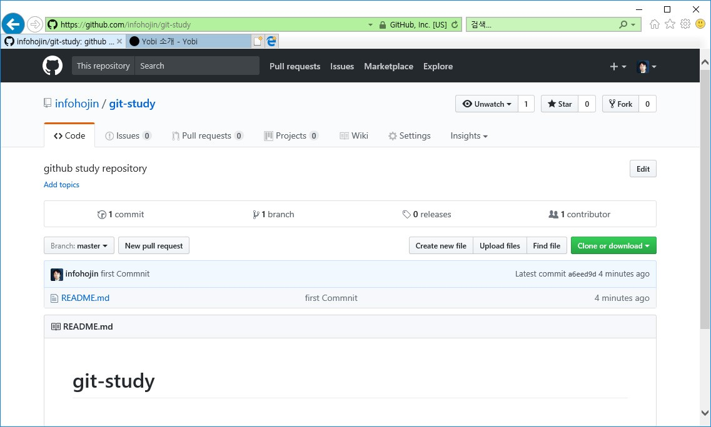

# 저장소 연결
---
대표적인 깃호스팅 사이트에 대해 알아보았습니다.  
또한, 저장소의 생성 방법에 대해서도 실습했습니다. 이번에서는 생성된 원격 저장소를 연결하는 방법에 대해서 알아보겠습니다.

<br>

## 저장소 주소
---
로컬 저장소에 깃호스팅으로 생성한 원격 저장소를 연결하기 위해서는 저장소 주소를 알아야 합니다. 

깃허브를 기준으로 설명합니다. 호스팅 사이트의 저장소로 이동하면 주소를 확인할 수 있습니다. 생성한 깃허브 저장소(repository)로 접속하면 간단한 인터페이스와 간단하게 설정 방법에 안내 페이지가 출력됩니다. 

깃허브는 원격 저장소를 연결할 수 있는 두 프로토콜인 HTTP와 SSH를 지원합니다. 친절하게 페이지를 제일 처음에 프로토콜을 선택하고, URL를 확인할 수 있습니다. 보통 깃허브 URL은 'https://github.com/아이디/저장소이름' 형태로 생성됩니다.

  

깃에서 보통 원격 저장소는 remote라는 표현을 자주 사용합니다. 

자신의 컴퓨터의 로컬 저장소는 한 개 이상 다수의 원격 저장소를 연결할 수 있습니다. 즉, 깃허브의 저장소도 연결할 수 있고 추가로 비트버킷의 저장소도 추가할 수 있습니다.

다만 각 저장소로 코드를 푸시하기 위해서는 별도로 명령을 나누어 실행해주어야 합니다.

<br>

## 원격 저장소 등록
---
깃허브 저장소 등록 실습을 위해 새로운 폴더를 하나 생성해봅니다.

```
$ mkdir github
$ cd github/
```

생성한 깃허브 저장소를 연결해보겠습니다.  
원격 저장소를 로컬 저장소와 연결을 하기 위해서는 먼저 등록해주어야 합니다. 

  
 

깃허브 안내 페이지에는 친절하게도 어떻게 원격 저장소를 연결하는지 방법과 예제 코드를 출력하고 있습니다. 따라해봅시다.

① echo 셸 명령어를 사용해 문자열이 들어간 파일을 하나 생성합니다.

```
$ echo "# git-study" >> README.md
```

② 저장소를 초기화합니다.

```
infoh@LAPTOP-M0820HEF MINGW64 /c/dev/github
$ git init
Initialized empty Git repository in C:/dev/github/.git/
```

③ 스테이지 영역에 파일을 등록하여 추적 상태로 변경합니다. 

```
infoh@LAPTOP-M0820HEF MINGW64 /c/dev/github (master)
$ git add README.md
warning: LF will be replaced by CRLF in README.md.
The file will have its original line endings in your working directory.
```

④ 첫 번째 커밋을 합니다.

```
infoh@LAPTOP-M0820HEF MINGW64 /c/dev/github (master)
$ git commit -m "first Commnit"
[master (root-commit) 0a1290c] first Commnit
 1 file changed, 1 insertion(+)
 create mode 100644 README.md
```

⑤ 원격 저장소를 등록합니다.
```
infoh@LAPTOP-M0820HEF MINGW64 /c/dev/github (master)
$ git remote add origin https://github.com/infohojin/git-study.git
```
앞에서 본 원격 저장소의 주소는 상당히 긴 이름입니다. 이를 깃에서 편리하게 작업할 수 있도록 별칭을 사용하여 짧은 이름으로 줄여서 사용할 수 있습니다. 주로 origin이라는 별칭을 많이 사용합니다.

⑥ 원격 저장소로 푸시합니다.
```
infoh@LAPTOP-M0820HEF MINGW64 /c/dev/github (master)
$ git push -u origin master
Counting objects: 3, done.
Writing objects: 100% (3/3), 221 bytes | 0 bytes/s, done.
Total 3 (delta 0), reused 0 (delta 0)
To https://github.com/infohojin/git-study.git
 * [new branch]      master -> master
Branch master set up to track remote branch master from origin.
```
원격 저장소를 연결하였다고 해서 내용이 동기화되어 있지는 않습니다. 현재 가지고 있는 첫 번째 커밋 버전을 원격 저장소로 전송하기 위해서는 push 명령어를 수행해야 합니다.

⑦ 갱신된 깃허브 원격 저장소를 확인합니다.

 

정상적으로 커밋이 푸시되었다면, 깃허브의 저장소 페이지를 갱신해봅니다 원격 저장소에 소스 파일들이 푸시되면 화면이 변경됩니다. 

깃허브에 저장소가 푸시되면 커밋된 로그들을 확인할 수 있습니다. 

<br>

### 원격 저장소 구성
---
깃허브는 깃과 관련된 다양한 시각화 정보를 제공합니다. 저장소의 제목 밑을 보면 다음과 같은 상태바가 하나 나타납니다.

  

한 개의 커밋과 한 개의 브랜치가 있다는 표시입니다. 또한, 소스를 함께 작업하고 기여자를 표시합니다.

이제 로컬 저장소와 원격 저장소의 데이터는 동일한 소스가 저장되어 있습니다. 깃허브 저장소와 좀 더 상세한 기능은 다음 장에서 추가로 설명할 것입니다.

<br>
