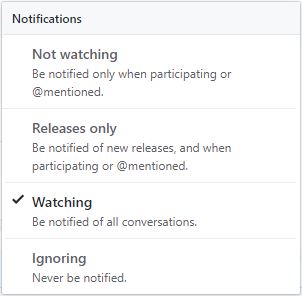
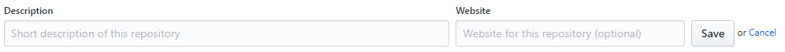

# 저장소
이번에는 생성된 깃허브 저장소의 구성 요소에 대해 알아보겠습니다. 저장소는 깃허브에서 가장 오랜 시간동안 머물고 있는 페이지입니다. 

## URL과 저장소 표시
저장소는 URL로 연결되어 있습니다. 사이트에 접속한 후 저장소로 이동하지 않고 직접 URL을 이용하여 바로 접속할 수 있습니다.

```
https://github.com/<username>/<repository>
```

위와 같은 형태입니다.

* Username : 사용자 아이디 또는 조직 이름입니다.
* Repository : 저장소 이름입니다. 중복이 허용되지 않습니다.

저장소로 접속하면 좌측 상단에 저장소의 이름이 표시됩니다.

  

저장소의 유형을 아이콘으로 표시합니다. 첫 번째는 조직 이름이나 계정 이름을 표시합니다. 클릭하면 조직이나 계정의 대시보드 화면으로 이동합니다. 두 번째는 저장소의 이름을 표시합니다.

## Star
저장소 우측 상단에는 3개의 버튼이 항상 출력됩니다. 

  

Star는 저장소의 인기를 측정할 수 있는 수치입니다. Star가 많을수록 깃허브에서 인기 있는 저장소로 주목받습니다.

프로젝트의 감사 의미로 Star를 표시하기도 합니다. 자신이 누른 Star의 저장소는 `https://github.com/stars`에서 확인할 수 있습니다.

## Watch 기능
깃허브에는 수많은 개발 프로젝트가 진행되고 있습니다. 관심이 있는 프로젝트가 있는데 매번 해당 프로젝트로 들어가 최신 사항을 알아보는 것은 힘들 것입니다.

Watch 버튼은 저장소를 구독하는 버튼입니다. Watch 기능은 관심 있는 저장소의 프로젝트에 대한 정보를 쉽게 살펴볼 수 있습니다. 또는 내부 팀 안에서 이루어지는 여러 프로젝트의 진행 사항을 참고하는 데도 매우 유용합니다.

구독을 하게 되면 저장소의 변경 사항들을 메일이나 알람으로 받을 수 있습니다.

Watch 설정은 4가지 방식이 있습니다.
  

## fork
포크를 통하여 권한이 없는 저장소를 복제하고, 수정 코드의 반영을 요청할 수 있습니다. 
포크는 깃허브가 지금의 인기를 얻게 만든 주요 기능입니다. 
권한이 없는 저장소를 자신의 계정으로 복사할 수 있습니다. 포크는 깃허브 계정 간의 복제를 의미합니다. 
포크된 저장소는 저장소 아이콘이 변경됩니다. 저장소 앞에 포크 모양의 아이콘이 표기되는 것을 볼 수 있습니다.

  

포크를 하게 되면 저장소의 포크 버튼에 숫자가 증가하게 됩니다.

  

포크의 숫자를 보고 저장소의 활성화 여부를 확인할 수 있습니다. 자세한 포크 작업에 대해서는 풀-리퀘스트 부분에서 설명하겠습니다.

## 저장소 설명
설명(description)은 저장소를 생성할 때 입력한 description 부분을 표시합니다. 
만일 설명 부분을 작성하지 않았다면 “No description, website or topics provided”와 같이 출력됩니다.

 
 
해당 글씨를 클릭하면 바로 설명 문구를 수정할 수 있습니다.

  