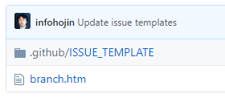
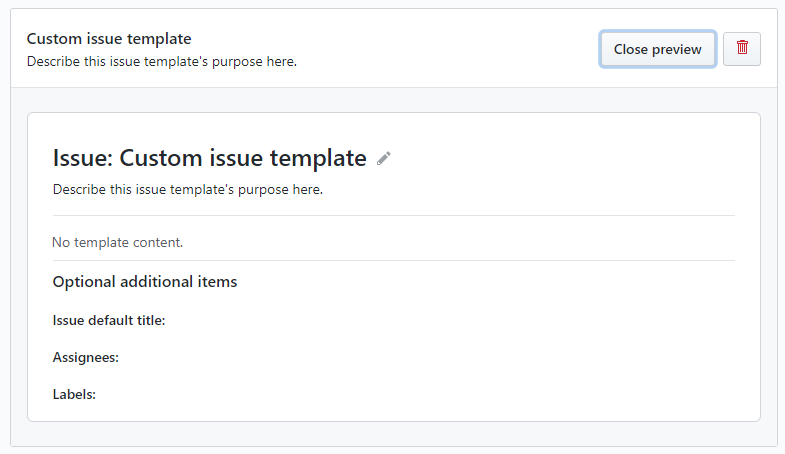
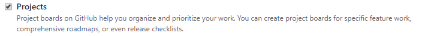
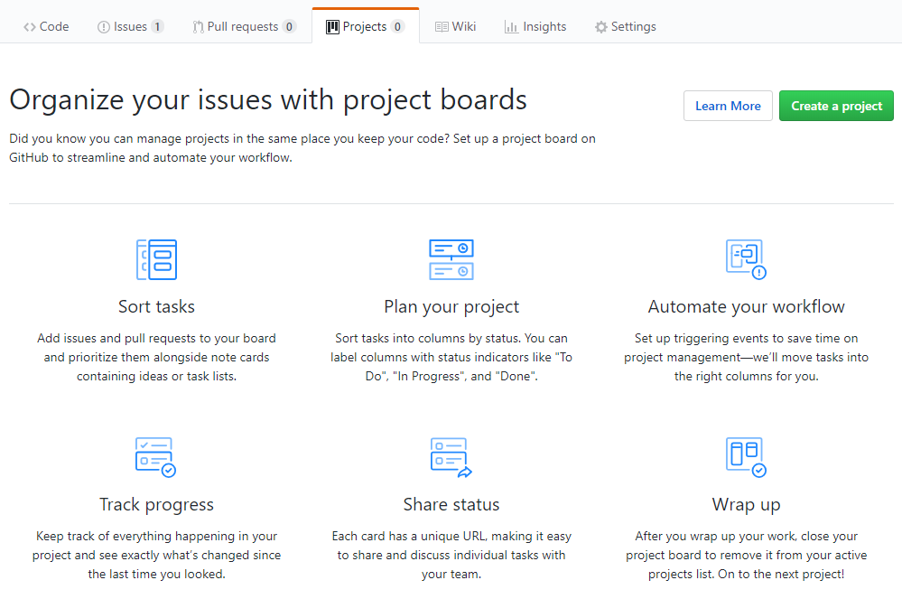
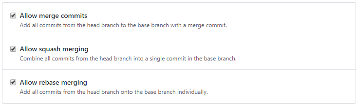
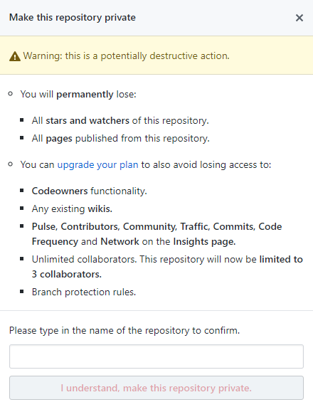
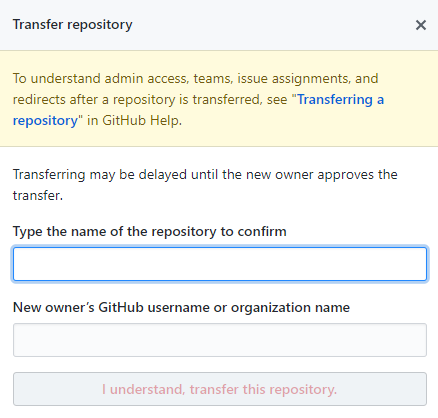
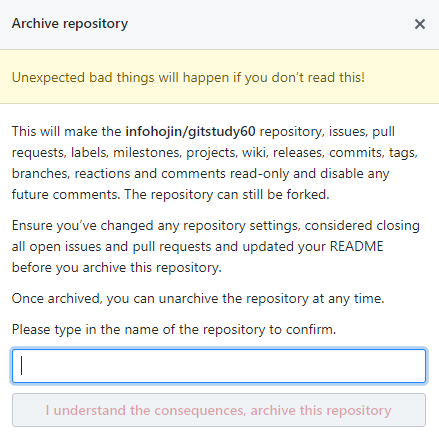
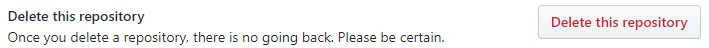
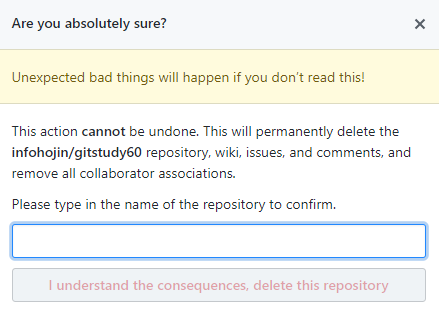

# 저장소 관리
---
깃허브는 각각의 모든 저장소별로 설정(setting) 기능을 제공합니다. 설정을 통하여 각 저장소의 동작을 다르게 할 수 있습니다. 
생성된 저장소의 이름을 변경, 삭제 등의 민감한 작업들도 할 수 있습니다. 크게 6개의 기능으로 구분됩니다.

<br>

## 이름 변경
---
생성된 저장소의 이름을 변경할 수 있습니다. 처음 저장소의 이름을 잘못 지었다고 해도 변경이 쉽습니다.

  

저장소는 깃허브의 URL 주소와 밀접한 관련이 있습니다. 저장소의 이름을 변경하면 주소도 같이 변경하게 됩니다. 하지만 이러한 '저장소 이름 변경'으로 배포된 URL이 변경되는 것은 중요한 문제입니다. 여러 사람들이 새로운 주소를 알리고, 재설정을 해야 하기 때문입니다.

```
http://github.com/계정이름/저장소이름
```

하지만 깃허브는 저장소 이름을 변경하여도 기존의 이름을 그대로 사용할 수 있도록 링크를 같이 제공합니다. 새로 변경된 URL로 접속하여도 변경 전의 이름 URL로 접속할 수 있습니다.

저장소의 이름은 중복할 수 없습니다. 만일 동일한 이름의 저장소가 있는 경우에는 해당 이름으로 변경할 수 없습니다.

<br>

### 위키
---
깃허브는 모든 저장소에 대해 각각의 독립된 위키(wiki) 저장소를 제공합니다. 기본적으로 위키 기능이 활성화되어 생성됩니다.

  

만일 저장소의 위키 기능을 사용하지 않는다면 이를 해제할 수 있습니다.

공개된 위키는 모든 사람이 접속하여 내용을 읽을 수 있습니다. 하지만 편집은 공동 작업자에게만 허용합니다.

  

<br>

### 이슈
---
깃허브는 모든 저장소에 대해 각각의 독립된 이슈(issue) 저장소를 제공합니다. 기본적으로 이슈 기능이 활성화되어 생성됩니다.

이슈는 버그 또는 기능 개선 등의 버그 추적 시스템(BTS)적인 부분 외에도 자신의 의견 등을 서로 교류할 수 있습니다. 프로젝트 운영자는 약간의 템플릿 이슈작성 양식을 제공하여 보다 일관적인 형식의 보고를 요청할 수 있습니다. 

  

[Set up templates”]를 선택합니다. 깃허브에서 제공하는 몇 가지 기본 템플릿이 있습니다. 이를 선택합니다.

  

선택한 템플릿마다 이슈 양식이 새롭게 추가됩니다. 추가 양식을 설정하면 저장소에는 .github/ISSUE_TEMPLATE 파일이 추가됩니다.

  

여러 개의 양식을 추가할 수 있으며, 편집도 가능합니다.

  

<br>

### 프로젝트
---
깃허브 저장소의 탭 중에는 프로젝트 항목이 있습니다. 프로젝트 항목의 활성/비활성 상태를 변경할 수 있습니다.

  

프로젝트 보드는 작업을 구성하고 우선 순위를 지정할 수 있습니다. 또는 특정 기능 작업, 포괄적인 로드맵 또는 릴리스 체크리스트를 위한 프로젝트 보드를 만들 수 있습니다.

  

<br>

### 취약점 경고
---
보안 취약점에 대한 경고를 수신합니다.

 

<br>

### 병합 조건
---
풀-리퀘스트를 이용하여 병합 조건을 허용합니다. 일반적인 병합, 스쿼시 병합, 리버스 병합 등이 허용되는 타입을 설정합니다. 최소한 한 개 이상의 병합 조건은 허용해야 합니다.

 

<br>

### 깃허브 페이지
---
깃허브 페이지 운영과 관련하여 설정할 수 있습니다. 

 

<br>

### 비공개 전환
---
공개로 생성된 저장소를 비공개로 전환할 수 있습니다.

  

저장소를 비공개로 전환하면, 공개 저장소만의 몇 가지 설정들이 같이 삭제됩니다.

* 모든 Star와 Watch 기록
* 저장소를 이용하여 배포한 페이지

몇 가지 기능들은 유료 회원으로 전환할 때 유지할 수도 있습니다.

  

중요한 사항을 변경할 때에는 확인을 요청합니다. 계정/저장소 이름을 입력하여 줍니다.

<br>

### 소유권 이전
---
저장소의 소유권을 이전할 수 있습니다.

  

 

중요한 사항을 변경할 때에는 확인을 요청합니다. 계정/저장소 이름을 입력하여 줍니다.

<br>

### 저장소 비활성화
---
저장소를 비활성화하여 읽기 전용으로 보관합니다. 

  
 

중요한 사항을 변경할 때에는 확인을 요청합니다. 계정/저장소 이름을 입력하여 줍니다.

<br>

### 저장소 삭제
---
저장소를 삭제할 수 있습니다. 작업 시 매우 주의해야 합니다.


 

중요한 사항을 변경할 때는 확인을 요청합니다. 계정/저장소 이름을 입력하여 줍니다.

<br>