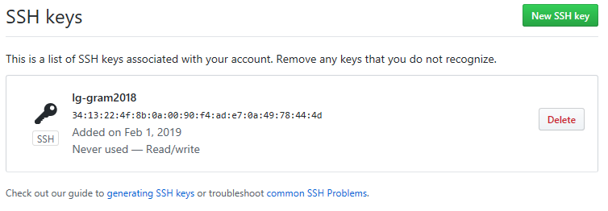

# SSH 등록
원격 저장소에 접속하여 자신의 로컬 저장소와 동기화 작업을 수행합니다. SSH를 이용하여 키를 입력하면 매번 비밀번호를 입력하지 않고도 원격 저장소에 접속할 수 있습니다.

## SSH
시큐어 셸(Secure Shell)은 네트워크를 통하여 다른 컴퓨터에 로그인하거나 명령을 시킬 수 있는 프로토콜 중 하나입니다. 기존에는 텔넷(telnet) 등을 이용하여 원격 접속을 많아 했으나 보안상의 문제로 인하여 SSH 접속으로 대체되고 있습니다.

SSH는 암호화 기법을 통하여 데이터를 전송합니다. 만일 통신 상에서 데이터가 노출되어도 암호화되어 있기 때문에 좀 더 안전합니다. 기본적으로 SSH는 22번 포트를 사용합니다.

깃허브를 비롯한 대부분의 호스팅은 SSH를 기반으로 하는 GIT 프로토콜을 지원합니다.

## 접속 암호
서버와 연결 작업을 할 때는 비밀번호를 입력해야 합니다. 처음 깃을 설치하고 원격 저장소와 연결하였다면 푸시(push) 명령어를 실행할 때 암호를 물어봅니다.

```
infoh@LAPTOP-M0820HEF MINGW64 /c/dev/git-clone/remote (master)
$ git push
git@211.110.1.195's password:
```

매번 원격 저장소와의 작업할 때마다 암호를 입력하는 것은 불편합니다. SSH는 서버와 로컬 컴퓨터 간에 암호 입력 없이 자동으로 로그인할 수 있는 키를 지원합니다.

## 키 생성
SSH 키를 생성하여 서버에 등록하면 자동으로 로그인 처리를 할 수 있습니다. SSH 키를 생성하기 위해 먼저 자신의 계정으로 셸을 실행합니다. 셸을 실행할 때는 관리자 권환으로 실행합니다.

  

자신의 계정에서 ssh-keygen -t rsa 명령어를 실행합니다. 실행 후에 암호를 입력하면 RSA 기반의 SSH 키가 생성됩니다.

```
infoh@DESKTOP-VAKLOFQ MINGW64 ~
$ ssh-keygen -t rsa
Generating public/private rsa key pair.
Enter file in which to save the key (/c/Users/infoh/.ssh/id_rsa): 엔터키 입력
Created directory '/c/Users/infoh/.ssh'.
Enter passphrase (empty for no passphrase): 비밀번호 입력
Enter same passphrase again: 비밀번호 입력
Your identification has been saved in /c/Users/infoh/.ssh/id_rsa.
Your public key has been saved in /c/Users/infoh/.ssh/id_rsa.pub.
The key fingerprint is:
SHA256:ri2KWBepfdHXeiegeeL0tYg5lbfvpgKn7t7lnNCi3lI infoh@DESKTOP-VAKLOFQ
The key's randomart image is:
+---[RSA 2048]----+
|               	|
|                	|
|                	|
|     . .   .     	|
|    o . S o..    	|
|   o . o.+E+.    	|
|  o o . **=.*..  	|
| o o ..=+X.X.=.  	|
|. . ...*@o=.*=o  	|
+------[SHA256]------+
```

SSH키가 정상적으로 생성되면 .ssh 폴더가 만들어집니다. .ssh 폴더로 이동합니다. 
```
$ cd .ssh

infoh@DESKTOP-VAKLOFQ MINGW64 ~/.ssh
$ ls -all
total 21
drwxr-xr-x 1 infoh 197609    0 2월   1 18:47 ./
drwxr-xr-x 1 infoh 197609    0 2월   1 18:47 ../
-rw-r--r-- 1 infoh 197609 1766 2월   1 18:47 id_rsa
-rw-r--r-- 1 infoh 197609  403 2월   1 18:47 id_rsa.pub
```

`.ssh` 폴더에는 두 개의 파일이 생성되어 있습니다. 
`id_rda`와 `id_rsa.pub` 파일입니다. 생성된 이 키들은 한 쌍으로 짝을 이루어 생성됩니다. 

id_rsa는 개인키를 말합니다. id_rsa.pub는 공개된 키를 말합니다.

## 키 복사
자신의 계정에서 생성한 SSH키를 서버로 복사해 두면 자동으로 로그인을 처리할 수 있습니다.

ssh-copy-id 명령어는 자신의 SSH키를 해당 서버에 복사해주는 명령입니다. 다음과 같이 입력합니다.

```
infoh@LAPTOP-M0820HEF MINGW64 ~
$ ssh-copy-id git@211.110.1.195
/usr/bin/ssh-copy-id: INFO: Source of key(s) to be installed: "/c/Users/infoh/.ssh/id_rsa.pub"
/usr/bin/ssh-copy-id: INFO: attempting to log in with the new key(s), to filter out any that are already installed
/usr/bin/ssh-copy-id: INFO: 1 key(s) remain to be installed -- if you are prompted now it is to install the new keys
git@211.110.1.195's password:

Number of key(s) added: 1

Now try logging into the machine, with:   "ssh 'git@211.110.1.195'"
and check to make sure that only the key(s) you wanted were added.
```

한번의 비밀번호를 물어보고, 자신의 키를 서버로 복사합니다. 서버에 접속하여 키가 복사되었는지 확인합니다.

```
[git@ns ~]$ ls -all
total 28
drwx------  4 git  git  4096 2017-10-08 15:30 .
drwx--x--x 22 root root 4096 2017-10-08 13:48 ..
-rw-r--r--  1 git  git    18 2014-10-16 22:56 .bash_logout
-rw-r--r--  1 git  git   202 2016-12-14 23:27 .bash_profile
-rw-r--r--  1 git  git   124 2014-10-16 22:56 .bashrc
drwxrwsr-x  7 root git  4096 2017-10-08 14:02 remote
drwx------  2 git  git  4096 2017-10-08 15:30 .ssh
[git@ns ~]$ cd .ssh/
[git@ns ~/.ssh]$ ls -all
total 12
drwx------ 2 git git 4096 2017-10-08 15:30 .
drwx------ 4 git git 4096 2017-10-08 15:30 ..
-rw------- 1 git git  403 2017-10-08 15:30 authorized_keys
[git@ns ~/.ssh]$
```

만일 위의 자동 복사 방법이 잘 되지 않는다면, 직접 수동으로 키를 복사할 수도 있습니다. 원격 서버의 계정으로 접속합니다. 서버 계정의 .ssh 디렉터리로 이동합니다. 만일 .ssh 폴더가 없다면 mkdir .ssh 명령어로 새로 생성하면 됩니다.

```
[root@ns /home/git]# mkdir .ssh
[root@ns /home/git]# cd .ssh
[root@ns /home/git/.ssh]#
```

.ssh 디렉터리 안에 새로운 파일 autorized_keys를 생성합니다. autorized_keys 파일 안에 자신의 컴퓨터의 id_rsa.pub 안의 내용을 전부 복사해서 넣으면 됩니다.

## 자동 접속 실험
키가 정상적으로 복사되면 자동으로 SSH 로그인을 처리합니다.

```
infoh@LAPTOP-M0820HEF MINGW64 /c/dev/git-clone/remote (master)
$ git push
Everything up-to-date
```

비밀번호 없이도 작업할 수 있습니다.

## 이중 계정 사용
하나의 컴퓨터에 다수의 깃허브 계정을 SSH 방식으로 등록하여 사용을 할 수 있습니다. 계정을 이용하여 SSH를 생성할 때 계정 이름을 같이 입력합니다.

다음은 계정을 이용한 SSH 키 생성 방법입니다.

```
infoh@hojin1 MINGW64 ~/.ssh
$ ssh-keygen -t rsa -b 4096 -C "이메일"
Generating public/private rsa key pair.
Enter file in which to save the key (/c/Users/infoh/.ssh/id_rsa): id_rsa2
Enter passphrase (empty for no passphrase):
Enter same passphrase again:
Your identification has been saved in id_rsa2.
Your public key has been saved in id_rsa2.pub.
The key fingerprint is:
SHA256:/zeKZwgesPzy9JqtmZIi0WTw4okbjZZ9wox2N55EuvM infohojin@naver.com
…생략…
```
기본적으로 생성되는 SSH 키의 파일 이름은 id_rsa입니다. 여러 개의 SSH 키를 생성할 때는 중복하여 덮어 쓰기할 수 있습니다. 다른 이름으로 저장하도록 합니다.

생성된 SSH 파일들을 확인합니다. 필자는 2개의 SSH 키를 생성하였습니다.
```
infoh@hojin1 MINGW64 ~/.ssh
$ ls
id_rsa  id_rsa.pub  id_rsa2  id_rsa2.pub  
```
두 개의 계정을 이용하여 깃을 접속할 수 있도록 호스트 환경 설정 파일을 추가합니다. 

```
$ vi ~/.ssh/config
```
에디터를 실행하여 다음과 같이 입력합니다.
```
# 첫 번째 계정
Host github.com
HostName github.com
User git
IdentityFile ~/.ssh/id_rsa

# 두 번째 계정
Host github.com2
HostName github.com
User git
IdentityFile ~/.ssh/id_rsa2
```

임의적으로 HOST 이름을 구분하여 줍니다. 각 호스트로 접속 시 사용할 SSH 키를 따로 지정합니다.

생성된 키와 호스트는 다음과 같이 확인할 수 있습니다.

```
infoh@hojin1 MINGW64 ~/.ssh
$ ssh -T git@github.com-2
The authenticity of host 'github.com (192.30.255.113)' can't be established.
RSA key fingerprint is SHA256:nThbg6kXUpJWGl7E1IGOCspRomTxdCARLviKw6E5SY8.
Are you sure you want to continue connecting (yes/no)? yes
Warning: Permanently added 'github.com,192.30.255.113' (RSA) to the list of known hosts.
Enter passphrase for key '/c/Users/infoh/.ssh/id_rsa2':
Hi hojin74! You've successfully authenticated, but GitHub does not provide shell access.
```

각각 생성한 SSH를 깃허브의 개인 설정에 추가합니다. 

## SSH 깃허브 등록
깃허브는 SSH를 이용한 접속을 허용합니다. 

생성한 SSH를 깃허브 계정에 등록합니다. 자신의 계정 -> 설정(setting)으로 이동합니다. [New SSH key]를 선택합니다.

   

깃허브는 여러 개의 SSH를 등록할 수 있습니다. 집/회사 등 여러 장비를 사용하는 경우 같이 설정하면 편리합니다.

  

공개키를 확인해서 복사 붙여넣기를 합니다.

```
infoh@DESKTOP-VAKLOFQ MINGW64 ~/.ssh
$ cat id_rsa.pub
ssh-rsa AAAAB3N …중간 생략 … OP-VAKLOFQ
```

다음과 같이 등록된 화면을 확인할 수 있습니다.

   

## 계정 리모트
다수의 계정으로 구분된 경우에는 원격 서버의 설정이 약간 다릅니다. 기본적으로 깃허브의 원격 저장소를 등록하면 .git/config 파일에 리모트 정보가 추가됩니다.

```
[remote "origin"]
    url = https://github.com/jinygit/hello.git
    fetch = +refs/heads/*:refs/remotes/origin/*
```

여러 계정을 이용하여 접속하는 경우 리모트 설정 부분을 약간 변경해주도록 합니다. 

```
url = git@호스트이름:계정이름/저장소이름.git
```

다음은 두 번째 계정으로 접속하는 설정의 예입니다.

```
[remote "origin"]
    url = git@github.com-2:hojin74/hello.git
    fetch = +refs/heads/*:refs/remotes/origin/*
```

풀-리퀘스트를 다루는 장에서 2개의 계정을 이용하여 작업해보는 실습을 같이 할 것입니다.

