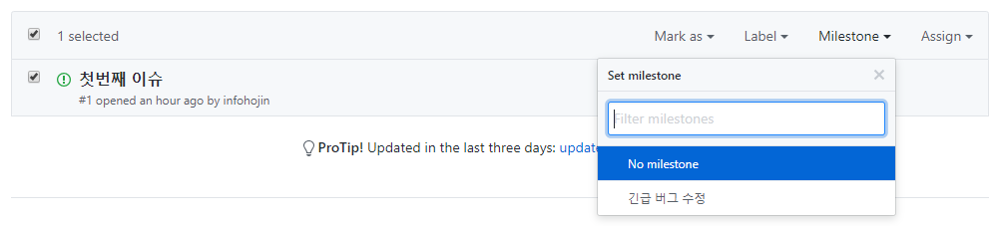

# 마일스톤 이슈 연결
---
마일스톤에는 이슈를 연결할 수 있습니다. 이슈 추가는 크게 2가지 방식입니다. 

 

## 이슈 연결하기
---
각각의 이슈에서 마일스톤을 선택하여 추가할 수 있습니다. 
이슈를 선택합니다. 오른쪽에서 `Milestone`을 선택합니다.

  

생성된 마일스톤을 추가할 수 있습니다.

 

## 복수의 이슈 추가하기
---
이번에는 `여러 이슈`를 목록에서 한 번에 선택하여 마일스톤을 추가하는 방법입니다. 

  

목록에서 이슈들을 체크합니다.  
이슈 메뉴에서 마일스톤을 선택하여 추가합니다.

 