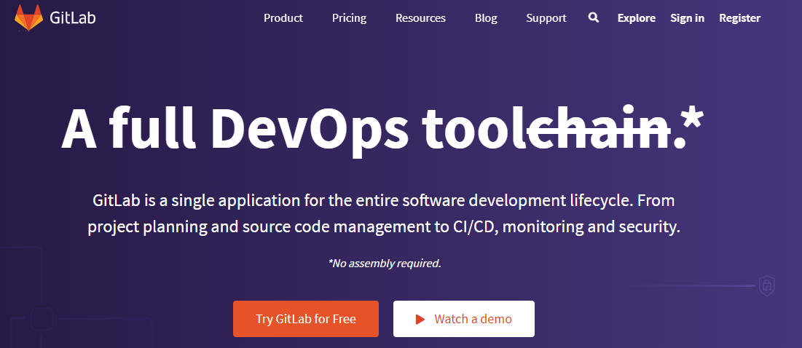
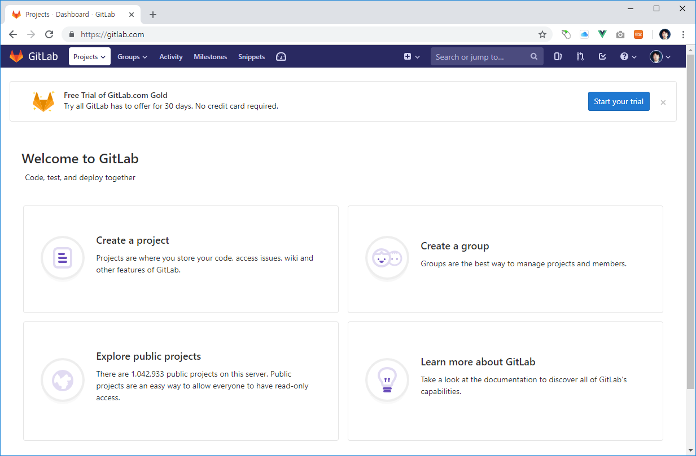

## 깃랩
깃랩(gitlab) 또한 깃허브나 비트버킷과 같은 깃 호스팅입니다. 차이점이라면 깃랩을 이용하여 자체 호스팅을 구축할 수 있다는 점입니다.

 

### 서비스 소개
깃랩은 오픈 소스로 누구나 내려받아 설치 사용할 수 있습니다. 또한, 자체적인 호스팅 서비스를 이용할 수 있습니다. 공식 사이트는 gitlab.com입니다.

 

깃랩은 커뮤니티 버전과 엔터프라이즈 버전으로 구분됩니다.

 

### 회원 가입
서비스 이용을 위해서 회원 가입을 합니다. 회원 가입 후 다음과 같은 대시보드 화면으로 이동합니다.

  

   