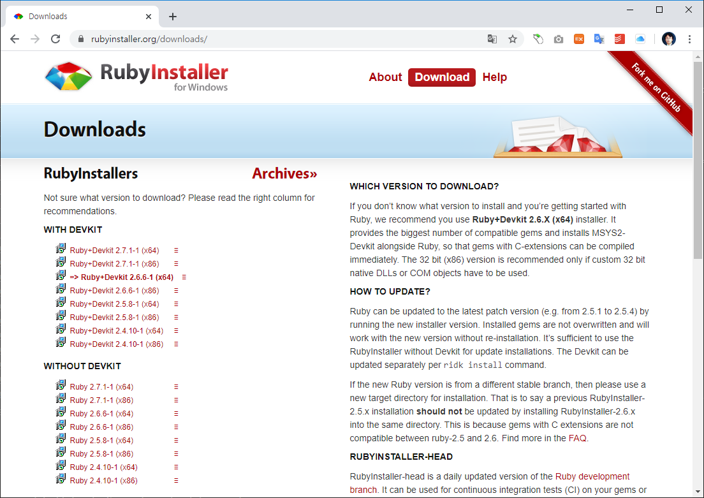

# 루비설치
---

## 공식사이트
루비의 공식사이트는 http://rubyinstaller.org/downloads/ 입니다. 공식 사이트에 접속하면, 무료로 루비를 다운로드 받을 수 있습니다.



운영체제 버전에 맞게 다운로드합니다. 윈도우 환경에서 루비를 설치해 보도록 하겠습니다. 

### 설치 진행
다운로드 받은 파일을 설치 진행 합니다.

## Jekyll
`Jekyll` 은 `ruby`라는 언어로 제작이 된 소프트웨어 입니다. 루비가 설치가 되어 있다면, 루비 패키지 메니저 `gem`을 사용하여 지킬을 설치할 수 있습니다. 터미널창을 실행한 후에 다음과 같이 입력을 합니다.

```
gem install jekyll
```


### 지킬 공식사이트
---
지킬을 이용하여 웹사이트를 만들고, 화면을 처리하여 깃 저장소에 등록을 하시면 멋진 정적 웹사이트를 운영할 수 있습니다. 
보다 자세한 것은 https://jekyllrb.com/ 를 참고하시길 바랍니다. 


<br>

### 기본 템플릿 생성
---
지킬을 이용하여 웹사이트의 기본 템플릿을 생성할 수 있습니다. 현재의 폴더에 제킬 프로젝트 사이트 하나를 생성해 봅니다.

```
c:\jekyll>jekyll new 폴더명
```

지정한 폴더명으로 새로운 템플릿 사이트를 생성합니다. 만일 현재의 폴더에 생성을 할때에는 폴더명 대신에 `.`을 사용합니다.

```
c:\jekyll>dir/w
 C 드라이브의 볼륨: windows
 볼륨 일련 번호: 447E-0DB0

 c:\jekyll 디렉터리

[.]           [..]          .gitignore    404.html      about.md      Gemfile       index.md      _config.yml
[_posts]
               6개 파일               3,801 바이트
               3개 디렉터리  18,317,680,640 바이트 남음
```

<br>

### 서버실행
---
생성한 템플릿 사이트를 로컬컴퓨터에서 실행해 보도록 합니다. 지킬은 자신의 컴퓨터를 웹서버로 구동을 할 수 있는 `serve` 명령을 제공합니다.

```
c:\jekyll>jekyll serve
Configuration file: c:/jekyll/_config.yml
            Source: c:/jekyll
       Destination: c:/jekyll/_site
 Incremental build: disabled. Enable with --incremental
      Generating...
                    done in 0.631 seconds.
  Please add the following to your Gemfile to avoid polling for changes:
    gem 'wdm', '>= 0.1.0' if Gem.win_platform?
 Auto-regeneration: enabled for 'c:/jekyll'
    Server address: http://127.0.0.1:4000/
  Server running... press ctrl-c to stop.
```

이와 같이 출력되면 콘솔을 닫지 말고 표기된 IP주소와 포트로 브라우저 접속을 해봅니다.  
http://127.0.0.1:4000/

제킬(Jekyll)로 생성된 정적 웹페이지를 확인해 보실 수 있습니다. 


