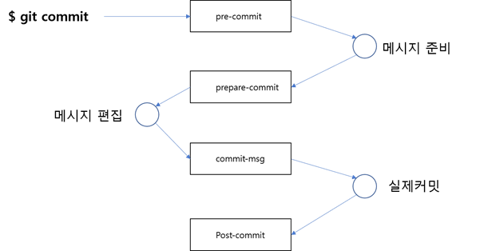

## 이메일 훅
---
이메일 훅은 크게 3가지의 종류를 지원합니다. 깃의 페치 파일을 이메일로 전송하거나 받을 때 사용할 수 있습니다. 

  

 

### applypatch-msg
---
페치의 커밋 메시지를 확인하거나 수정하고자 할 때 사용할 수 있습니다. 페치 메시지를 확인하기 위해 커밋 작성자가 보낸 파일 이름을 인자값으로 전달합니다.

종료값이 0이 아닌 값을 반환하면 페치하지 않습니다.

 

### pre-applypatch
---
git am 명령어로 페치를 시도할 때 실행됩니다. 페치를 적용하고 커밋을 위한 스냅샷을 생성할 때 이를 검사하기 위한 목적으로 사용됩니다. 페치 결과를 커밋하기 전에 실행됩니다.

pre-applypatch는 pre-commit 스크립트의 기능과 매우 유사합니다.

페치된 내용을 커밋 전단계에서 테스트를 수행할 수 있습니다. 만일 테스트의 동작에 문제가 발생하면 반환값을 0이 아닌 값을 통하여 am 명령을 취소합니다.

 

### post-applypatch
---
페치를 적용한 후에 페치를 보낸 개발자, 그룹에게 페치 적용을 통보할 수 있습니다. 이 스크립트는 단순히 완료된 페치를 통보하는 역할만 합니다. 

post-applypatch는 post-commit 페치 동작과 유사합니다. 어떤 반환값을 이용하여 페치 동작을 취소할 수는 없습니다.
