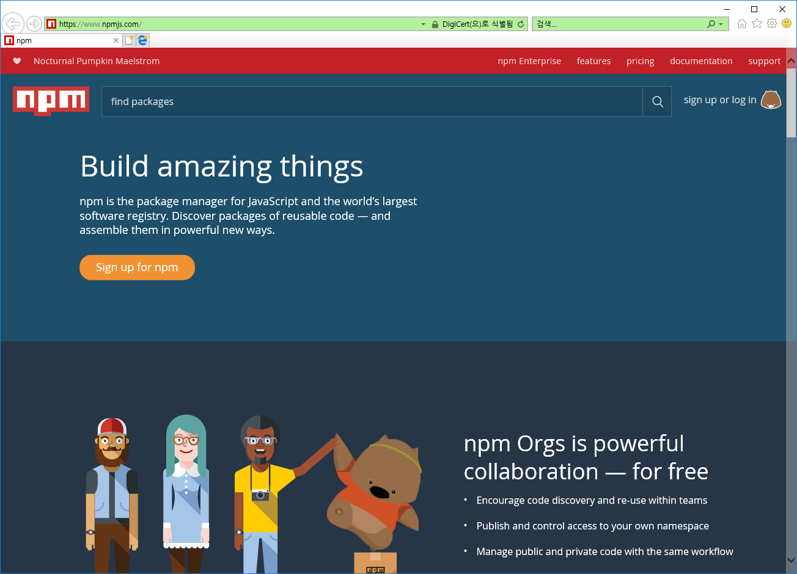

## NPM
NPM은 Node package manager의 약자 입니다. 노드 기반으로 작성된 라이브러리 패키지를 관리해 주는 도구 입니다.  

### npm 사이트
NPM의 공식사이트는 https://www.npmjs.com 입니다. Npm은 무료로 회원 가입하여 사용을 할 수 있습니다.  

 

NPM 사이트는 다양한 자바스크립트 언어로 작성된 코드의 허브 저장소 입니다.다른 개발자들이 작성한 코드를 찾아 볼 수 있고, 공개된 패키지를 쉽게 설치 할 수 있도록 도와 줍니다. 현재 npm 사이트에는 2019년 2월 현재 90만개 이상의 패키지들이 등록되어 있습니다.  

### 패키지 생성
Npm 패키지는 고유한 정보를 package.json 파일안에 기록해 둡니다. 이 파일은 npm init 명령을 통하여 생성할 수 있습니다.  

Npm은 자체적인 깃 호스팅을 운영하고 있습니다. Npm publish 명령은 현재의 패키지를 npm 호스팅에 등록을 하는 과정을 자동으로 수행합니다.  

등록한 패키지를 삭제할때는 npm unpublish 명령을 사용할 수 있습니다. 다만, 24시간 이내만 가능합니다.  

### 깃허브 연동
NPM의 package.json 속성중에는 git repository 설정부분이 있습니다. 이곳에 코드의 깃 저장소를 적어 줍니다. 향후 배포되는 코드에 문제 발생시 이 주소를 찾아 문제를 보고하시면 됩니다. 또한, 코드 개선에 기여자로 참여할 수 있습니다.  

NPM 저장소를 통하여 페키지를 설치하는 방법이 일반적입니다. 하지만 깃허브에 있는 노드 페키지 라이브러리를 직접 설치를 할 수 있습니다.  

NPM은 다양한 방법의 설치 옵션을 제공합니다. 콘솔창에서 npm help install 명령을 실행해 보면 몇가지의 설치 옵션방법이 출력이 됩니다.  

```bash
infoh@DESKTOP-VAKLOFQ MINGW64 /e/jinygit
$ npm -help install

npm install (with no args, in package dir)
npm install [<@scope>/]<pkg>
npm install [<@scope>/]<pkg>@<tag>
npm install [<@scope>/]<pkg>@<version>
npm install [<@scope>/]<pkg>@<version range>
npm install <folder>
npm install <tarball file>
npm install <tarball url>
npm install <git:// url>
npm install <github username>/<github project>

aliases: i, isntall, add
common options: [--save-prod|--save-dev|--save-optional] [--save-exact] [--no-save]
```

깃의 저장소를 이용하여 직접 설치를 할 수 있습니다.  

```
$ npm install 저장소URL
```

### 실습
새로운 npm 모듈을 위한 폴더를 하나 생성합니다.  

```
$ mkdir npmtest
$ cd npmtest
infoh@DESKTOP-VAKLOFQ MINGW64 /e/jinygit/npmtest
```

깃 저장소를 초기화 합니다.  

```
infoh@DESKTOP-VAKLOFQ MINGW64 /e/jinygit/npmtest
$ git init
Initialized empty Git repository in E:/jinygit/npmtest/.git/
```

깃허브에 새로운 저장소를 하나 생성합니다. 원격 저장소를 등록합니다.  

```
infoh@DESKTOP-VAKLOFQ MINGW64 /e/jinygit/npmtest (master)
$ git remote add origin https://github.com/jinygit/mpntest.git
```

NPM 패키지를 초기화 합니다.  

```
infoh@DESKTOP-VAKLOFQ MINGW64 /e/jinygit/npmtest
$ npm init
This utility will walk you through creating a package.json file.
It only covers the most common items, and tries to guess sensible defaults.

See `npm help json` for definitive documentation on these fields
and exactly what they do.

Use `npm install <pkg>` afterwards to install a package and
save it as a dependency in the package.json file.

Press ^C at any time to quit.
package name: (npmtest) jinyjs-npmtest
version: (1.0.0)
description: 깃허브 npm테스트
entry point: (index.js)
test command:
git repository:
keywords:
author:
license: (ISC)
About to write to E:\jinygit\npmtest\package.json:

{
  "name": "jinyjs-npmtest",
  "version": "1.0.0",
  "description": "",
  "main": "index.js",
  "scripts": {
    "test": "echo \"Error: no test specified\" && exit 1"
  },
  "author": "",
  "license": "ISC"
}
Is this OK? (yes)
```

Npm 패키지 생성을 위한 package.json 파일을 만들었습니다. 이번에는 새로운 테스트 모듈 파일을 생성해 봅니다.  

Index.js
```
module.exports = () => {
    return 'hello gitnpm package';
}
```

파일 등록과 커밋을 합니다.  

```
infoh@DESKTOP-VAKLOFQ MINGW64 /e/jinygit/npmtest (master)
$ git add index.js

infoh@DESKTOP-VAKLOFQ MINGW64 /e/jinygit/npmtest (master)
$ git add package.json
warning: LF will be replaced by CRLF in package.json.
The file will have its original line endings in your working directory

infoh@DESKTOP-VAKLOFQ MINGW64 /e/jinygit/npmtest (master)
$ git commit -m "first npm"
[master (root-commit) 3f85879] first npm
 2 files changed, 14 insertions(+)
 create mode 100644 index.js
 create mode 100644 package.json
```

작성된 npm 패키지 코드를 깃허브 원격 저장소로 푸시를 합니다.  

```
infoh@DESKTOP-VAKLOFQ MINGW64 /e/jinygit/npmtest (master)
$ git push -u origin master
Enumerating objects: 4, done.
Counting objects: 100% (4/4), done.
Delta compression using up to 8 threads
Compressing objects: 100% (4/4), done.
Writing objects: 100% (4/4), 456 bytes | 228.00 KiB/s, done.
Total 4 (delta 0), reused 0 (delta 0)
To https://github.com/jinygit/mpntest.git
 * [new branch]      master -> master
Branch 'master' set up to track remote branch 'master' from 'origin'.

infoh@DESKTOP-VAKLOFQ MINGW64 /e/jinygit/npmtest (master)
```

이제는 깃허브의 주소를 이용하여 npm 패키지를 설치해 보도록 합니다. 새로운 폴더를 하나 생성합니다. 또한, npm init을 통하여 초기화를 합니다.  

```
infoh@DESKTOP-VAKLOFQ MINGW64 /e/jinygit/jinyjs-npmapp
$ npm install https://github.com/jinygit/mpntest.git
npm notice created a lockfile as package-lock.json. You should commit this file.
npm WARN jinyjs-npmapp@1.0.0 No description
npm WARN jinyjs-npmapp@1.0.0 No repository field.

+ jinyjs-npmtest@1.0.0
added 1 package and audited 1 package in 9.94s
found 0 vulnerabilities
```

깃허브 저장소를 이용하여 페키지를 설치하였습니다. ls명령을 통하여 설치 디렉토리를 확인해 봅니다.  

```
infoh@DESKTOP-VAKLOFQ MINGW64 /e/jinygit/jinyjs-npmapp
$ ls
node_modules/  package.json  package-lock.json
```

새로운 node_modules 패키지가 생성된 것을 확인 할 수 있습니다.  

<br><br><br>