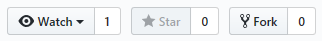
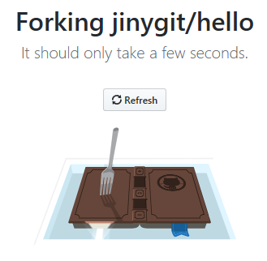
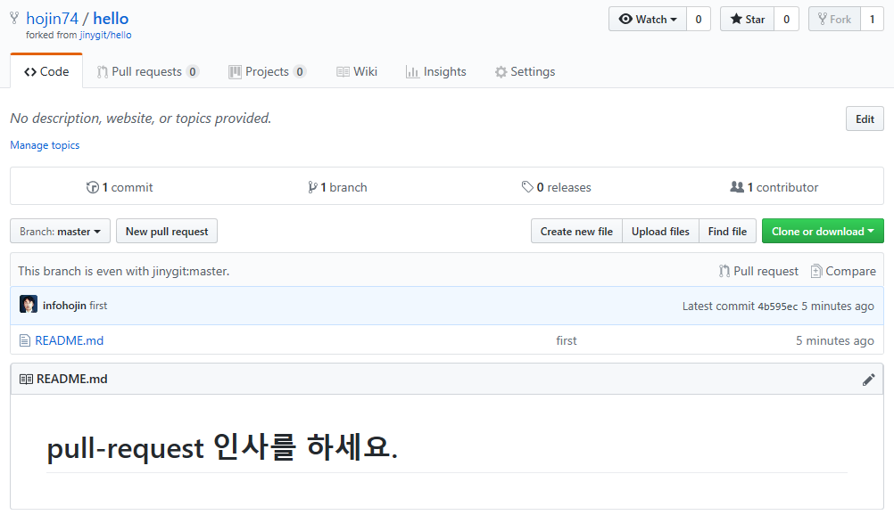

# 포크

포크는 타인의 저장소를 수정 접근할 수 있도록 저장소를 복제하는 기능입니다.

 

## 코드 공유

자신의 작업하던 소스를 다른 사람에게 전달하려고 할 때 어떻게 해야 할까요? 예전에는 자신의 컴퓨터에서 직접 파일을 복사하여 주었습니다. 인터넷 환경이 활성화되지 않을 때 많이 사용하던 방법입니다.

또한, 작업하는 코드의 버전이 여러 개가 있을 경우 어떻게 해야 할까요? 깃은 자신의 프로젝트를 원격 저장소에 저장하고, 원격 저장소에 있는 파일을 다른 사람이 쉽게 복제/다운로드할 수 있습니다.

하지만 여러 공동 작업자들이 협업하여 개발할 때 이러한 코드를 주고받은 일들은 매우 빈번히 일어납니다. 포크는 협업을 위해서 상대방의 코드를 가지고 오는 공유 방법 중의 하나입니다.

 

## 접근 권한

자신이 소유자이거나 구성원인 경우에는 접근 권한을 이미 가지고 있습니다. 하지만 타인의 저장소에서 코드를 수정하기 위해서는 접근 권한이 필요합니다.

깃은 저장소를 쉽게 복제할 수 있는 clone 명령어를 제공합니다. clone은 원격 저장소에서 로컬 저장소로 복제를 하기 위한 명령어입니다. 이와 유사하게 포크는 원격 저장소에서 다른 원격 저장소로 복제하는 기능입니다.

  

원격 저장소를 자신의 계정의 저장공간으로 복제하면 복제된 저장소에는 수정과 접근 권한을 얻을 수 있습니다. 

 

## 포크 동작

깃허브는 모든 저장소를 쉽게 복제할 수 있도록 포크 기능을 제공합니다. 깃허브 저장소 페이지의 우측 상단에는 포크 버튼이 활성화되어 있습니다.

예) https://github.com/jinygit/hello
  

포크 버튼 옆에는 숫자가 같이 표시됩니다. 숫자는 포크한 횟수를 의미합니다. 포크의 숫자가 많다는 것은 해당 프로젝트 저장소의 개발 참여자가 많이 있다는 것을 활동지수로 생각할 수 있습니다. 

포크를 클릭합니다. 포크하면 깃허브는 원격 저장소 간의 복제를 시작합니다. 이는 저장소의 크기에 따라서 약간의 시간이 필요합니다. 저장소를 복제하고 있는 도중에는 다음과 같은 화면이 출력됩니다.

  

포크는 원격 저장소 간에 이루어지는 복제입니다. 상대방의 계정의 저장소가 자신의 계정의 저장소로 복제됩니다. 또는 계정 대신 조직(organization) 계정으로 대체할 수도 있습니다.

  

만일 계정 저장소 외에 추가로 다른 조직에 속해 있다면 포크할 대상의 계정을 선택할 수 있습니다.

 

## 포크 확인

정상적으로 메인 프로젝트의 저장소를 포크하였다면 포크된 계정에서 복제된 저장소를 확인할 수 있습니다.

  

보통 아이디/저장소 형태로 생성됩니다. 포크된 저장소는 메인 저장소와 몇 개의 차이점이 있습니다. 

먼저 저장소 우측 상단에 위치한 포크 버튼이 비활성화됩니다. 또한, 저장소의 로고가 포크 모양으로 변경됩니다. 저장소 이름 하단에는 포크된 원본 저장소의 주소도 같이 표시됩니다.

  

메인 프로젝트의 저장소를 포크하면 원본과 동일한 저장소를 자신의 계정에서 확인할 수 있습니다.

  