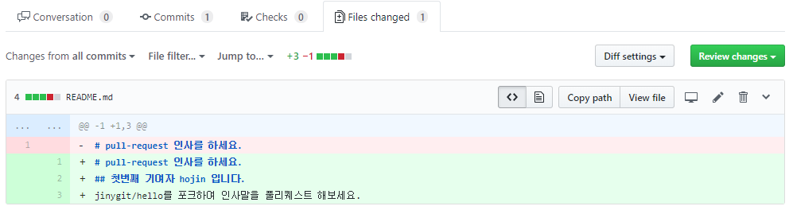
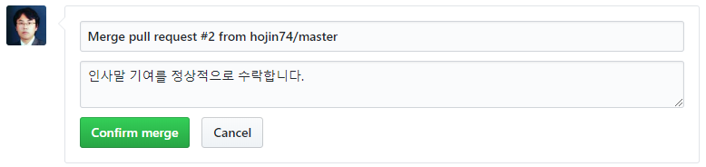
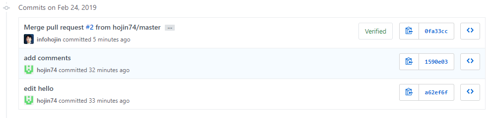

# 풀-리퀘스트 수신
<hr>
이번에는 수신 측면을 알아봅니다. 프로젝트의 관리자가 되면 풀-리퀘스트의 수신을 확인할 수 있습니다. 풀-리퀘스트를 수신한다는 것은 오픈 프로젝트를 진행하는 구성원 또는 소유자일 것입니다.

<br>
<a name="1"></a>

## pull-request
<hr>
메인 프로젝트의 저장소로 접속합니다. 상단에 pull request 탭이 있습니다. 기여자로부터 요청받은 풀-리퀘스트를 확인할 수 있습니다.

  

Pull request 화면을 보면 오픈되어 있는 목록들을 확인해볼 수 있습니다.

목록에서 풀 리퀘스트 항목을 클릭하면 상세한 정보를 확인할 수 있습니다. 누가 요청한 것인지, 어느 브랜치로부터 파생된 것인지 등을 확인할 수 있습니다.

<br>
<a name="2"></a>

## URL
<hr>
깃허브 URL을 이용하여 확인할 수 있습니다. 풀-리퀘스트가 생성되면 같이 이슈 번호도 추가됩니다. 

  

이슈 번호를 이용하여 다음과 같이 URL 주소로 접근이 가능합니다.

```
http://github.com/사용자아이디/저정소이름/pull/번호
```

만일 요청된 풀 리퀘스트의 변경된 내용만을 보고 싶은 경우에는 .diff를 추가합니다.

```
http://github.com/사용자아이디/저정소이름/pull/번호.diff
```

또는 diff 내용만을 페치 형태의 파일로도 받을 수 있습니다.

```
http://github.com/사용자아이디/저정소이름/pull/번호.patch
```

<br>
<a name="3"></a>

## conversation 탭
<hr>
Conversation 탭을 선택하면 풀 리퀘스트에 대한 대화와 커밋들에 대한 이력을 확인할 수 있습니다. 

   

풀 리퀘스트를 반영하기 위해서는 개발자와 관리자 간의 충분한 대화와 테스트가 필요합니다.

대화 도중에 다른 사람의 말을 인용할 수도 있습니다. 인용하고자 하는 메시지를 마우스로 드래그하여 선택합니다. 
단축키 `R`을 선택하면 해당 메시지가 인용되어 자동으로 삽입됩니다.

<br>
<a name="4"></a>

## commit 탭
<hr>
commit 탭을 선택하면 풀-리퀘스트와 관련된 커밋들이 시간순으로 출력됩니다. 옆에 있는 숫자는 커밋의 횟수를 의미합니다.

   

<br>
<a name="5"></a>

## Files changed 탭
<hr>
풀 리퀘스트 요청으로 변경된 파일들을 확인할 수 있습니다.

   

수정된 코드 부분으로 마우스를 이동하면 + 기호를 사용해 해당 코드 부분에 대한 의견을 추가로 달 수 있습니다.

이 기능은 코드를 리뷰하면서 세부적인 소견을 작성하는 데 매우 유용합니다.

<br>
<a name="6"></a>

## 거절
<hr>
요청한 풀-리퀘스트에 오류가 있거나 병합이 적절하지 않는 경우에는 거절할 수도 있습니다.

   

거절 사유를 입력하고 [Reopen pull request]를 입력합니다. 거절하면 풀-리퀘스트는 종료됩니다.

   

메인 프로젝트 저장소의 풀-리퀘스트에서 거절 사유를 확인할 수 있습니다. 
종료된 풀-리퀘스트도 저장소의 pull-request 탭에서 확인할 수 있습니다.

   

만일 기여자가 새로운 코드를 보완했다면 종료된 풀-리퀘스트에서 추가로 확인이 가능합니다.

종료된 이전의 기록으로 접속하면 새로운 코드를 보완하여 커밋과 푸시가 있다는 정보를 같이 출력합니다. 
`New changes since you last view` 목록이 더 추가된 것을 확인할 수 있습니다.

   

담당자는 `Reopen full-request`를 클릭하여 다시 풀-리퀘스트를 활성화할 수 있습니다.

<br>
<a name="7"></a>

## 재요청
<hr>
자신의 풀-리퀘스트가 거절될 경우 이를 보완하여 다시 풀-리퀘스트를 요청할 수 있습니다. 코드를 좀 더 보완하여 포크 저장소에 푸시합니다.

```md
# pull-request 인사를 하세요.
## 첫번째 기여자 hojin입니다.
안녕하세요 이호진입니다. jinygit/hello를 포크하여 인사를 드립니다.
```

```
infoh@hojin1 MINGW64 /e/jinygit/hello_fork (master)
$ git commit -am "edit hello"
[master a62ef6f] edit hello
 1 file changed, 1 insertion(+), 1 deletion(-)
```

이렇게 풀-리퀘스트 실습과, 처음 기여를 하게되어 기쁩니다.

```
infoh@hojin1 MINGW64 /e/jinygit/hello_fork (master)
$ git commit -am "add comments"
[master 1590e03] add comments
 1 file changed, 2 insertions(+), 1 deletion(-)

infoh@hojin1 MINGW64 /e/jinygit/hello_fork (master)
$ git push
Enter passphrase for key '/c/Users/infoh/.ssh/id_rsa2':
Enumerating objects: 8, done.
Counting objects: 100% (8/8), done.
Delta compression using up to 8 threads
Compressing objects: 100% (4/4), done.
Writing objects: 100% (6/6), 582 bytes | 194.00 KiB/s, done.
Total 6 (delta 2), reused 0 (delta 0)
remote: Resolving deltas: 100% (2/2), completed with 1 local object.
To github.com-2:hojin74/hello.git
   1590e03..9542215  master -> master
```

다시 `New pull request` 버튼을 클릭합니다. 새로운 풀-리퀘스트를 신청할 수 있습니다. 
또한, 이전에 종료된 요청 기록을 확인할 수 있습니다.

  

<br>
<a name="8"></a>

## 승인
<hr>
리퀘스트는 반드시 테스트한 후에 승인해주는 것이 좋습니다. 오류가 있거나 코드 충돌이 발생할 수도 있습니다. 또는 자동 테스트 툴을 이용할 수도 있습니다.

  

화면에서 `Merge pull request` 버튼을 클릭하면 요청된 리퀘스트가 코드와 병합됩니다. 
또는 버튼 옆에 작은 화살표 버튼이 있습니다. 
이를 클릭하면 3종류의 병합을 선택하여 풀-리퀘스트 병합 형태를 변경할 수 있습니다.

  

3가지 병합 방식에 대해서 하나씩 알아보겠습니다.

<br>
<a name="9"></a>

## Create a merge commit
<hr>
포크 저장소를 브랜치 형태로 병합합니다. 커밋 메시지를 작성하고 `Confirm merge`를 클릭하면 병합이 이루어집니다.

  

요청한 풀-리퀘스트의 병합을 승낙합니다. 

`Create a merge commit`은 병합 시 이루어지는 모든 커밋에 대해 하나씩 병합을 수행합니다. 
만일 포크 저장소에 추가로 작성된 커밋이 3개가 있을 경우 이를 각각 메인 저장소의 커밋으로 추가합니다.

메인 저장소로 이동하여 자신이 기여한 커밋을 확인해봅니다.

  

승낙된 풀-리퀘스트는 pull-request 탭에서 확인이 가능합니다. 
풀-리퀘스트승낙이 되면 자동으로 종료(close)되기 때문에 close 부분을 체크해야 목록을 확인할 수 있습니다.

  

자신의 코드가 정상적으로 기여하게 되면 원본 저장소의 기여자(contributor)로 등록됩니다.

  

<br>
<a name="10"></a>

## Squash and merge
<hr>
병합되는 여러 개의 커밋 메시지를 1개의 커밋 메시지로 병합합니다. 실습을 통하여 이를 확인해봅니다. 
포크 저장소의 인사말을 수정해서 3번째 풀-리퀘스트를 전송합니다.

```md
## 두번째 Squash 리퀘스트
```

```
infoh@hojin1 MINGW64 /e/jinygit/hello_fork (master)
$ git commit -am "second commit"
[master d4e495c] second commit
 1 file changed, 2 insertions(+), 1 deletion(-)
```

`Squash and merge` 풀-리퀘스트 실습을 위한 두번째 인사말 커밋입니다.

```
infoh@hojin1 MINGW64 /e/jinygit/hello_fork (master)
$ git commit -am "squash request"
[master 9542215] squash request
 1 file changed, 2 insertions(+), 1 deletion(-)

infoh@hojin1 MINGW64 /e/jinygit/hello_fork (master)
$ git push
Enter passphrase for key '/c/Users/infoh/.ssh/id_rsa2':
Enumerating objects: 8, done.
Counting objects: 100% (8/8), done.
Delta compression using up to 8 threads
Compressing objects: 100% (4/4), done.
Writing objects: 100% (6/6), 582 bytes | 194.00 KiB/s, done.
Total 6 (delta 2), reused 0 (delta 0)
remote: Resolving deltas: 100% (2/2), completed with 1 local object.
To github.com-2:hojin74/hello.git
   1590e03..9542215  master -> master
```

수정한 인사말을 다시 새로운 풀-리퀘스트로 요청합니다. 
2번째 인사말은 `Squash and merge` 방식으로 병합을 승인합니다.

 
 
풀-리퀘스트 커밋 메시지로 포크 저장소의 커밋들의 메시지가 자동으로 들어가는 것을 확인할 수 있습니다.

  

이전 `Create a merge commit` 방법과 달리 병합되는 2개의 커밋이 하나의 커밋으로 풀-리퀘스트 병합을 하게 됩니다.

Squash 병합 승인은 포크저장소의 커밋들을 나열할 필요가 없는 경우 유용합니다.

<br>
<a name="11"></a>

## Rebase and merge
<hr>
이전의 `Create a merge commit`과 `Squash and merge`는 포크 저장소를 브랜치 형태로 병합을 처리합니다.

깃은 브랜치를 병합하는 방법으로 크게 3-way 방법과 리베이스(rebase) 방법이 있습니다. 
`Rebase and merge`는 풀-리퀘스트를 리베이스 방법으로 승인합니다.

실습을 위해 포크 저장소의 코드를 수정해봅니다.

```md
## 세번째 rebase 리퀘스트
```

```
infoh@hojin1 MINGW64 /e/jinygit/hello_fork (master)
$ git commit -am "third commit"
[master f3d6339] third commit
 1 file changed, 2 insertions(+), 1 deletion(-)
```

rebase and merge 풀-리퀘스트 실습을 위한 두번째 인사말 커밋입니다.

```
infoh@hojin1 MINGW64 /e/jinygit/hello_fork (master)
$ git commit -am "rebase request"
[master 2c4b5ec] rebase request
 1 file changed, 2 insertions(+), 1 deletion(-)

infoh@hojin1 MINGW64 /e/jinygit/hello_fork (master)
$ git push
Enter passphrase for key '/c/Users/infoh/.ssh/id_rsa2':
Enumerating objects: 8, done.
Counting objects: 100% (8/8), done.
Delta compression using up to 8 threads
Compressing objects: 100% (4/4), done.
Writing objects: 100% (6/6), 520 bytes | 173.00 KiB/s, done.
Total 6 (delta 2), reused 0 (delta 0)
remote: Resolving deltas: 100% (2/2), completed with 1 local object.
To github.com-2:hojin74/hello.git
   9542215..2c4b5ec  master -> master
```

저장한 후에 새로운 풀-리퀘스트를 요청합니다. 리베이스 방식으로 풀-리퀘스트를 승인할 경우에는 커밋 메시지를 작성하지 않습니다.

  

<br>
<a name="12"></a>

## 충돌
<hr>
풀-리퀘스트는 포크 저장소의 코드의 브랜치를 병합하는것과 동일합니다. 따라서 풀-리퀘스트도 언제든지 충돌이 발생할 수 있습니다.

충돌이 발생한 경우 깃허브는 다음과 같이 충돌이 발생한 파일과 방법을 안내합니다.

  

해결 방법은 `Use the command line` 부분을 클릭하면 알려줍니다. 
문제 해결을 위해서 새로운 메인 프로젝트의 복제 저장소를 생성합니다.

```
infoh@hojin1 MINGW64 /e/jinygit
$ git clone https://github.com/jinygit/hello.git hello-req3
Cloning into 'hello-req3'...
remote: Enumerating objects: 16, done.
remote: Counting objects: 100% (16/16), done.
remote: Compressing objects: 100% (8/8), done.
remote: Total 16 (delta 3), reused 13 (delta 2), pack-reused 0
Unpacking objects: 100% (16/16), done.

infoh@hojin1 MINGW64 /e/jinygit
$ cd hello-req3
```

충돌이 발생한 원격 저장소의 코드를 가지고 옵니다. 

```
infoh@hojin1 MINGW64 /e/jinygit/hello-req3 (master)
$ git checkout -b hojin74-master master
Switched to a new branch 'hojin74-master'

infoh@hojin1 MINGW64 /e/jinygit/hello-req3 (hojin74-master)
$ git pull https://github.com/hojin74/hello.git master
remote: Enumerating objects: 14, done.
remote: Counting objects: 100% (14/14), done.
remote: Compressing objects: 100% (4/4), done.
remote: Total 12 (delta 4), reused 12 (delta 4), pack-reused 0
Unpacking objects: 100% (12/12), done.
From https://github.com/hojin74/hello
 * branch            master     -> FETCH_HEAD
Auto-merging README.md
CONFLICT (content): Merge conflict in README.md
Automatic merge failed; fix conflicts and then commit the result.

infoh@hojin1 MINGW64 /e/jinygit/hello-req3 (hojin74-master|MERGING)
```

충돌 부분을 해결하고 커밋합니다.

```
infoh@hojin1 MINGW64 /e/jinygit/hello-req3 (hojin74-master|MERGING)
$ git commit -am "resolve conflict"
[hojin74-master a23ce96] resolve conflict
```

이제 직접 수동으로 풀-리퀘스트를 진행해봅니다.

```
infoh@hojin1 MINGW64 /e/jinygit/hello-req3 (hojin74-master)
$ git checkout master
Switched to branch 'master'
Your branch is up to date with 'origin/master'.
```

마스터 브랜치로 이동한 후에, 해결된 풀-리퀘스트 브랜치를 병합합니다. 

```
infoh@hojin1 MINGW64 /e/jinygit/hello-req3 (master)
$ git merge --no-ff hojin74-master
Merge made by the 'recursive' strategy.
 README.md | 5 ++++-
 1 file changed, 4 insertions(+), 1 deletion(-)
```

병합된 풀-리퀘스트를 원격 저장소로 푸시합니다.

```
infoh@hojin1 MINGW64 /e/jinygit/hello-req3 (master)
$ git push origin master
Enumerating objects: 18, done.
Counting objects: 100% (18/18), done.
Delta compression using up to 8 threads
Compressing objects: 100% (10/10), done.
Writing objects: 100% (14/14), 1.23 KiB | 157.00 KiB/s, done.
Total 14 (delta 5), reused 0 (delta 0)
remote: Resolving deltas: 100% (5/5), completed with 1 local object.
To https://github.com/jinygit/hello.git
   851715b..7fd4685  master -> master
```

수동으로 충돌을 해결하고 메인 저장소로 푸시하면 풀-리퀘스트 상태는 `merged`로 변경됩니다.

  

수동 병합을 승인한 후에는 직접 풀-리퀘스트를 종료(close)로 변경합니다.

<br><br>