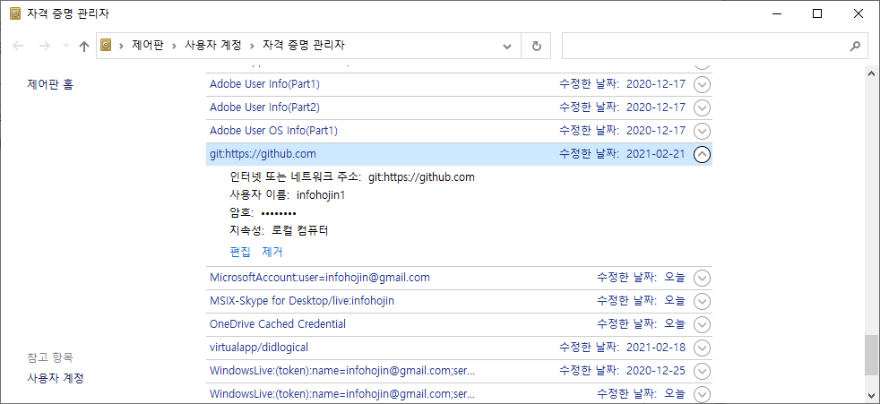

# 자격증명
---

## 자격증명 삭제
---
기존 github에 로그인 했거나, 계정이 변경된 경우 config 환경 설정외에 윈도우에 등록된 자격증명도 같이 삭제를 해주어야 합니다.

윈도우 검색창에서 `자격증명관리자`를 입력합니다.

`windows 자격증명`을 입력합니다. 목록에서 github 항목을 선택하여 `제거`합니다.

제거한 후에는 다시 `git push` 시 계정 접속 창이 다시 실행이 됩니다.

