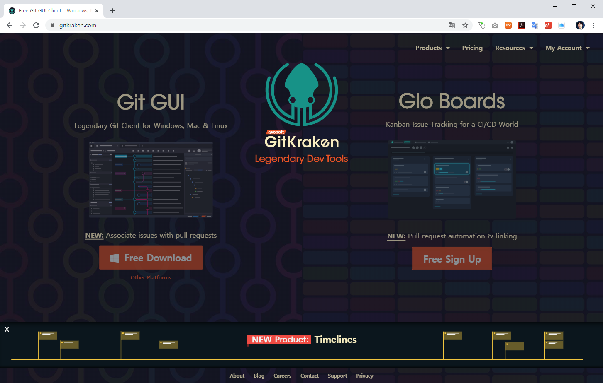

## 깃 크라켄
`GitKraken`은 GUI 환경을 깃을 사용할 수 있게 도와주는 도구 입니다.

홈페이지: https://www.gitkraken.com/

 

### 소개영상
<iframe width="866" height="488" src="https://www.youtube.com/embed/ub9GfRziCtU" frameborder="0" allow="accelerometer; autoplay; encrypted-media; gyroscope; picture-in-picture" allowfullscreen></iframe>

   