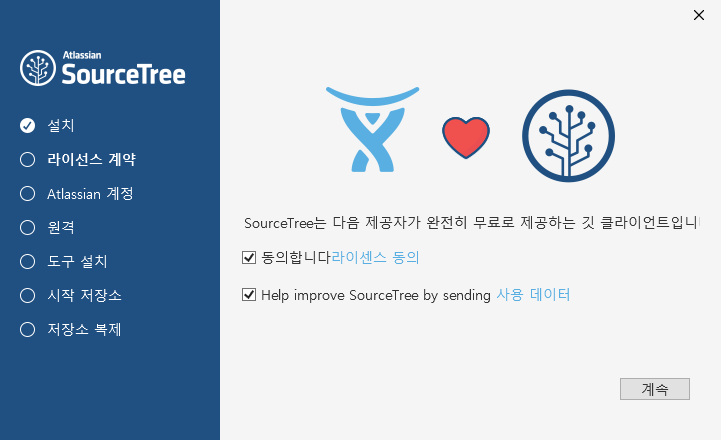

## 소스트리
기본적으로 깃은 콘솔 터미널 모드에서 동작하는 프로그램 입니다. 터미널 환경이 익숙한 전문 개발자들과 달리 처음으로 개발에 입문을 하거나, 깃의 초보자의 경우 명령어를 이용하여 깃을 사용하는 것은 쉽지 않습니다.

깃을 GUI환경에서 좀더 쉽게 사용할 수 있는 전용툴이 있어 같이 소개를 합니다.
소스트리는 깃의 동작과 명령을 GUI환경으로 제공을 합니다.
 

## 다운로드 사이트
소스트리는 https://www.sourcetreeapp.com/ 에서 접속하여 다운로드 받을 수 있습니다.
 

 
## 설치
---
다운로드 받은 설치 파일을 실행합니다.

단계1]

소스트리를 사용하기위해서는 회원가입 및 계정이 필요로 합니다. My Atlassian 버튼을 클릭해서 회원가입을 할 수 있습니다. 구글 로그인 계정을 가지고 있으시다면 회원인증 연동을 통하여 쉽게 가입 절차를 진행할 수 있습니다.

만일 이전에 가입한 계정이 있다면 “기존계정사용”을 선택하시면 됩니다.

외부 저장소 연결

소스트리는 Bitbucket 과 GitHub 를 지원합니다. 

등록된 계정이 있다면든 설치시 입력을 하시면 됩니다.

SSH 등록

 
## 소스트리 실행

소스트리가 정상적으로 잘 설치가 되었다면 바탕화면에 다음과 같은 아이콘이 설치되어 있습니다.

아이콘을 클릭하시면 소스트리가 실행이 됩니다.
 

## 로컬 저장소

새로운 로컬 저장소를 생성해 봅니다. 상단 탭의 아이콘 중에서 “create” 를 선택합니다. 

탐색 버튼을 클릭하여 저장소로 사용할 폴더를 선택하시면 됩니다. 만일 생성한 폴더가 없으시다면 탐색 버튼 실행화면에서 마우스 오른쪽 클릭을 통하여 “새로운 폴더”를 생성을 할 수도 있습니다.

다음 저장소의 이름을 지정합니다. 기본적으로 폴더이름과 같이 자동으로 삽입이 됩니다.

정상적으로 저장소가 생성이 되었다면 다음과 같은 화면으로 전환이 됩니다.

 
### 터미널 실행

소스트리 우측상단에 보면 터미널 버튼이 있습니다. 

터미널을 선택하시면 git 명령어를 통하여 직접 작업을 실행할 수 있습니다.

 
### 로컬저장소 추가
폴더 추가 또는 기존의 저장소 폴더를 마우스로 드래그드롭 형태로 끌어 오시면 됩니다.

 
“폴더 추가” 버튼을 클릭해서 새로운 폴더를 생성해 봅니다. 마우스 오른쪽 키를 눌러서 “이름변경” 을 해봅니다.

### 로컬저장소 Clone

 

## 원격 저장소

## 환경설정
상단 메뉴의 `도구` > `옵션`을 선택하시면 소스트리의 환경설정을 하실 수 있습니다.

