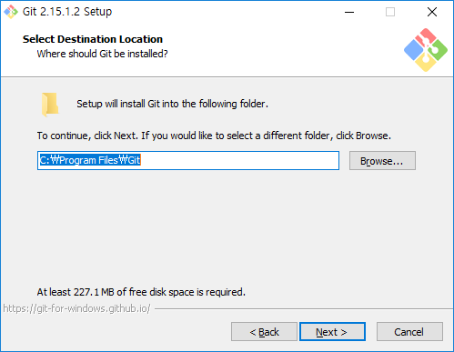
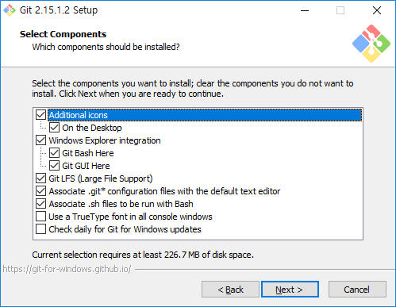
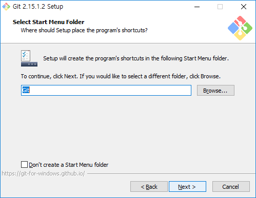

# 깃 윈도우 설치
---
많은 사람들이 기본 운영체제로 사용하고 있는 윈도우 환경을 먼저 알아 보도록 하겠습니다. 윈도우 환경에서 깃을 설치하는 방법은 매우 간단합니다. 

 

## 다운로드
---
설치파일을 다운로드 받아 실행만 하시면 됩니다.

깃은 누구나 무료로 사용을 할 수 있는 대표적인 오픈소스 프로젝트 입니다. 

 

## 설치 진행
---
처음 설치화면에서 볼 수 있듯이 GNU 라이센스를 적용받습니다.

깃의 설치 경로를 선택합니다.

항목을 설정합니다. 그냥 다음(next)을 선택하시면 됩니다.

그냥 다음(next)을 선택하시면 됩니다.

그냥 다음(next)을 선택하시면 됩니다.

그냥 다음(next)을 선택하시면 됩니다.

그냥 다음(next)을 선택하시면 됩니다.

그냥 다음(next)을 선택하시면 됩니다.

그냥 다음(next)을 선택하시면 됩니다.

그냥 다음(next)을 선택하시면 됩니다.

설치가 진행이 됩니다. 잠시만 기다리세요.

설치가 완료가 되면 위와 같은 화면을 출력합니다.  
이제 깃을 사용하시면 됩니다.

 