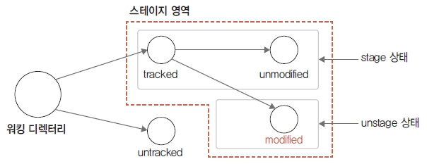

## 스테이지
깃은 여러 단계의 논리적인 저장 공간을 가지고 있습니다. 스테이지(stage)는 ‘임시로 저장하는 공간’을 의미합니다. 스테이지 영역은 워킹 디렉터리에서 제출된 tracked 파일들을 관리합니다. 이 영역은 나중에 배울 커밋 작업과 연관이 매우 많습니다.  

<br>
<hr>

### 스테이지 = 임시 영역
스테이지는 워킹 디렉터리와 `실제로 저장하여 기록하는 공간` 사이에 있는 임시 영역입니다. 깃은 워킹 디렉터리에서 작업이 끝난 파일을 스테이지로 잠시 복사합니다. 스테이지가 임시 영역이라고 해서 파일의 콘텐츠 내용을 직접 가지고 있지는 않습니다. 단지 커밋하려는 파일의 추적 상태 정보들만 기록합니다.  

그림 3-16] 스테이지는 커밋하려는 파일의 추적 정보만 기록  
 

이처럼 임시 영역인 스테이지를 별도로 운영하는 것은 커밋을 빠르게 처리하기 위해서입니다. `실제로 저장하여 기록하는 공간`인 저장소는 스테이지 영역에서 가리키는 파일 내용을 기반으로 변경된 차이점만 기록합니다.  

파일들의 스테이지 상태는 status 명령어로 확인 가능합니다. 또는 깃의 git ls-files 같은 명령어로도 확인 가능합니다.  

```
$ git status
$ git ls-files --stage
```

스테이지 영역에 등록된 파일들은 또 다시 stage 상태와 unstage 상태로 구분됩니다. 버전 관리에서 제외하고 싶은 파일이 있다면 .gitignore 파일에 등록합니다. .gitignore 파일은 3.5절에서 설명합니다.  

<br>
<hr>

### 파일의 stage 상태와 unstage 상태
워킹 디렉터리에 있는 tracked 상태의 파일들은 스테이지 영역과 긴밀한 상관관계를 맺습니다. 스테이지 영역으로 등록된 모든 파일은 untracked 상태에서 tracked 상태로 변경됩니다. 스테이지는 워킹 디렉터리 안에 있는 파일들의 추적 상태를 관리하는 역할을 수행합니다.  

스테이지 영역은 파일을 stage 상태와 unstage 상태로 구분합니다. 깃이 변화 이력을 기록하려면 파일들의 최종 상태가 stage 상태여야 합니다. unstage 상태라면 파일에 변화가 있다는 것을 의미합니다. 즉, 스테이지 영역에 있는 파일과 워킹 디렉터리 안에 있는 파일 내용에 차이가 있을 때는 unstage 상태가 됩니다.  

또 넓게 보면 아직 스테이지 영역으로 등록하지 않은 워킹 디렉터리 안의 파일도 unstage 상태라고 생각할 수 있습니다. 이때는 unstage 상태이자 동시에 untracked 상태입니다.  

unstage 상태라고 해서 실제 파일이 없어지는 것은 아닙니다. 단지 파일이 수정되어 임시적으로 스테이지 목록에서 제외된 것입니다. git add 명령어를 사용하면 스테이지에 다시 추가할 수 있습니다.  

<br>
<hr>

### 파일의 modified 상태와 unmodified 상태
코드를 변경한다는 것은 워킹 디렉터리에서 파일을 수정하는 것을 의미합니다. 파일이 수정되면 워킹 디렉터리와 스테이지 간 내용이 일치하지 않습니다. 따라서 스테이지는 수정한 파일과 원본 파일을 구분하려고 수정함(modified) 상태와 수정하지 않음(unmodified) 상태로 표현합니다. 파일 수정 작업은 스테이지 영역과 긴밀한 상관관계를 맺습니다.  

* modified 상태  
스테이지에 등록된 파일은 깃이 추적 관리합니다. 깃이 실제로 기록한 파일이며, 사실상 버전을 의미합니다. 파일 수정은 개발 과정에서 뗄 수 없는 작업입니다. 개발 작업에서 수많은 코드가 변경되고, 깃을 사용하면 이 변경 내역은 영구적으로 기록됩니다.  

앞에서 설명했듯이 깃은 tracked 상태인 파일만 수정 여부를 관리할 수 있습니다. tracked 상태인 파일이 수정되면 스테이지는 파일 상태를 modified 상태로 변경합니다.  

그림 3-17] 파일 수정 여부 확인  
 

그러면 수정된 파일은 스테이지에서 잠시 제외됩니다. 깃은 수정 여부만 체크해 주기 때문에 modified 상태로 변경된 파일은 스테이지로 재등록해야 합니다. 수정된 파일을 스테이지 영역으로 다시 적용하려면 git add 명령어로 재등록합니다.  

* unmodified 상태
unmodified 상태는 tracked 상태이면서 스테이지에서 한 번도 수정하지 않은 원본 상태를 의미합니다. 이처럼 수정하지 않은 파일들은 재등록하지 않아도 됩니다. 스테이지에 등록한 후 어떤 수정도 하지 않았다면 unmodified 상태입니다. 깃은 파일의 수정 여부를 체크하고, 스테이지 영역의 갱신 작업 여부를 작업자에게 알려 줍니다.  

3.2절과 3.3절에서 배운 개념을 그림 하나로 정리하면 다음과 같습니다. 워킹 디렉터리에서 등록 명령(git add 명령어)을 실행하면 스테이지에 등록됩니다. 이때 자동으로 tracked 상태가 됩니다. 파일을 수정하지 않으면 계속 stage 상태에 머무릅니다. 파일이 수정되면 modified 상태가 되고, 스테이지에서 떨어져 나와 unstage 상태가 됩니다. unstage 상태의 파일은 워킹 디렉터리에 잠시 담아 둡니다. 이때 다시 등록 명령을 실행하면 stage 상태로 변경됩니다.  

그림 3-18] 워킹 디렉터리와 스테이지 상태 구분  
 

<br><br>