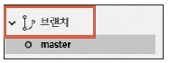
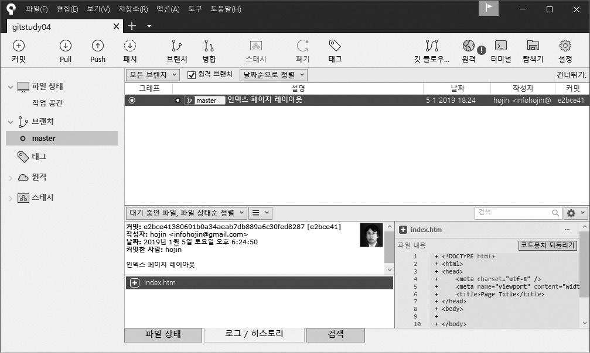

## 4.5 커밋 확인
터미널과 소스트리에서 커밋하는 방법을 알아보았습니다. 성공적으로 커밋을 했다면 이를 확인해 보아야 합니다.  

### 4.5.1 스테이지 초기화

먼저 터미널에서 status 명령어를 실행해서 상태를 확인합니다.

```
infoh@hojin MINGW64 /e/gitstudy04 (master)
$ git status ☜ 상태 확인
On branch master
nothing to commit, working tree clean ☜ 워킹 트리 정리됨

```

이전과 달리 working tree clean 메시지를 볼 수 있습니다. 커밋을 하면 스테이지 영역은 초기화됩니다. 더 이상 추가된 새로운 파일과 수정된 파일이 없다는 의미입니다.

그림 4-16] 스테이지 초기화  
  

항상 커밋 전후에 status 명령어로 상태를 확인하는 것이 좋습니다.  

### 4.5.2 로그 기록 확인
커밋한 후 커밋 기록은 어떻게 확인할까요? 깃은 커밋 목록을 확인할 수 있는 log 명령어를 별도로 제공합니다.  

```
$ git log
```
 
log 명령어는 시간 순으로 커밋 기록을 출력하는데, 최신 커밋 기록부터 내림차순으로 나열합니다.  

```
infoh@hojin MINGW64 /e/gitstudy04 (master)
$ git log
commit e2bce41380691b0a34aeab7db889a6c30fed8287 (HEAD -> master)
Author: hojin <infohojin@gmail.com>
Date:   Sat Jan 5 18:24:50 2019 +0900
    인덱스 페이지 레이아웃

```

커밋한 후에는 습관적으로 한 번씩 log 명령어를 실행하여 기록을 확인하는 것이 좋습니다. 또 log 명령어는 다양한 커밋 기록을 확인할 수 있도록 여러 옵션을 제공합니다. -help 옵션으로 확인할 수 있습니다.  

>Note: 커밋 시간을 맹목적으로 믿을 수는 없습니다. 깃은 분산형 저장소로 각자의 PC에 설정한 시간 정보를 바탕으로 커밋 기록을 작성합니다. 작업 중인 컴퓨터가 다른 지역의 시간이나 잘못된 시간으로 설정되어 있을 수도 있습니다.  

### 4.5.3 소스트리에서 로그 기록 확인
터미널로 로그 기록을 확인하는 것은 가독성이 좋지 않습니다. 커밋 횟수가 많을수록 보기도 어렵습니다. 이때는 소스트리를 이용하면 좀 더 직관적으로 커밋 기록을 확인할 수 있습니다. 소스트리 같은 GUI 도구를 사용하도록 추천하는 이유이기도 합니다. 소스트리에서 왼쪽의 브랜치 탭을 선택합니다.

그림 4-17] 소스트리에서의 브랜치  
 
 

앞에서 status 명령어를 실행했을 때 `On branch master` 메시지를 본 적이 있을 것입니다. 또 log 명령어를 실행한 결과에서 (HEAD -> master) 부분도 보았습니다.  

브랜치는 나중에 다시 설명하겠지만, 깃을 처음 생성하면 자동으로 master 브랜치 1개를 생성합니다. 또 커밋은 master 브랜치 안에 기록됩니다. 소스트리의 master 브랜치를 선택하면 다음 화면을 볼 수 있습니다. 오른쪽 화면에 커밋의 로그 기록이 순차적으로 나열되는 것을 확인하세요.  

그림 4-18] 소스트리에서 브랜치 확인  
 

이렇게 직관적인 뷰 때문에 터미널(깃 배시)과 소스트리를 같이 이용하길 권장합니다.  

소스트리 목록은 크게 `그래프, 커밋 메시지(설명), 작성자, 날짜, 커밋 아이디` 다섯 가지로 구분합니다. 이와 관련된 내용은 실습하면서 계속 설명해 나갈 것입니다.  

<br><br>