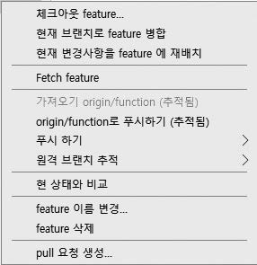

## 브랜치 삭제
생성된 브랜치를 삭제하는 것은 생각보다 간단합니다. 하지만 브랜치를 삭제하는 것은 해당 브랜치 내용과 커밋을 모두 삭제하는 것입니다. 따라서 삭제 명령을 실행할 때는 주의해야 합니다. 브랜치 삭제는 크게 스테이지 상태에 따라 달라집니다.  

가장 먼저 주의할 점은 현재 자신이 있는 브랜치는 삭제할 수 없다는 것입니다. 브랜치를 삭제하려면 master 브랜치나 다른 브랜치로 잠시 이동해야 합니다. 예를 들어 앞에서 만든 로컬 저장소의 bug 브랜치를 삭제한다고 합시다.  

```
infoh@DESKTOP MINGW64 /e/gitstudy06 (aaa)
$ git branch -d aaa
error: Cannot delete branch 'aaa' checked out at 'E:/gitstudy06'
```

현재 자신의 브랜치에서 삭제 명령어를 실행하면 오류 메시지가 출력됩니다. 어느 브랜치로 체크아웃될지 모르기 때문입니다. 그래서 삭제하고자 할 때는 다른 브랜치로 이동해서 삭제해야 합니다.  

<br>
<hr>

### 일반적인 삭제 방법
일반적으로 브랜치를 삭제할 때는 -d 옵션을 사용합니다.  

```
$ git branch -d 브랜치이름
```

-d 옵션은 스테이지 상태가 깨끗할 때만 삭제를 허용합니다. 워킹 디렉터리에 작업한 기록이 있거나 add 명령어로 스테이지의 인덱스가 변경된 상태라면 삭제하지 않습니다. 삭제하려면 반드시 최종 상태가 커밋되어 깨끗한 스테이지 상태여야 합니다. 또 병합되지 않은 브랜치는 -d 옵션으로 삭제할 수 없습니다.  

-d 옵션을 사용하여 footer 브랜치를 삭제해 보겠습니다.  

```
infoh@DESKTOP MINGW64 /e/gitstudy06 (aaa)
$ git branch -d footer
Deleted branch footer (was cc66812).
```

잘 삭제되었습니다.  

<br>
<hr>

### 강제로 삭제하는 방법
워킹 디렉터리 또는 스테이지에 추가 커밋 작업이 남아 있다면 일반적인 방법으로는 브랜치를 삭제할 수 없습니다. 이때는 강제로 삭제해야 합니다.  

실습을 위해 hotfix 브랜치로 이동한 후 branch.htm 파일을 수정하고 저장합니다.  

```
infoh@DESKTOP MINGW64 /e/gitstudy06 (aaa)
$ git checkout hotfix
Switched to branch 'hotfix'

infoh@DESKTOP MINGW64 /e/gitstudy06 (hotfix)
$ code branch.htm
```

branch.htm
```html
<h1>브랜치 실습을 합니다.</h1>
<h2>마스터 워킹 디렉터리 작업 중</h2>
<h3>hotfix 수정 작업입니다.</h3>
```

수정했다면 커밋합니다.  

```
infoh@DESKTOP MINGW64 /e/gitstudy06 (hotfix)
$ git commit -am "hotfix working"
[hotfix 0225e85] hotfix working
 1 file changed, 2 insertions(+), 1 deletion(-)
```

hotfix 브랜치에 커밋이 하나 추가되었습니다. master 브랜치로 체크아웃하여 hotfix 브랜치를 삭제해 보겠습니다.  

```
infoh@DESKTOP MINGW64 /e/gitstudy06 (master)
$ git branch -d hotfix
error: The branch 'hotfix' is not fully merged.
If you are sure you want to delete it, run 'git branch -D hotfix'.
```

그림 6-31] 커밋이 있는 브랜치 삭제  


브랜치를 삭제하면 해당 브랜치에서 작업했던 커밋 기록들이 같이 삭제되기 때문에 오류가 발생합니다. 이때는 브랜치를 강제로 삭제해야 합니다. 대문자 -D 옵션을 사용하면 강제로 브랜치를 삭제할 수 있습니다.  

```
infoh@DESKTOP MINGW64 /e/gitstudy06 (master)
$ git branch -D hotfix
Deleted branch hotfix (was 8026ed6).
```

-D 옵션으로 잘 삭제된 것을 확인할 수 있습니다.

<br>
<hr>

### 소스트리에서 삭제하는 방법
소스트리에서도 브랜치를 삭제할 수 있습니다. 먼저 소스트리의 왼쪽에서 브랜치 목록 중 삭제하고 싶은 것을 하나 선택합니다. 브랜치를 선택한 상태에서 마우스 오른쪽 버튼을 누릅니다. 예를 들어 다음과 같이 브랜치를 삭제할 수 있는 메뉴가 나오면 feature 삭제를 선택합니다.  

그림 6-32] 소스트리에서 브랜치 삭제  


### 리모트 브랜치를 삭제하는 방법
지금까지는 로컬에 생성된 브랜치를 삭제하는 방법을 알아보았습니다. 그렇다면 원격 저장소의 브랜치는 어떻게 삭제해야 할까요? 원격 브랜치를 삭제하려면 먼저 삭제 명령을 푸시해야 합니다.  

```
$ git push origin --delete 리모트브랜치이름
```
 
그럼 깃허브의 aaa 브랜치를 삭제해 보겠습니다.  

```
infoh@DESKTOP MINGW64 /e/gitstudy06 (master)
$ git push origin --delete aaa
To https://github.com/jinygit/gitstudy06.git
 - [deleted]         aaa
```

깃허브 페이지에서 aaa 브랜치가 삭제된 것을 확인할 수 있습니다. 원격 저장소의 브랜치를 삭제하면 리모트 브랜치에 기록된 커밋도 모두 삭제됩니다. 따라서 함께 사용하는 브랜치라면 신중하게 삭제하는 것이 좋습니다.  

<br><br>