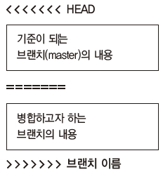

## 충돌
실습을 그대로 따라 했다면 모든 병합을 성공적으로 처리했을 것입니다. 하지만 실제 개발 환경에서는 실습과 달리 다양한 문제가 발생합니다. 대표적으로 여러 사람과 개발한 코드 일부분이 충돌(complicit)하는 경우입니다. 보통 충돌은 3-way 병합이 실패한 경우입니다.  

<br>
<hr>

### 충돌이 생기는 상황
여러 사람과 개발 작업을 하다 보면 예상외로 충돌이 자주 발생합니다. 대부분의 충돌 원인은 같은 위치의 코드를 동시에 수정했기 때문입니다. 파일을 수정할 때 여러 개발자가 서로 다른 위치를 수정했다면 깃에서 서로 다른 위치의 소스를 자동으로 병합하기 때문에 문제가 없습니다. 하지만 파일에서 동일한 위치에 두 명 이상이 서로 다르게 수정했다면 충돌이 발생합니다.  

즉, 같은 위치를 동시에 수정하면 두 수정 중 어떤 것이 맞는지 깃에서 자동으로 알 수 없기 때문에 충돌이 발생합니다. 이때 깃은 충돌 오류라고 알려 주고, 개발자에게 직접 수정하여 충돌을 해결하라고 요청합니다. 이러한 병합 충돌은 상당히 자주 발생합니다.  

<br>
<hr>

### 실습을 위한 충돌 만들기
실습을 위해 인위적인 충돌 상황을 만들어 보겠습니다. 새로운 footer 브랜치를 만들고 체크아웃합니다.  

```
infoh@DESKTOP MINGW64 /e/gitstudy08 (master) ☜ 기준브랜치
$ git checkout -b footer ☜ 기준에서 새로운 브랜치 파생
Switched to a new branch 'footer'
```

독립된 footer 브랜치에서 index.htm 파일의 `<footer>~</footer>` 부분 코드를 수정하고 커밋하겠습니다.  

```
infoh@DESKTOP MINGW64 /e/gitstudy08 (footer)
$ code index.htm
```

index.htm
```html
<!DOCTYPE html>
<html>
<head>
    <meta charset="utf-8" />    
    <meta name="viewport" content="width=device-width, initial-scale=1">
    <title>Page Title</title>
</head>
<body>
    <header>
        <ul>
            <li>깃소개</li>
            <li>깃설치</li>
        </ul>
    </header>        
    <h1>hello GIT world!</h1>
    <footer>
        copyright all right 2018 reserved 
by hojinlee ☜ 수정
    </footer>
</body>
</html>

```
 

카피라이터 부분을 두 줄로 수정했습니다. 이어서 커밋합니다.  

```
infoh@DESKTOP MINGW64 /e/gitstudy08 (footer)
$ git commit -am "edit footer"
[footer d141624] edit footer
 1 file changed, 1 insertion(+)

```

그림으로 나타내면 다음과 같습니다.  

그림 8-23] footer 브랜치 생성 및 수정  


이번에는 다시 master 브랜치로 체크아웃하여 index.htm 파일을 수정합니다. 충돌이 발생하도록 동일한 위치의 내용을 수정하고 커밋하겠습니다.  

```
infoh@DESKTOP MINGW64 /e/gitstudy08 (master)
$ git checkout master
Switched to branch 'master'

infoh@DESKTOP MINGW64 /e/gitstudy08 (master)
$ code index.htm

```

index.htm
```html
…
    <footer>
        copyright all right 2018 reserved 
        by jinyphp
    </footer>
…
```
 

두 줄로 만들고, hojinlee를 jinyphp로 수정했습니다. 이어서 커밋합니다.  

```
infoh@DESKTOP MINGW64 /e/gitstudy08 (master)
$ git commit -am "edit copyright"
 [master c6e2ed7] edit copyright
 1 file changed, 1 insertion(+)

```

두 브랜치에 있는 index.htm 파일에서 동일한 위치의 코드를 각각 수정했습니다.  

그림 8-24] 동일한 위치의 코드를 수정한 후 커밋 브랜치  


master 브랜치와 footer 브랜치 각각에 커밋이 하나씩 추가되었습니다. 서로 다른 브랜치에서 각각 커밋했기 때문에 그래프가 두 갈래로 갈라집니다. 소스트리에서 갈라진 로그 기록을 확인할 수 있습니다.  

그림 8-25] 소스트리에서 분기된 커밋 확인  


서로 다르게 분기된 브랜치이기 때문에 3-way 병합을 시도하겠습니다. master 브랜치인지 확인한 후 병합 명령어를 실행합니다.  

```
infoh@DESKTOP MINGW64 /e/gitstudy08 (master)
$ git merge footer
Auto-merging index.htm
CONFLICT (content): Merge conflict in index.htm
Automatic merge failed; fix conflicts and then commit the result.

```

자동으로 병합하지 않고 충돌이 발생합니다. 충돌이 발생한 것은 두 브랜치의 index.htm 파일에서 같은 위치의 내용을 각각 다르게 수정했기 때문입니다.  

 

충돌 해결 방법을 알아봅시다. 지금까지 보지 못한 새로운 메시지가 출력되었습니다. 자동으로 병합하는 과정에서 충돌이 발생되면 깃은 “Merge Conflicts” 메시지를 출력합니다. 소스트리에서 그래프를 확인하면 충돌이 발생하여 커밋되지 않은 변경 사항이 하나 추가되어 있습니다.  

그림 8-26] 소스트리에서 충돌 확인  


여기서 알 수 있는 것은 병합 충돌이 발생하면 자동으로 커밋이 생성되지 않는다는 것입니다. 충돌이 발생하면 깃은 충돌 메시지를 출력하고 병합 작업을 중단합니다.  

이렇게 충돌이 발생하면 담당 개발자가 직접 수동으로 해결해야 합니다. 어떤 충돌 상태인지 알아보기 위해 깃 상태를 확인합니다.  

```
infoh@DESKTOP MINGW64 /e/gitstudy08 (master|MERGING)
$ git status
On branch master
You have unmerged paths. ☜ 충돌 사항
  (fix conflicts and run "git commit")
  (use "git merge --abort" to abort the merge)

Unmerged paths:
  (use "git add <file>..." to mark resolution)
        both modified:   index.htm
no changes added to commit (use "git add" and/or "git commit -a")

```

충돌 내용이 메시지로 출력됩니다. `Unmerged` 메시지를 확인할 수 있습니다. 깃 배시에도 master|MERGING으로 표시된 것을 확인할 수 있습니다. 현재 충돌된 병합을 해결해야 하는 상태라고 표시합니다.  

사실 이러한 충돌은 버전 관리 시스템에서는 흔히 발생하는 문제입니다. 실제 사용하다 보면 깃 또한 충돌을 피할 수 없습니다. 하지만 피할 수 없더라도 예방은 가능합니다. 내부적으로 팀원 간 규칙을 정하고 상의하면서 개발을 진행하면 향후 발생할 충돌을 많이 줄일 수 있습니다. 다른 방안으로는 master 브랜치 내용을 자주 자신의 브랜치로 병합하는 것입니다. 자주 커밋하고 병합할수록 충돌이 발생할 기회는 적습니다. 많은 내용을 수정할수록 병합할 때 충돌이 발생하기 쉽습니다. 자신의 브랜치 상태가 최신일수록 향후 병합할 때 발생하는 충돌을 최소화할 수 있습니다.  

>Note: 방금 실행한 병합을 취소할 때는 --abort 옵션을 실행합니다.  

```
infoh@hojin1 MINGW64 /e/gitstudy08 (master|MERGING)       
$ git merge --–abort ☜ 병합 명령을 취소
infoh@hojin1 MINGW64 /e/gitstudy08 (master)

```

<br>
<hr>

### 8.5.3 수동으로 충돌 해결
병합 충돌이 발생하면 결국 수동으로 해결해야 합니다. 직접 소스 코드를 보고 충돌된 부분을 확인한 후 코드를 수정합니다.  

먼저 충돌한 소스 코드를 확인합니다. 깃은 충돌이 발생하면 충돌된 코드 내용을 기호와 함께 표시합니다.  

```
infoh@DESKTOP MINGW64 /e/gitstudy08 (master|MERGING)
$ code index.htm

```

그림 8-27] index.htm 파일의 충돌 사항 표시  


충돌은 두 부분으로 표시됩니다. 하나는 기준이 되는 브랜치 내용이고, 다른 하나는 병합하고자 하는 브랜치 내용입니다.  

그림 8-28] 충돌 코드  



충돌한 내용을 수정할 때는 깃에서 표시한 충돌 기호도 함께 삭제해야 합니다. 코드를 수정하고 표시된 기호도 같이 삭제하여 다음과 같이 수정한 후 저장합니다.  

index.htm
```
…
    <footer>
        copyright all right 2018 reserved 
        by jiny
    </footer>
…
```
 

>Note: 저수준 명령어 git ls-files -u를 사용하여 충돌한 파일들의 집합을 확인할 수 있습니다.  

```
$ git ls-files -u
```

직접 코드를 수정하여 충돌을 해결했습니다. 충돌이 발생하면 병합 커밋을 자동으로 생성하지 않습니다. 충돌을 해결한 후 병합 커밋을 직접 만들어야 합니다. 직접 충돌을 해결하면 파일은 modified 상태가 됩니다. 이를 다시 스테이지 영역에 등록하고 커밋합니다.  

```
infoh@DESKTOP MINGW64 /e/gitstudy08 (master|MERGING)
$ git add index.htm ☜ 스테이지 등록

infoh@DESKTOP MINGW64 /e/gitstudy08 (master|MERGING)
$ git commit -m "resolve complict" ☜ 병합 커밋 작성
[master 533051d] resolve complicit

infoh@DESKTOP MINGW64 /e/gitstudy08 (master)
```

병합 커밋을 생성하면 깃의 충돌 마크는 자동으로 없어집니다. 깃 배시에서 master|MERGING이 master로 돌아온 것을 확인합니다.  

<br>
<hr>

### 8.5.4 소스트리에서 충돌 해결
소스트리에서도 병합 충돌을 확인할 수 있습니다. 이미 8.5.3절에서 충돌을 해결했기 때문에 8.5.2절까지 진행하여 실습을 위한 충돌을 만든 상황이라고 가정한 채 설명하겠습니다.  

충돌이 발생하면 ‘스테이지에 올라간 파일’과 ‘스테이지에 올라가지 않은 파일’ 두 영역에 파일이 표시됩니다. 파일을 클릭하면 충돌 메시지를 확인할 수 있습니다.  

그림 8-29] 소스트리에서 충돌 확인  


소스트리는 병합 커밋을 자동으로 생성할 수 있는 옵션을 제공합니다. 충돌한 파일에서 마우스 오른쪽 버튼을 누릅니다.  

그림 8-30] 소스트리에서 충돌 해결  


충돌 해결 메뉴를 선택하면 다양한 해결 옵션이 보입니다. 이 옵션들을 사용하여 충돌을 간단하게 해결할 수 있습니다. 하지만 가능하면 직접 수동으로 수정하는 것이 안전합니다.  

그림 8-31] 병합 커밋 생성  


충돌을 해결하면 두 브랜치가 하나로 표시됩니다.  

그림 8-32] 병합을 완료한 브랜치  


<br><br>