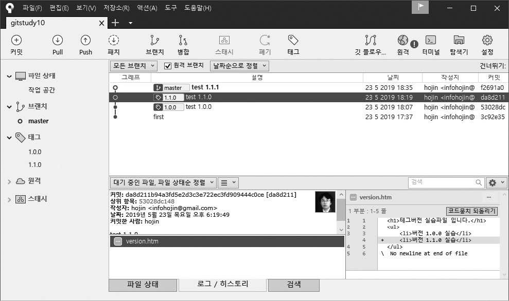
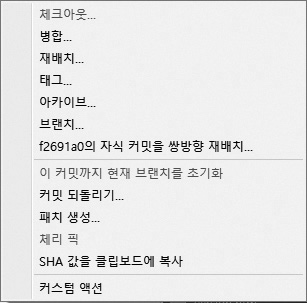
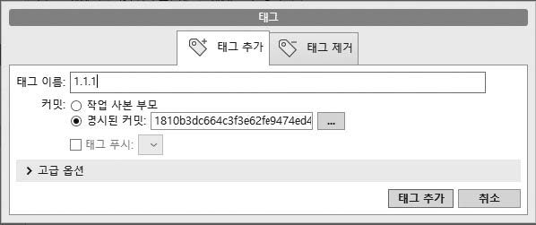

## Annotated 태그
Annotated 태그는 깃에서 가장 일반적으로 사용하는 태그 방법입니다. Annotated는 ‘주석이 달린’이라는 뜻입니다.  

<br>
<hr>

### 태그 생성
Annotated 태그를 생성할 때는 커밋의 해시 값뿐 아니라 추가로 생성자 정보를 같이 넣을 수 있습니다. 예를 들어 이메일, 날짜, 메시지 등 정보입니다. 또 GPG 방식으로 서명도 가능합니다.  

Annotated 태그를 생성하려면 tag 명령어 뒤에 -a 옵션을 사용합니다.  

```
$ git tag -a 버전
```

바로 실습해 보겠습니다. version.htm 파일을 수정하고 커밋합니다.  

```
infoh@DESKTOP MINGW64 /e/gitstudy10 (master)
$ code version.htm ☜ VS Code를 실행합니다.

```

version.htm
```html
<h1>태그 버전 실습 파일입니다.</h1>
<ul>
    <li>버전 1.0.0 실습</li>
</ul>
```
 
```
infoh@DESKTOP MINGW64 /e/gitstudy10 (master)
$ git commit -am "test 1.0.0"
[master 53028dc] test 1.0.0
 1 file changed, 4 insertions(+), 1 deletion(-)
```

작성한 커밋에 Annotated 태그를 붙이겠습니다.  

```
infoh@DESKTOP MINGW64 /e/gitstudy10 (master)
$ git tag -a 1.0.0 ☜ 태그 추가
```

Annotated 태그를 생성할 때는 태그 메시지를 작성할 수 있는 vi 에디터가 함께 실행됩니다.  

그림 10-2] 태그 메시지 작성  


```
#

# Write a message for tag:

# 1.0.0

# Lines starting with '#' will be ignored.
```
 

간략한 메시지를 작성하고 저장하면, 정상적으로 태그가 생성됩니다. 태그는 현재의 마지막 커밋을 기준으로 생성되며, 이 커밋은 HEAD 포인터와 일치합니다.  

그림 10-3] 태그 생성 위치  


앞에서 생성한 태그를 확인해 봅시다. 생성한 태그의 버전을 출력합니다.  

```
infoh@DESKTOP MINGW64 /e/gitstudy10 (master)
$ git tag
1.0.0 ☜ 태그 확인

```

이번에는 생성된 태그를 좀 더 자세히 알아봅시다. 로그 기록을 확인합니다.  

```
infoh@DESKTOP MINGW64 /e/gitstudy10 (master)
$ git log --decorate
commit 53028dc1486b42d23253ffd4001a758cef455372 (HEAD -> master, tag: 1.0.0) ☜ 태그 확인
Author: hojin <infohojin@gmail.com>
Date:   Thu May 23 18:07:18 2019 +0900
    test 1.0.0

commit 3c92e359a0039a5884fec9bb9e0535bdcd188cc4
Author: hojin <infohojin@gmail.com>
Date:   Thu May 23 17:37:53 2019 +0900
    first

```

생성된 태그가 53028d 커밋에 1.0.0으로 추가된 것을 확인할 수 있습니다. 커밋에 꼬리표처럼 연결되어 있습니다.  

<br>
<hr>

### 간단한 메시지
Annotated 태그를 생성할 때는 메시지를 작성해야 합니다. 작성할 태그 정보가 간단하다면 vi 에디터를 사용하지 않고, -m 옵션으로 대체할 수 있습니다. 커밋 명령어의 -m 옵션과 유사합니다.  

이어서 실습해 보겠습니다. version.htm 파일에 한 줄을 더 추가하고 커밋합니다.  

```
infoh@DESKTOP MINGW64 /e/gitstudy10 (master)
$ code version.htm

```

version.htm
```html
<h1>태그 버전 실습 파일입니다.</h1>
<ul>
    <li>버전 1.0.0 실습</li>
    <li>버전 1.1.0 실습</li>
</ul>

```
 
```
infoh@DESKTOP MINGW64 /e/gitstudy10 (master)
$ git commit -am "test 1.1.0"
[master da8d211] test 1.1.0
 1 file changed, 1 insertion(+)
```

추가된 커밋에 새로운 태그를 만듭시다. 이번에는 간략한 태그 메시지를 작성하려고 -m 옵션을 같이 사용합니다.  

```
infoh@DESKTOP MINGW64 /e/gitstudy10 (master)
$ git tag -a 1.1.0 -m "simple tag 1.1.0"
```

정상적으로 태그가 생성되었는지 목록을 확인합니다.  

```
infoh@DESKTOP MINGW64 /e/gitstudy10 (master)
$ git tag
1.0.0
1.1.0
```

태그 목록이 2개 출력됩니다. 정상적으로 태그가 추가되었네요.  

그림 10-4] 두 번째 태그  


<br>
<hr>

### 소스트리에서 태그 생성
소스트리에서도 태그를 작성할 수 있습니다. 실습을 위해 version.htm 파일을 수정하고 저장한 후 커밋합니다.  

```
infoh@DESKTOP MINGW64 /e/gitstudy10 (master)
$ code version.htm
```

version.htm
```html
<h1>태그 버전 실습 파일입니다.</h1>
<ul>
    <li>버전 1.0.0 실습</li>
    <li>버전 1.1.0 실습
        <ul>
            <li>수정 작업 1.1.1</li>
        </ul>
    </li>
</ul>
```
 
```
infoh@DESKTOP MINGW64 /e/gitstudy10 (master)
$ git commit -am "test 1.1.1"
[master f2691a0] test 1.1.1
 1 file changed, 5 insertions(+), 1 deletion(-)

```

소스트리와 gitstudy10 폴더를 연결합시다. 소스트리의 새 탭에서 Add 버튼을 클릭합니다. 탐색을 눌러 앞에서 만든 gitstudy10 폴더를 찾아 선택한 후 추가를 누릅니다. 소스트리와 연결했다면 소스트리에서 로컬 저장소를 확인합니다. 왼쪽의 태그 탭에서 지금까지 생성된 전체 태그를 확인할 수 있습니다.  

그림 10-5] 소스트리에서 저장소 태그 확인  



새롭게 추가한 커밋을 선택합니다. 이 커밋의 메시지는 ‘test 1.1.1’입니다. 이 메시지 위에서 마우스 오른쪽 버튼을 눌러 태그 메뉴를 확인합니다. 또는 소스트리 위쪽에서 태그 10-a.jpg 버튼을 클릭해도 됩니다.  

그림 10-6] 태그 생성 메뉴  


태그 창이 열리면 태그 이름을 입력합니다. 책에서는 1.1.1을 입력하겠습니다. 이름을 입력한 후 태그 추가를 누릅니다.  

그림 10-7] 태그 이름 입력  


소스트리 그래프에 1.1.1 태그가 생성된 것을 확인할 수 있습니다.  

그림 10-8] 태그 생성  


<br>
<hr>

### 태그는 중복해서 생성할 수 없다
깃에 등록된 태그 이름은 유일해야 합니다. 즉, 태그는 같은 이름으로 중복해서 생성할 수 없습니다. 실습으로 확인해 봅시다.  

version.htm 파일을 수정하고 저장한 후 커밋합니다.  

```
infoh@DESKTOP MINGW64 /e/gitstudy10 (master)
$ code version.htm

```

version.htm
```html
<h1>태그 버전 실습 파일입니다.</h1>
<ul>
    <li>버전 1.0.0 실습</li>
    <li>버전 1.1.0 실습
        <ul>
            <li>수정 작업 1.1.1</li>
            <li>수정 버전 1.1.2</li>
        </ul>
    </li>
</ul>

```
 
```
infoh@DESKTOP MINGW64 /e/gitstudy10 (master)
$ git commit -am "test 1.1.2"
[master 80f8890] test 1.1.2
 1 file changed, 1 insertion(+)

```

지금까지 생성한 태그 목록을 확인합니다.  

```
infoh@DESKTOP MINGW64 /e/gitstudy10 (master)
$ git tag
1.0.0
1.1.0
1.1.1

```

이번에는 중복된 이름으로 태그를 생성해 보겠습니다.  

```
infoh@DESKTOP MINGW64 /e/gitstudy10 (master)
$ git tag -a 1.1.1 -m "test 1.1.1"
fatal: tag '1.1.1' already exists

```

이미 태그 1.1.1이 있다는 오류 메시지를 출력합니다. 깃은 안정적인 배포 환경을 위해 이처럼 중복된 태그 이름을 사용하지 못하도록 태그 목록을 검사합니다.  

<br>
<hr>

### 태그 삭제
태그는 특정 커밋을 가리키는 꼬리표입니다. 실수로 생성할 태그의 커밋을 잘못 지정할 수도 있습니다. 이때는 기존에 생성한 태그를 삭제해야 합니다.  

태그는 tag -d 명령어로 삭제할 수 있습니다.  

```
$ git tag -d 태그이름
```
 
태그 목록에서 삭제된 태그 이름은 이후에 다시 사용할 수 있습니다.  
지금까지 진행한 실습의 로그를 확인해 보겠습니다.  

```
infoh@DESKTOP MINGW64 /e/gitstudy10 (master)
$ git log --oneline
80f8890 (HEAD -> master) test 1.1.2
f2691a0 (tag: 1.1.1) test 1.1.1
da8d211 (tag: 1.1.0) test 1.1.0
53028dc (tag: 1.0.0) test 1.0.0
3c92e35 first

```

커밋 f2691a0에 태그 1.1.1이 지정되어 있습니다. 태그 1.1.1을 삭제해 보겠습니다.  

```
infoh@DESKTOP MINGW64 /e/gitstudy10 (master)
$ git tag -d 1.1.1
Deleted tag '1.1.1' (was b3ffc7d)

```

태그가 삭제되었습니다. 다시 로그를 확인합니다.  

```
infoh@DESKTOP MINGW64 /e/gitstudy10 (master)
$ git log --oneline
80f8890 (HEAD -> master) test 1.1.2
f2691a0 test 1.1.1
da8d211 (tag: 1.1.0) test 1.1.0
53028dc (tag: 1.0.0) test 1.0.0
3c92e35 first

```

추가된 태그가 커밋 로그에서도 삭제된 것을 확인할 수 있습니다. 태그 목록을 확인합니다.  

```
infoh@DESKTOP MINGW64 /e/gitstudy10 (master)
$ git tag
1.0.0
1.1.0
```

태그는 단순히 커밋의 포인터이므로, 태그를 삭제해도 실제 커밋은 삭제되지 않습니다.  

<br>
<hr>

### 태그의 상세 정보 확인: show 명령어
Annotated 태그는 커밋의 태그 포인터와 함께 여러 정보를 포함합니다. tag 명령어는 태그의 목록만 출력할 뿐 상세 정보는 표시하지 않습니다. 태그의 상세 정보를 확인하려면 show 명령어를 사용해야 합니다.  

```
$ git show 태그이름
```
 
다음과 같이 show 명령어를 실행하면 생성된 태그의 상세 정보를 확인할 수 있습니다.  

```
infoh@DESKTOP MINGW64 /e/gitstudy10 (master)
$ git show 1.0.0
tag 1.0.0
Tagger: hojin <infohojin@gmail.com>
Date:   Thu May 23 18:12:16 2019 +0900

this is first tag ☜ 태그 정보

commit 53028dc1486b42d23253ffd4001a758cef455372 (tag: 1.0.0)
Author: hojin <infohojin@gmail.com> 
Date:   Thu May 23 18:07:18 2019 +0900 
    test 1.0.0 

diff --git a/version.htm b/version.htm
index 14f6513..eccf619 100644
--- a/version.htm
+++ b/version.htm
@@ -1 +1,4 @@
-<h1>태그 버전 실습 파일입니다.</h1>
\ No newline at end of file
+<h1>태그 버전 실습 파일입니다.</h1>
+<ul>
+    <li>버전 1.0.0 실습</li>
+</ul>
\ No newline at end of file

```

<br><br>