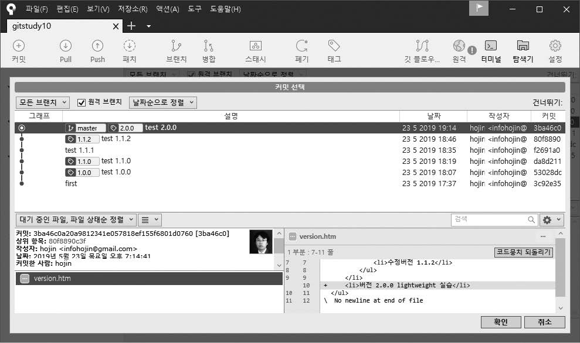
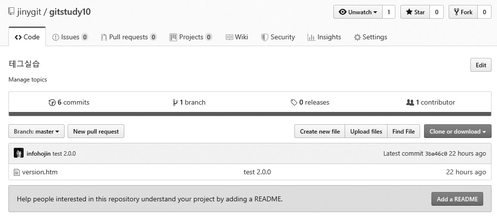
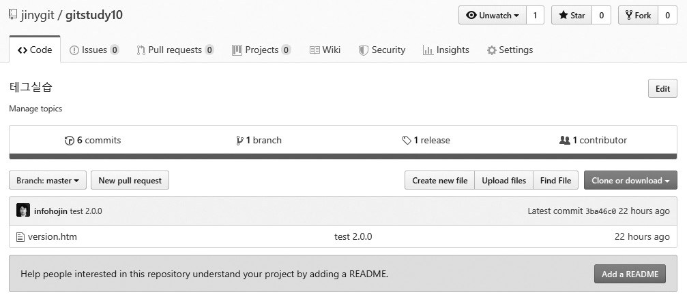

## 태그 공유
지금까지는 로컬 저장소에서 태그를 생성하는 방법에 대해 알아보았습니다. 로컬 저장소에서의 생성한 태그를 원격 저장소로에 공유할 수 있습니다. 태그도 공유할 수 있습니다. 태그를 공유하는 것은 불특정 다수에게 최종 소스의 커밋 정보를 알리기 위해서입니다.  

태그의를 외부로 공개하는 것은 최종 코드를 배포하는 것과 같습니다. 태그를 이용하여 사용자는 최종 코드를 내려받을아 사용할 수 있습니다. 

<br>
<hr>

### 원격 저장소 생성
태그 정보를 공유하기 위해서는 원격 저장소가 필요합니다. 깃허브와 같은 호스팅 서비스를 통하여 공개 저장소를 생성합니다. 책에서는 5장에서 만든 깃허브 저장소를 사용하겠습니다.  

```
infoh@DESKTOP MINGW64 /e/gitstudy10 (fix)
$ git checkout master ☜ master 체크아웃
Switched to branch 'master'
```

생성된 공개 저장소를 로컬 저장소에 등록합니다.  

```
infoh@DESKTOP MINGW64 /e/gitstudy10 (master)
$ git remote add origin https://github.com/jinygit/gitstudy10.git ☜ 자기 계정의 실습 저장소
```

> Note: 원격 저장소의 주소는 자신의 계정으로 직접 생성한 주소로 등록합니다. 책 예제와 똑같이 하면 권한 문제가 발생합니다.

원격 저장소의 목록을 확인합니다.

```
infoh@DESKTOP MINGW64 /e/gitstudy10 (master)
$ git remote -v
origin  https://github.com/jinygit/gitstudy10.git (fetch)
origin  https://github.com/jinygit/gitstudy10.git (push)
```

<br>
<hr>

### 태그 동기화
생성된 원격 저장소로 로컬의 태그 정보를 공유합니다.하려면 직접 동기화 명령을 수행해야 합니다. 태그 정보는 원격 저장소로 자동 전송되지 않습니다. 직접 동기화 명령을 수행해야 합니다.  

로컬 저장소의 커밋을기록을 원격 저장소로 전송할때하려면 push 명령을 사용해야 합니다. 원격 저장소로에 현재 로컬 브랜치를 전송하려면 다음처럼 합니다.  

[예시]
```
$ git push 브랜치이름
```

직접 실습해볼까요? 로컬 저장소의 master 브랜치를 원격 저장소로 전송해보겠습니다.  

```
infoh@DESKTOP MINGW64 /e/gitstudy10 (master)
$ git push origin master
Enumerating objects: 18, done.
Counting objects: 100% (18/18), done.
Delta compression using up to 8 threads
Compressing objects: 100% (11/11), done.
Writing objects: 100% (18/18), 1.44 KiB | 113.00 KiB/s, done.
Total 18 (delta 4), reused 0 (delta 0)
remote: Resolving deltas: 100% (4/4), done.
To https://github.com/jinygit/gitstudy10.git
 * [new branch]      master -> master
```

깃허브의 저장소를 확인합니다.하면 로컬 저장소의 커밋을 정보만 원격 저장소로 전송된저장된 것을 확인할 수 있습니다. 그리고, 배포를 의미하는 realease는 텝을 확인합니다. 숫자가 0으로 되어 있습니다.  

그림 10-10 커밋 전송 및 release 텝 확인제목  


방금 우리는 원격 저장소로 커밋을 전송하였습니다. 하지만, 태그의 정보는 전송에서 제외 욉니다. 태그의 전송은 별도로 해주어야 합니다. 만일 태그 정보가 임의로 공유된다면 테스트 중인 태그 버전과 혼동되어 문제가 많이 발생할 것입니다.  

태그 정보의를 전송은할 때도 동일하게한 push 명령을 같이 사용합니다. 브랜치 이름 대신 태그 이름을 입력하면 됩니다.  

[예시]
```
$ git push 태그이름
```

생성된 로컬 저장소의 태그 정보를 하나를만 원격 저장소로 전송해봅시다.  

```
infoh@DESKTOP MINGW64 /e/gitstudy10 (master)
$ git push origin 1.0.0 ☜ 테그전송
Enumerating objects: 1, done.
Counting objects: 100% (1/1), done.
Writing objects: 100% (1/1), 160 bytes | 32.00 KiB/s, done.
Total 1 (delta 0), reused 0 (delta 0)
To https://github.com/jinygit/gitstudy10.git
 * [new tag]         1.0.0 -> 1.0.0
```

로컬 저장소의 테그를 전송하였습니다. 깃허브 저장소를 이동하여 확인을 해봅시다.하면 이전과 달리 realease가 1로 변경된 것을 확인 할 수 있되었습니다. 깃허브에서는 깃의 태그 정보를 realease 항목으로에 표시합니다.  

그림 10-11 release 확인 제목  
 

깃허브의 release 항목을 선택하면 방금 로컬 저장소에서 전송한 태그의 정보를와 커밋이 확인 할 수 있습니다.표시됩니다. 또한, 사용자는 해당 태그가 가리키는 커밋의 최종 소스를 내려받을 수 있습니다.  

그림 10-12 테그가 가리키는 소스제목  
 

이처럼 태그를 공유하는 것은 push 명령을 사용하지만 자동으로 동기화되지는 않습니다. 직접 태그를 공유해야 합니다. 만일 태그 정보가 임의로 공유된다면 테스트 중인 태그 버전과 혼동되어 문제가 많이 발생할 것입니다.  

<br>
<hr>

### 전체 태그 동기화
이전에는 한 개의 태그 하나를 지정하여 원격 저장소로와 공유 하였해봤습니다. 하지만 로컬 저장소에는 태그가 여러 개 태그가 존재하기도 합니다. 많은 태그를 이럴 때는 하나씩 공유실행하는 것은 불편합니다.  

지금까지 실습한 로컬 저장소의 태그를 다시 확인해봅시다.  

```
infoh@DESKTOP MINGW64 /e/gitstudy10 (master)
$ git tag
1.0.0
1.1.0
1.1.2
2.0.0
```

태그가 많군요. push 명령의 --tags 옵션을 사용하면 로컬 저장소의 모든 태그를 한 번에 원격 저장소로 전송할 수 있습니다.  

```
$ git push origin --tags
```

그럼 로컬 저장소의 모든 태그를 원격 서버로 전송해보겠습니다.  

```
infoh@DESKTOP MINGW64 /e/gitstudy10 (master)
$ git push origin --tags
Enumerating objects: 1, done.
Counting objects: 100% (1/1), done.
Writing objects: 100% (1/1), 156 bytes | 39.00 KiB/s, done.
Total 1 (delta 0), reused 0 (delta 0)
To https://github.com/jinygit/gitstudy10.git
 * [new tag]         1.1.0 -> 1.1.0
 * [new tag]         1.1.2 -> 1.1.2
 * [new tag]         2.0.0 -> 2.0.0
```

깃은 원격 저장소로 전송되지 않은 모든 태그를 감지합니다. 그리고 한꺼번에 미전송된 모든 태그를 전송합니다. 깃허브 저장소를 다시 한 번 확인해볼까요?  

그림 10-13 release 확인제목  


release 항목의 숫자가 1에서 4로 변경되었습니다. release 항목을 클릭합니다. 로컬에서 생성된 모든 태그를 확인할 수 있습니다. 태그 번호를 클릭하면 좀 더 상세한 태그 정보를 확인할 수 있습니다. 또한, 해당 태그의 커밋을 기준 코드를 압축 파일로 내려받을 수 있습니다.  

그림 10-14 테그목록 확인 및 내려받기제목  
 

<br>
<hr>

### 원격 저장소의 태그 수정과 삭제
깃허브에서도 원격 저장소에 등록된 태그를 수정할 수 있습니다. 깃허브에서 태그를 선택합니다.하고, 선택된 화면에서 우측 상단의 [Eedit tag]를 클릭합니다.하면 됩니다.  

그림 10-15 깃허브 테그 수정제목  
 

마찬가지로 원격 저장소의에서 태그를 삭제할 수도 있습니다. 로컬 저장소의에서 태그를 삭제할 때는 tag 명령을 사용합니다. 이용했습니다. 하지만 원격 저장소로 공유된 태그를 삭제할 때는 push 명령을 사용해야 합니다.   

```
$ git push --delete 서버이름 태그이름
```

push 명령을 사용하는 이유는 실제 저장소가 분리되어 있기 때문 입니다. 테그 삭제 명령을이 원격 저장소로 전송하여, 원격저장소에서 실행 되어야 하기 때문입니다. 그럼 원격 저장소의 2.0.0 태그를 삭제해보겠습니다.  

```
infoh@DESKTOP MINGW64 /e/gitstudy10 (master)
$ git push --delete origin 2.0.0 ☜ 명령 전송
To https://github.com/jinygit/gitstudy10.git
 - [deleted]         2.0.0
```

명령을 전송하고태그를 삭제하고 깃허브 저장소를 확인합니다.하면 release 목록에 삭제한 2.0.0 테그가이 삭제된 것을 release 목록에서 확인 합니다.사라졌습니다.  

그림 10-16 삭제 확인제목  
 

push 명령으로 원격 저장소의 태그를 삭제하였습니다. 하지만할 수 있지만, 로컬 저장소는 태그가는 삭제되지 않고 2.0.0이 남아 있습니다. 원격 저장소의 태그를 삭제하였으면 했으니 로컬 저장소도의 태그도 같이 삭제합시다.  

```
infoh@DESKTOP MINGW64 /e/gitstudy10 (master)
$ git tag -d 2.0.0
Deleted tag '2.0.0' (was 3ba46c0)
```

이처럼 로컬 저장소와 원격 저장소의 태그는 저장소간 자동으로 동기화되지 않습니다.  

전송된 태그의 이름을 변경하고자 할때에는 어떻게 해야 할까요?만일 태그가 동기화되어 있는 상태에서 태그 이름을 변경하고자 할 때는 반드시 원격 저장소의 태그와를 삭제합니다. 그리고 로컬 저장소의 태그를 모두 삭제 합니다. 그리고 한 후에 다시 새로운 태그를 생성합니다. 그다음 원격 저장소로 새로운 다시 생성된 변경 태그를 재전송 하면 됩합니다. 만일, 원격 저장소의 태그가 삭제되어 있지 않고, 동일한 태그 이름으로 전송하면 오류가 발생합니다.  

반대로 원격 저장소의 태그 목록을 가지고 올 때는 pull 명령을 사용하면 됩니다. 또는 clone 명령을 이용해서 복제할 때도 태그 정보를 같이 가지고 옵올 수 있습니다.  

<br>
<hr>

### 원격 저장소에 로컬과 다른 이름으로 태그 전송
push 명령은 로컬 저장소의 정보를 원격 저장소로 전송합니다. push명령을 사용하여 또한, 로컬 브랜치를는 원격 브랜치로서버의 전송할때 다른 브랜치 이름으로도 전송할 수 있었습니다.  

[예시]
```
$ git push origin mater:master1
```

위의 예시는 로컬 저장소의 master 브랜치를 origin 서버(원격 저장소)의 master1 브랜치로 등록하는 방법입니다. 이 원리를 응용하여 깃의 태그도 동일한 이름이 아닌 다른 테그명이름으로 전송할 수 있습니다. 다음처럼 콜론(:)을 이용하여 기존 태그 이름과 원격 저장소의 태그 이름을 지정합하면 됩니다.  

```
$ git push origin 태그이름 : 원격태그이름 
```

그럼 로컬 저장소의 1.1.2 태그를 원격 저장소에는 3.0.0 태그로 등록해보겠습니다.  

```
infoh@DESKTOP MINGW64 /e/gitstudy10 (master)
$ git push origin 1.1.2:3.0.0
Total 0 (delta 0), reused 0 (delta 0)
To https://github.com/jinygit/gitstudy10.git
 * [new tag]         1.1.2 -> 3.0.0
```

깃허브 저장소를 확인합니다.하면 변경된 3.0.0 태그가 등록된되 것을 확인합었습니다. 좀 더 주의 깊게 살펴보면 1.1.2 태그와 3.0.0 태그가 모두 동일한하게 80f8890 해시값을 가리키고 있는 것을 알 수 있습니다.  

그림 10-17 다른이름의 태그전송제목  
 

> Note: 태그 생성 원리
깃은 태그 생성 정보를 .git/ref/tags 폴더 안에 저장합니다. 태그 목록에 1.0.0, 1.1.0, 1.1.2가 있다면 태그 저장 폴더에도 동일한 이름의 파일들이 존재 합있습니다.  

```
infoh@DESKTOP MINGW64 /e/gitstudy10 (master)
$ git tag
1.0.0
1.1.0
1.1.2

infoh@DESKTOP MINGW64 /e/gitstudy10 (master)
$ ls .git/refs/tags
1.0.0  1.1.0  1.1.2 ☜ 파일
```

tag 명령을 사용하지 않고 직접 태그를 생성할 수도 있습니다. 태그 정보가 저장된 폴더의에 있는 파일을 읽으면 테그의 커밋의 해시값을 알 수갖고 있습니다. 이 해시값으로 tag 명령을 사용하지 않고 직접 태그를 생성할 수도 있습니다.  

먼저 해시값을 확인합니다.   

```
infoh@DESKTOP MINGW64 /e/gitstudy10 (master)
$ cat .git/refs/tags/1.0.0
fa90a3b104defc714a1357e59c95138383587037
```

먼저 해시값을 확인합니다.  

```
infoh@DESKTOP MINGW64 /e/gitstudy10 (master)
$ git log --decorate
commit 3ba46c0a20a9812341e057818ef155f6801d0760 (HEAD -> master, origin/master)
Author: hojin <infohojin@gmail.com>
Date:   Thu May 23 19:14:41 2019 +0900
    test 2.0.0

commit 80f8890c3ff009f0d7d007d85a65d34c8ae2d25a (tag: 1.1.2)
Author: hojin <infohojin@gmail.com>
Date:   Thu May 23 18:46:33 2019 +0900
    test 1.1.2

commit f2691a05b82233acf5b37ffeae738ee07a596bde
Author: hojin <infohojin@gmail.com>
Date:   Thu May 23 18:35:27 2019 +0900
    test 1.1.1

commit da8d211b94a3fd5e2d3c3e722ec3fd909444c0ce (tag: 1.1.0)
Author: hojin <infohojin@gmail.com>
Date:   Thu May 23 18:19:49 2019 +0900
    test 1.1.0

commit 53028dc1486b42d23253ffd4001a758cef455372 (tag: 1.0.0, fix) 
…생략
```

중간에 비어 있는 커밋을태그를 이용하여 새로운 태그를 생성해 봅니다.할 수 있습니다. f2691a05b82233acf5b37ffeae738ee07a596bde 커밋을 태그 1.1.1로 생성 합니다.해봅시다.  

```
infoh@DESKTOP MINGW64 /e/gitstudy10 (master)
$ echo f2691a05b82233acf5b37ffeae738ee07a596bde > .git/refs/tags/1.1.1
```

그냥 해시값을 가지는 파일만을 생성하였습니다. 새로운 태그 파일이 생성된 것을 확인합니다.할 수 있습니다. 이렇게 생성된 태그는 Lightweight 태그입니다.  

```
infoh@DESKTOP MINGW64 /e/gitstudy10 (master)
$ ls .git/refs/tags/
1.0.0  1.1.0  1.1.1  1.1.2

infoh@DESKTOP MINGW64 /e/gitstudy10 (master)
$ git tag
1.0.0
1.1.0
1.1.1
1.1.2
```

Annotated 태그의 경우에는 좀 더 복잡합니다. Annotated 태그는 태그의 정보를 추가적으로 가지고 있기 때문입니다.에 추가 정보에 대한 객체를 먼저 생성한 후에 생성된 정보를 가리키는 객체의 해시값을 사용저장해야 합니다.  

<br><br>