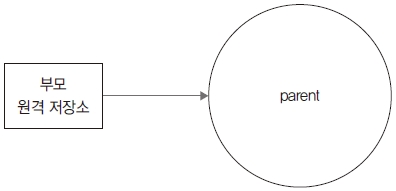

서브모듈

지금까지 우리는 저장소 하나로만 작업했습니다. 대부분의 프로젝트는 깃 저
장소 하나만으로도 충분히 관리할 수 있습니다. 이 장에서는 저장소 하나를
여러 저장소로 분리하는 방법을 살펴보겠습니다

11.1 git
깃은 작은 프로젝트부터 대용량 프로젝트까지 관리할 수 있는 버전 관리 도구입니다. 깃은 작은
프로젝트뿐만 아니라 큰 규모의 프로젝트도 관리하기 쉽도록 저장소를 여러 개 이용하여 단일 프
로젝트를 진행할 수 있습니다.
11.1.1 저장 용량
깃 저장소는 용량 한계가 없습니다. 컴퓨터의 하드디스크에서 지원하는 용량만큼 깃 저장소를 생
성할 수 있습니다. 또 깃은 파일을 기반으로 데이터베이스를 관리합니다. 하지만 저장소 크기가
너무 크면 컴퓨터에 부담을 줍니다.
이러한 이유로 깃 호스팅 서비스들은 제공되는 저장소 용량을 제한합니다. 보통 1GB 용량을 제
공하기 때문에 파일 개수가 많은 프로젝트에서는 좀 더 효율적인 관리 방법이 필요합니다.
11.1.2 저장소 분리
규모가 큰 프로젝트는 저장소 용량이 많이 필요합니다. 또 단지 용량이 크기만 한 저장소는 비효
율적입니다. 필요에 맞게 작은 저장소로 분할하여 운영하는 것이 좀 더 효율적입니다. 깃 역시 큰
규모의 저장소를 작은 저장소로 나누어 관리할 수 있습니다.
즉, 저장소 하나를 작은 저장소 몇 개로 분할할 수 있다는 의미입니다. 이러한 저장소의 분할 개념
을 서브모듈이라고 합니다. 서브모듈은 저장소 하나가 다른 깃 저장소를 포함하는 형태를 의미합니
다. 이러한 서브모듈 개념을 적용하면 대형 프로젝트도 효과적으로 관리할 수 있습니다.
깃교과서_06.indd 361 2020-03-05 오후 1:51:48
362

그림 11-1 분할된 저장소  

분할
저장소
분할
저장소
분할
저장소
메인
저장소
분할
저장소
작게 나뉜 모듈 형태의 저장소는 다른 프로젝트에서도 재사용할 수 있습니다.
11.1.3 상하 관계
요즘 규모가 큰 프로젝트는 모듈화하여 개발하는 추세입니다. 각 기능들을 모듈화하여 독립된 깃
저장소로 관리합니다. 그리고 독립된 깃 저장소는 모듈로서 다시 메인 저장소와 결합하여 재사용
됩니다.
메인 저장소에는 서브 저장소가 여러 개 있습니다. 따라서 저장소 간 상하 관계가 발생합니다. 보
통 부모 저장소와 자식 저장소 형태로 나눕니다. 부모 자식 관계로 분리된 로컬 저장소는 또다시
개별 원격 저장소와 연결됩니다. 원격 저장소로 동기화된 자식들은 언제든지 다른 프로젝트의 모
듈별로 기능을 처리하고 결합할 수 있습니다.
실습을 위한 저장소 준비 11.2 git
서브모듈을 실습할 수 있는 환경을 구축하겠습니다. 서브모듈을 테스트하려면 저장소가 2개 필요
합니다. 먼저 로컬 컴퓨터에 깃 저장소를 2개 생성할 것입니다. 그리고 원격 저장소도 2개 생성하
여 각 로컬 저장소와 연결하겠습니다.
깃교과서_06.indd 362 2020-03-05 오후 1:51:48
363
11
서브모듈  

그림 11-2 깃 저장소 생성 후 원격 저장소와 연결  

parent child
11.2.1 메인 저장소 생성
먼저 부모 역할의 메인 저장소를 생성합니다.
$ cd 실습폴더
$ mkdir gitstudy11_parent 새 폴더 만들기
$ cd gitstudy11_parent
infoh@DESKTOP MINGW64 /e/gitstudy11_parent (master)
$ git init 저장소 초기화
Initialized empty Git repository in E:/gitstudy11_parent/.git/
메인 저장소( gitstudy11_parent)에 parent.htm 파일을 생성하고 저장합니다.
infoh@DESKTOP MINGW64 /e/gitstudy11_parent (master)
$ code parent.htm VS Code 실행
parent.htm
<h1>부모 저장소</h1>
첫 번째 커밋을 합니다.
infoh@DESKTOP MINGW64 /e/gitstudy11_parent (master)
$ git add parent.htm 등록
infoh@DESKTOP MINGW64 /e/gitstudy11_parent (master)
깃교과서_06.indd 363 2020-03-05 오후 1:51:48
364
$ git commit -m "parent first" 커밋
[master (root-commit) 6a9851e] parent first
1 file changed, 1 insertion(+)
create mode 100644 parent.htm
메인 저장소와 동기화할 원격 저장소를 생성합시다. 먼저 깃허브에 로그인한 후 New 버튼 또는
+  New repository를 클릭합니다.

그림 11-3 깃허브에서 새 저장소 메뉴 선택  

다음 화면에서 원하는 저장소 이름을 입력하고 Create repository를 누릅니다. 필자는
gitstudy11_parent로 정했는데, 로컬 저장소 이름과 동일하지 않아도 됩니다.

그림 11-4 원하는 이름으로 새 저장소 생성  

저장소가 생성되면 https://github.com/jinygit/gitstudy11_parent.git 주소가 나옵니다. 이 주
소와 로컬 저장소를 연결할 것입니다. 이 주소를 복사해 둡니다.
깃교과서_06.indd 364 2020-03-05 오후 1:51:48
365
11
서브모듈
다시 깃 배시 화면으로 돌아갑니다. 메인 저장소에 리모트 등록을 합시다. 1
infoh@DESKTOP MINGW64 /e/gitstudy11_parent (master)
$ git remote add origin https://github.com/jinygit/gitstudy11_parent.git 원격 저장소 등록
커밋 정보를 원격 저장소로 전송합니다.
infoh@DESKTOP MINGW64 /e/gitstudy11_parent (master)
$ git push -u origin master 커밋 전송
Enumerating objects: 3, done.
Counting objects: 100% (3/3), done.
Writing objects: 100% (3/3), 235 bytes | 117.00 KiB/s, done.
Total 3 (delta 0), reused 0 (delta 0)
To https://github.com/jinygit/gitstudy11_parent.git
* [new branch] master -> master
깃허브에서 커밋 정보가 잘 전송된 것을 확인할 수 있습니다.

그림 11-5 부모 저장소의 커밋 정보 확인  

11.2.2 자식 저장소 생성
이번에는 메인 저장소와 연결되는 자식 저장소를 생성합니다.
$ cd 실습폴더
$ mkdir gitstudy11_child 새 폴더 만들기
1 자신의 깃허브 계정 URL을 입력하세요. 책의 주소를 그대로 입력하면 권한 오류가 발생합니다.
자신의 URL 주소
깃교과서_06.indd 365 2020-03-05 오후 1:51:48
366
$ cd gitstudy11_child
infoh@DESKTOP MINGW64 /e/gitstudy11_child (master)
$ git init 저장소 초기화
Initialized empty Git repository in E:/gitstudy11_child/.git/
자식 저장소에 child.htm 파일을 생성하고 저장합니다.
infoh@DESKTOP MINGW64 /e/gitstudy11_child (master)
$ code child.htm VS Code 실행
child.htm
<h1>자식 저장소</h1>
자식 저장소에서 첫 번째 커밋을 합니다.
infoh@DESKTOP MINGW64 /e/gitstudy11_child (master)
$ git add child.htm 등록
infoh@DESKTOP MINGW64 /e/gitstudy11_child (master)
$ git commit -m "child first" 커밋
[master (root-commit) 2573787] child first
1 file changed, 1 insertion(+)
create mode 100644 child.htm
자식 저장소와 동기화할 원격 저장소도 생성합시다. 깃허브에서 gitstudy11_child로 저장소를
만듭니다. 생성된 https://github.com/jinygit/gitstudy11_child.git 주소를 복사합니다.
그리고 다시 깃 배시로 돌아와 원격 저장소와 연결한 후 자식 저장소의 커밋을 원격 저장소로 전
송합니다.
infoh@DESKTOP MINGW64 /e/gitstudy11_child (master)
$ git remote add origin https://github.com/jinygit/gitstudy11_child.git 원격 저장소 등록
infoh@DESKTOP MINGW64 /e/gitstudy11_child (master)
$ git push -u origin master 커밋 전송
Enumerating objects: 3, done.
Counting objects: 100% (3/3), done.
Writing objects: 100% (3/3), 232 bytes | 116.00 KiB/s, done.
Total 3 (delta 0), reused 0 (delta 0)
자신의 URL 주소
깃교과서_06.indd 366 2020-03-05 오후 1:51:48
367
11
서브모듈
To https://github.com/jinygit/gitstudy11_child.git
* [new branch] master -> master
깃허브에서 커밋 정보가 전송된 것을 확인할 수 있습니다.

그림 11-6 자식 저장소의 커밋 정보 확인  

서브모듈 추가 11.3 git
두 저장소를 생성하고 원격 저장소와 연결하여 서브모듈 실습 환경을 준비했습니다. 서브모듈은
2개 이상인 저장소를 부모와 자식 관계로 연결합니다.
저장소를 모듈로 연결하려면 submodule 명령어를 사용합니다.
$ git submodule -help
submodule 명령어는 옵션을 사용하여 다양한 동작을 실행할 수 있습니다. 자세한 옵션은 -help
명령어로 확인합니다.
깃교과서_06.indd 367 2020-03-05 오후 1:51:48
368
11.3.1 저장소 연결
메인 저장소에 자식 저장소를 연결합니다. 메인 저장소에 자식 저장소를 추가하는 옵션은 add 명
령어입니다. 서브모듈로 저장소가 추가되면 메인 저장소는 서브 저장소를 서브 폴더 형태로 취급합
니다.
$ git submodule add 원격저장소URL 폴더이름
실습하면서 개념을 익혀 봅시다. 먼저 서브 저장소가 추가될 메인 저장소로 이동합니다. 여기서는
부모 저장소를 의미합니다.
infoh@DESKTOP MINGW64 /e/gitstudy11_child (master)
$ cd ../gitstudy11_parent 메인 저장소로 이동
infoh@DESKTOP MINGW64 /e/gitstudy11_parent (master)
메인 저장소에 submodule 명령어를 사용하여 또 다른 저장소를 추가합니다. 실습에서는 준비한 자
식 저장소를 등록하겠습니다. 자식 저장소를 등록할 때는 자식 저장소와 연결된 원격 저장소 주소
를 입력합니다.
infoh@DESKTOP MINGW64 /e/gitstudy11_parent (master)
$ git submodule add https://github.com/jinygit/gitstudy11_child.git child
Cloning into 'E:/gitstudy11_parent/gitstudy11_child'... 저장소 복제
remote: Enumerating objects: 3, done.
remote: Counting objects: 100% (3/3), done.
remote: Total 3 (delta 0), reused 3 (delta 0), pack-reused 0
Unpacking objects: 100% (3/3), done.
warning: LF will be replaced by CRLF in .gitmodules.
The file will have its original line endings in your working directory
출력 메시지를 살펴보니 자식 저장소와 연결된 원격 저장소에서 복제(clone)를 시작합니다. 부모
저장소에 서브모듈을 등록하면 원격 저장소를 매개체로 자식 저장소를 복제합니다. ls 명령어로
목록을 확인해 봅시다.
infoh@DESKTOP MINGW64 /e/gitstudy11_parent (master)
$ ls -all 파일 목록
total 50
자식 저장소 등록
깃교과서_06.indd 368 2020-03-05 오후 1:51:49
369
11
서브모듈
drwxr-xr-x 1 infoh 197609 0 5월 24 19:57 .
drwxr-xr-x 1 infoh 197609 0 5월 24 19:33 ..
drwxr-xr-x 1 infoh 197609 0 5월 24 19:57 .git
-rw-r--r-- 1 infoh 197609 111 5월 24 19:57 .gitmodules 파일 생성
drwxr-xr-x 1 infoh 197609 0 5월 24 19:57 child 복제 저장소
-rw-r--r-- 1 infoh 197609 25 5월 24 19:24 parent.htm
저장소 파일들을 확인해 보니 서브모듈을 추가한 후 두 항목을 생성했습니다. 첫 번째로 자식의
원격 저장소가 child 폴더로 복제되었고, 두 번째로 서브모듈의 설정 파일인 .gitmodules가 추가
되었습니다.

그림 11-7 서브모듈 추가 후 작업  

child child
parent
자식
원격 저장소
2 1
11.3.2 설정 파일
처음으로 메인 저장소에 서브모듈이 등록되면 깃은 루트 위치에 설정 파일을 생성합니다. 설정 파
일은 메인 저장소와 연결된 자식 저장소들을 관리합니다. 설정 파일 이름은 .gitmodules입니다.
파일 이름이 점(.)으로 시작되기 때문에 숨김 파일 형태로 관리합니다.
설정 파일 내용을 살펴봅시다.
infoh@DESKTOP MINGW64 /e/gitstudy11_parent (master)
$ cat .gitmodules 서브모듈 설정 파일
[submodule "child"]
path = child 폴더 이름
url = https://github.com/jinygit/gitstudy11_child.git 원격 주소 URL
환경 설정에는 서브모듈 이름과 URL이 기록되어 있군요.
깃교과서_06.indd 369 2020-03-05 오후 1:51:49
370
11.3.3 모듈 커밋
서브모듈 명령을 실행하여 메인 저장소에 자식 저장소를 연결했습니다. 서브모듈이 추가된 부모
저장소의 상태를 확인해 보겠습니다. status 명령어를 입력합니다.
infoh@DESKTOP MINGW64 /e/gitstudy11_parent (master)
$ git status 상태 확인
On branch master
Changes to be committed:
(use "git reset HEAD <file>..." to unstage)
new file: .gitmodules
new file: child
앞에서 확인했듯이, 메인 저장소에 자식 저장소의 폴더와 환경 설정 파일을 생성했습니다. 메
인 저장소와 서브모듈인 자식 저장소 간 관계를 지속적으로 유지하려면 추가된 정보들을 계속 가
지고 있어야 합니다. 메인 저장소가 자식들의 정보를 계속 가지려면 이를 커밋하여 저장해야 합
니다.
infoh@DESKTOP MINGW64 /e/gitstudy11_parent (master)
$ git add .gitmodules 등록
infoh@DESKTOP MINGW64 /e/gitstudy11_parent (master)
$ git commit -m "add submodule" 커밋
[master 7a6d131] add submodule
2 files changed, 4 insertions(+)
create mode 100644 .gitmodules
create mode 160000 child
부모 저장소에 .gitmodules를 커밋하여 자식들의 저장소 이력을 관리합니다. 서브모듈은 자식들
의 관계를 가지는 설정 파일을 포함하여 같이 배포합니다.
깃교과서_06.indd 370 2020-03-05 오후 1:51:49
371
11
서브모듈

그림 11-8 서브모듈 저장소의 구조  

child child
parent
자식
원격 저장소
부모
원격 저장소
2 1
3
커밋한 후에는 다시 status 명령어로 상태를 확인하는 것이 좋습니다.
infoh@DESKTOP MINGW64 /e/gitstudy11_parent (master)
$ git status 상태 확인
On branch master
nothing to commit, working tree clean
저장소를 다시 깔끔하게 정리했습니다. 사실은 자식들의 서브모듈 환경 설정 파일인
.gitmodules 파일만 등록하여 커밋했습니다. 복제된 자식 저장소는 커밋하지 않았습니다.
서브모듈 작업 11.4 git
메인 저장소를 서브모듈 형태로 변경했습니다. 메인 저장소에는 서브 저장소의 연결 정보만 있습
니다. 메인 저장소에 등록된 서브 저장소는 독립된 별도의 저장 공간입니다.
11.4.1 모듈 저장소
독립된 자식 저장소에서 새롭게 작업해 봅시다. 먼저 메인 저장소 내용을 확인해 보겠습니다.
깃교과서_06.indd 371 2020-03-05 오후 1:51:49
372
infoh@DESKTOP MINGW64 /e/gitstudy11_parent (master)
$ ls 파일 목록
child/ parent.htm
메인 저장소에 등록된 서브모듈의 폴더로 이동합니다.
infoh@DESKTOP MINGW64 /e/gitstudy11_parent (master)
$ cd child 서브모듈 폴더
child는 자식 저장소의 원격 저장소를 복제한 폴더입니다. 서브 폴더 안의 내용을 확인합니다.
infoh@DESKTOP MINGW64 /e/gitstudy11_parent/child (master)
$ ls -all 서브모듈의 파일 목록
total 6
drwxr-xr-x 1 infoh 197609 0 5월 25 15:27 .
drwxr-xr-x 1 infoh 197609 0 5월 25 15:27 ..
-rw-r--r-- 1 infoh 197609 30 5월 25 15:27 .git
-rw-r--r-- 1 infoh 197609 25 5월 25 15:27 child.htm
child 폴더 안에 또 다른 숨긴 저장소인 .git 폴더가 있습니다. 서브 폴더는 서브모듈로 분리한 독립
된 깃 저장소입니다.
11.4.2 모듈 상태
모듈로 등록된 자식 저장소를 수정합시다. 메인 저장소의 child 폴더에서 child.htm 파일의 내용
을 수정합니다.
infoh@DESKTOP MINGW64 /e/gitstudy11_parent/child (master)
$ code child.htm VS Code 실행
child.htm
<h1>자식 저장소</h1>
<h2>child는 서브모듈입니다.</h2>
파일을 수정한 후 서브 폴더 안에서 깃 상태를 확인합니다.
infoh@DESKTOP MINGW64 /e/gitstudy11_parent/child (master)
$ git status 서브 폴더 안에서 상태 확인
서브모듈 폴더
깃교과서_06.indd 372 2020-03-05 오후 1:51:49
373
11
서브모듈
On branch master
Your branch is up to date with 'origin/master'.
Changes not staged for commit:
(use "git add <file>..." to update what will be committed)
(use "git checkout -- <file>..." to discard changes in working directory)
modified: child.htm
no changes added to commit (use "git add" and/or "git commit -a")
child 폴더 안의 파일을 수정했습니다. 서브 폴더도 독립된 깃 저장소이기 때문에 status 명령어
로 상태를 추적할 수 있습니다.
이번에는 상위인 메인 저장소의 폴더로 이동합니다. 여기서 다시 상태를 확인합니다.
infoh@DESKTOP MINGW64 /e/gitstudy11_parent/child (master)
$ cd .. 상위 메인 저장소로 이동
infoh@DESKTOP MINGW64 /e/gitstudy11_parent (master)
$ git status 상위 폴더의 상태 확인
On branch master
Changes not staged for commit:
(use "git add <file>..." to update what will be committed)
(use "git checkout -- <file>..." to discard changes in working directory)
(commit or discard the untracked or modified content in submodules)
modified: child (modified content) 서브모듈 폴더가 변경됨
no changes added to commit (use "git add" and/or "git commit -a")
메인 저장소의 상위 폴더에서는 child 폴더만 변경했다고 출력합니다. child 서브 폴더 안에서는 자
식 저장소의 변경된 파일만 추적하고, 상위 메인 저장소에서는 서브모듈의 저장소 자체를 추적합
니다.
diff 명령어로 확인해 봅시다.
infoh@DESKTOP MINGW64 /e/gitstudy11_parent (master)
$ git diff 커밋 비교
diff --git a/child b/child
--- a/child
+++ b/child
@@ -1 +1 @@
-Subproject commit 257378745eb0929a2f416fb51b34c4bdce4d29ce
+Subproject commit 257378745eb0929a2f416fb51b34c4bdce4d29ce-dirty 서브모듈 저장소를
추적 비교
깃교과서_06.indd 373 2020-03-05 오후 1:51:49
374
11.4.3 모듈 커밋
parent/child 저장소의 내용을 수정했습니다. 자식의 서브 폴더 저장소에서 수정한 내용을 커밋
합시다. 먼저 메인 저장소의 parent/child 폴더로 이동합니다.
infoh@DESKTOP MINGW64 /e/gitstudy11_parent (master)
$ cd child 서브모듈 폴더 이동
infoh@DESKTOP MINGW64 /e/gitstudy11_parent/child (master)
$ git commit -am "add content of child" 등록 및 커밋
[master a7709f5] add content of child
1 file changed, 2 insertions(+), 1 deletion(-)
커밋했습니다. 이 커밋은 메인 저장소에서 하위로 복제 생성된 자식 저장소에만 커밋하는 것입니
다. 저장소 상태를 다시 확인합니다.

그림 11-9 커밋해서 저장한 저장소 위치  

메인 저장소
하위 저장소
여기에 커밋되어
저장됨
infoh@DESKTOP MINGW64 /e/gitstudy11_parent/child (master)
$ git status 서브 폴더의 상태 확인
On branch master
Your branch is ahead of 'origin/master' by 1 commit.
(use "git push" to publish your local commits)
nothing to commit, working tree clean
커밋으로 메인 저장소 안에 있는 복제된 자식 저장소가 깨끗한 상태입니다. 복제된 자식 저장소에
만 커밋했을 뿐, 수정한 내용을 자식의 원격 저장소에는 아직 전송하지 않았습니다.p arent/child
에는 자식의 원격 저장소보다 앞선 커밋들이 있습니다.
깃교과서_06.indd 374 2020-03-05 오후 1:51:49
375
11
서브모듈
parent/child 폴더에서 원격 저장소 정보를 확인해 봅시다. remote 명령어로 목록을 확인합니다.
infoh@DESKTOP MINGW64 /e/gitstudy11_parent/child (master)
$ git remote -v 서브 폴더
origin https://github.com/jinygit/gitstudy11_child.git (fetch)
origin https://github.com/jinygit/gitstudy11_child.git (push)
서브모듈을 추가할 때 원격 저장소를 복제합니다. 복제할 때 원격 저장소의 정보들이 자동으로 설
정됩니다. parent/child의 원격 저장소로 수정된 커밋을 푸시합니다.
infoh@DESKTOP MINGW64 /e/gitstudy11_parent/child (master)
$ git push 서브 폴더
Enumerating objects: 5, done.
Counting objects: 100% (5/5), done.
Delta compression using up to 8 threads
Compressing objects: 100% (2/2), done.
Writing objects: 100% (3/3), 311 bytes | 155.00 KiB/s, done.
Total 3 (delta 0), reused 0 (delta 0)
To https://github.com/jinygit/gitstudy11_child.git
2573787..a7709f5 master -> master
parent/child 저장소에서 수정된 커밋을 원격 저장소로 전송했습니다. 다시 상태를 확인해 봅시다.
infoh@DESKTOP MINGW64 /e/gitstudy11_parent/child (master)
$ git status 상태 확인
On branch master
Your branch is up to date with 'origin/master'.
nothing to commit, working tree clean
parent/child와 자식의 원격 저장소를 모두 갱신한 상태입니다.
11.4.4 부모 커밋
parent/child 폴더의 저장소에서 수정 작업을 했습니다. 이제 상위 메인 저장소로 이동하여 부모
저장소의 상태를 다시 확인해 보겠습니다.
infoh@DESKTOP MINGW64 /e/gitstudy11_parent/child (master)
$ cd .. 메인 저장소로 이동
infoh@DESKTOP MINGW64 /e/gitstudy11_parent (master)
깃교과서_06.indd 375 2020-03-05 오후 1:51:49
376
$ git status 상위 폴더의 상태 확인
On branch master
Your branch is ahead of 'origin/master' by 1 commit.
(use "git push" to publish your local commits)
Changes not staged for commit:
(use "git add <file>..." to update what will be committed)
(use "git checkout -- <file>..." to discard changes in working directory)
modified: child (new commits)
no changes added to commit (use "git add" and/or "git commit -a")
메인 저장소를 살펴보니 child 폴더의 저장소가 변경된 상태를 가리킵니다. 메인 저장소의
parent/child 폴더를 수정한 후 커밋했다면, 메인 저장소의 서브모듈도 변경됩니다. 이 변경 사
항을 커밋하여 기록합니다. 메인 저장소를 커밋하고 다시 상태를 살펴봅시다.
infoh@DESKTOP MINGW64 /e/gitstudy11_parent (master)
$ git commit -am "child update" 등록 및 커밋
[master d302a0b] child update
1 file changed, 1 insertion(+), 1 deletion(-)
infoh@DESKTOP MINGW64 /e/gitstudy11_parent (master)
$ git status 상위 폴더의 상태 확인
On branch master
Your branch is ahead of 'origin/master' by 2 commits.
(use "git push" to publish your local commits)
nothing to commit, working tree clean
커밋으로 변경된 사항을 기록했습니다. 메인 저장소도 변경된 커밋 때문에 원격 저장소로 미전송
된 ahead가 남아 있습니다. 메인 저장소의 원격 저장소 목록을 확인합니다.
infoh@DESKTOP MINGW64 /e/gitstudy11_parent (master)
$ git remote -v 상위 폴더
origin https://github.com/jinygit/gitstudy11_parent.git (fetch)
origin https://github.com/jinygit/gitstudy11_parent.git (push)
부모 메인 저장소의 원격 저장소 주소가 출력됩니다.
메인 저장소와 서브 저장소에 연결된 원격 저장소 주소는 서로 다릅니다. 각 저장소의 폴더에서 remote
명령어로 확인할 수 있습니다.
Note
깃교과서_06.indd 376 2020-03-05 오후 1:51:49
377
11
서브모듈
메인 저장소의 커밋을 전송합니다. 서브모듈은 원격 저장소와 연결되어 있기 때문에 저장소마다
푸시해야 합니다.
infoh@DESKTOP MINGW64 /e/gitstudy11_parent (master)
$ git push 커밋 전송
Enumerating objects: 6, done.
Counting objects: 100% (6/6), done.
Delta compression using up to 8 threads
Compressing objects: 100% (5/5), done.
Writing objects: 100% (5/5), 649 bytes | 162.00 KiB/s, done.
Total 5 (delta 0), reused 0 (delta 0)
To https://github.com/jinygit/gitstudy11_parent.git
6a9851e..d302a0b master -> master

그림 11-10 서브모듈의 구성과 원격 서버의 연결 상태  

child
parent
자식
원격 저장소
부모
원격 저장소
4
5
자식 저장소 갱신 11.5 git
지금까지 한 작업은 메인 저장소에 복제된 parent/child 저장소에서만 작업했습니다. 수정된
parent/child 저장소의 커밋들은 원격 저장소와 동기화했습니다.
깃교과서_06.indd 377 2020-03-05 오후 1:51:50
378
11.5.1 자식 저장소
자식 저장소( gitstudy11_child)와 메인 저장소(parent/child)에 등록된 저장소는 서로 다른 영
역입니다. gitstudy11_child 저장소는 처음에 생성한 자식 저장소고, 메인 저장소에 등록된
parent/child 원격 저장소로 동기된 복제본입니다.

그림 11-11 자식 저장소의 관계도  

gitstudy11_parent gitstudy11_child
자식 저장소 갱신
parent/child
하위 저장소
push 전송
깃허브
원격 저장소
따라서 서로 다른 두 저장소는 아직 동일한 커밋 정보를 가지고 있지 않습니다. 자식 저장소에 연
결된 원격 저장소를 이용하여 실제 자식 저장소( gitstudy11_child)를 최신 커밋 정보로 갱신해야
합니다.
11.5.2 자식 저장소 갱신
메인 저장소에 등록된 서브모듈(parent/child)의 커밋들은 자식의 원격 저장소로 푸시되었습니
다. 이제는 수정 반영된 커밋들을 실제의 자식 저장소( gitstudy11_child)로 가져와야 합니다.
실제 자식 저장소로 이동합니다.
infoh@DESKTOP MINGW64 /e/gitstudy11_parent (master)
$ cd ../gitstudy11_child 자식 원본 저장소
infoh@DESKTOP MINGW64 /e/gitstudy11_child (master)
실제 자식 저장소에서 child.htm 파일 내용을 확인합니다.
infoh@DESKTOP MINGW64 /e/gitstudy11_child (master)
$ cat child.htm
<h1>자식 저장소</h1>
깃교과서_06.indd 378 2020-03-05 오후 1:51:50
379
11
서브모듈
부모 저장소의 parent/child에서 수정된 내용을 실제 자식 저장소에는 반영하지 않았습니다. 자
식 저장소의 원격 저장소를 이용하여 갱신합니다.
infoh@DESKTOP MINGW64 /e/gitstudy11_child (master)
$ git pull origin master 커밋 내려받기
From https://github.com/jinygit/gitstudy11_child
* branch master -> FETCH_HEAD
Updating 2573787..a7709f5
Fast-forward
child.htm | 3 ++-
1 file changed, 2 insertions(+), 1 deletion(-)
pull 명령어로 실제 자식 저장소를 최신 커밋 정보로 갱신했습니다.

그림 11-12 자식 저장소의 갱신  

child child
parent
자식
원격 저장소
4 6
다시 child.htm 파일을 확인하면, 부모 저장소의 parent/child에서 수정한 작업들이 실제 자식
저장소에도 적용되었습니다.
infoh@DESKTOP MINGW64 /e/gitstudy11_child (master)
$ cat child.htm 확인
<h1>자식 저장소</h1>
<h2>child는 서브모듈입니다.</h2>
11.5.3 자식 저장소 작업
지금까지는 메인 저장소에서 복제한 자식 저장소(parent/child)에서 수정 작업을 했습니다. 그리
고 수정 내역의 커밋을 자식 저장소의 원격 저장소를 거쳐 실제 자식 저장소에 반영했습니다. 이
번에는 반대로 실제 자식 저장소에서 코드를 수정하고, 이를 자식 저장소의 원격 저장소를 거쳐
부모 저장소의 서브모듈(parent/child)로 적용하는 방법을 알아보겠습니다.
먼저 실제 자식 저장소에서 child.htm 파일을 수정하고 커밋합니다.
깃교과서_06.indd 379 2020-03-05 오후 1:51:50
380
infoh@DESKTOP MINGW64 /e/gitstudy11_child (master)
$ code child.htm VS Code 실행
child.htm
<h1>자식 저장소</h1>
<h2>child는 서브모듈입니다.</h2>
<h2>엄마 100원 주세요.</h2>
infoh@DESKTOP MINGW64 /e/gitstudy11_child (master)
$ git commit -am "give me 100 wan" 등록 및 커밋
[master 8ecc866] give me 100 wan
1 file changed, 2 insertions(+), 1 deletion(-)
실제 자식 저장소의 코드를 수정했습니다. 수정된 코드를 자식 저장소의 원격 저장소로 전송합시다.
infoh@DESKTOP MINGW64 /e/gitstudy11_child (master)
$ git push origin master 커밋 전송
Enumerating objects: 5, done.
Counting objects: 100% (5/5), done.
Delta compression using up to 8 threads
Compressing objects: 100% (2/2), done.
Writing objects: 100% (3/3), 336 bytes | 168.00 KiB/s, done.
Total 3 (delta 0), reused 0 (delta 0)
To https://github.com/jinygit/gitstudy11_child.git
a7709f5..8ecc866 master -> master
이제 자식 저장소의 원격 저장소에도 정보가 갱신되었습니다. 실제 자식의 로컬 저장소와 원격 저
장소는 변경된 최신 정보를 가지고 있습니다.
11.5.4 부모 저장소 적용
실제 자식 저장소에서 변경한 커밋을 메인 저장소의 서브모듈(parent/child)에 반영해 보겠습니
다. 로컬 저장소의 부모 저장소로 이동합니다.
메인 저장소로 이동합니다.
infoh@DESKTOP MINGW64 /e/gitstudy11_child (master)
$ cd ../gitstudy11_parent 부모 원본 저장소
깃교과서_06.indd 380 2020-03-05 오후 1:51:50
381
11
서브모듈
그리고 메인 저장소에서 서브모듈의 자식 폴더로 이동합니다.
infoh@DESKTOP MINGW64 /e/gitstudy11_parent (master)
$ cd child/ 서브모듈 폴더 이동
서브모듈 저장소의 코드 내용을 확인합시다.
infoh@DESKTOP MINGW64 /e/gitstudy11_parent/child (master)
$ cat child.htm 확인
<h1>자식 저장소</h1>
<h2>child는 서브모듈입니다.</h2>
파일 내용은 이전 작업 상태 그대로입니다. 자식 저장소의 원격 저장소에서 최신 정보를 갱신합니다.
infoh@DESKTOP MINGW64 /e/gitstudy11_parent/child (master)
$ git pull origin master 커밋 내려받기
From https://github.com/jinygit/gitstudy11_child
* branch master -> FETCH_HEAD
Updating a7709f5..8ecc866
Fast-forward
child.htm | 3 ++-
1 file changed, 2 insertions(+), 1 deletion(-)
지금까지 과정을 그림으로 나타내면 다음과 같습니다.

그림 11-13 서브모듈 저장소 갱신  

child child
parent
자식
원격 저장소
8 7
갱신된 커밋과 수정된 파일 내용을 확인합니다.
infoh@DESKTOP MINGW64 /e/gitstudy11_parent/child (master)
$ cat child.htm 확인
<h1>자식 저장소</h1>
<h2>child는 서브모듈입니다.</h2>
<h2>엄마 100원 주세요.</h2>
깃교과서_06.indd 381 2020-03-05 오후 1:51:50
382
11.5.5 부모 저장소 갱신
자식 저장소의 원격 저장소를 이용하여 메인 저장소의 서브모듈을 갱신했습니다.
infoh@DESKTOP MINGW64 /e/gitstudy11_parent/child (master)
$ git status 상태 확인
On branch master
Your branch is up to date with 'origin/master'.
nothing to commit, working tree clean
서브모듈을 갱신하면 메인 저장소는 자신의 서브 폴더가 변경된 것을 인식합니다.
부모 폴더로 이동해서 상태를 확인해 보겠습니다.
infoh@DESKTOP MINGW64 /e/gitstudy11_parent/child (master)
$ cd .. 메인 저장소 이동
infoh@DESKTOP MINGW64 /e/gitstudy11_parent (master)
$ git status 상태 확인
On branch master
Your branch is up to date with 'origin/master'.
Changes not staged for commit:
(use "git add <file>..." to update what will be committed)
(use "git checkout -- <file>..." to discard changes in working directory)
modified: child (new commits)
no changes added to commit (use "git add" and/or "git commit -a")
즉, 메인 저장소는 서브모듈의 변경 내용을 모니터링하고 있는 것입니다. 메인 저장소의 서브 폴더
자체를 변경했기 때문에 변경된 내용을 다시 메인 저장소로 커밋해야 합니다.
infoh@DESKTOP MINGW64 /e/gitstudy11_parent (master)
$ git commit -am "update submodule" 등록 및 커밋
[master 6ebe93e] update submodule
1 file changed, 1 insertion(+), 1 deletion(-)
깃교과서_06.indd 382 2020-03-05 오후 1:51:50
383
11
서브모듈
부모 저장소 복제 11.6 git
서브모듈로 구성된 저장소는 부모/자식 관계를 맺습니다. 서브모듈의 저장소를 복제하거나 배포
할 때는 부모/자식 관계도 같이 복제해야 합니다.
11.6.1 부모 저장소 복제
새로운 실습을 위해 clone 명령어를 실행하여 메인 저장소를 복제합니다.
$ cd 실습폴더
$ git clone https://github.com/jinygit/gitstudy11_parent.git gitstudy11 복제
Cloning into 'gitstudy11'...
remote: Enumerating objects: 8, done.
remote: Counting objects: 100% (8/8), done.
remote: Compressing objects: 100% (6/6), done.
remote: Total 8 (delta 0), reused 8 (delta 0), pack-reused 0
Unpacking objects: 100% (8/8), done.
gitstudy11은 부모/자식 관계인 서브모듈 형태로 되어 있습니다. 현재는 메인 저장소만 복제했으
며, 그림으로 나타내면 다음과 같습니다.

그림 11-14 서브모듈 복제  

parent
부모
원격 저장소
메인 저장소를 잘 복제했는지 내용을 확인합시다.
$ cd gitstudy11
infoh@DESKTOP MINGW64 /e/gitstudy11 (master)
$ ls -all 파일 목록
깃교과서_06.indd 383 2020-03-05 오후 1:51:50
384
total 50
drwxr-xr-x 1 infoh 197609 0 1월 24 19:07 ./
drwxr-xr-x 1 infoh 197609 0 1월 24 19:06 ../
drwxr-xr-x 1 infoh 197609 0 1월 24 19:09 .git/
-rw-r--r-- 1 infoh 197609 92 1월 24 19:07 .gitmodules
drwxr-xr-x 1 infoh 197609 0 1월 24 19:07 child/
-rw-r--r-- 1 infoh 197609 25 1월 24 19:07 parent.htm
서브모듈에 대한 .gitmodules 설정 파일을 확인할 수 있습니다. 그리고 서브모듈인 child 폴더로
이동합니다.
infoh@DESKTOP MINGW64 /e/gitstudy11 (master)
$ cd child 서브모듈 폴더 이동
infoh@DESKTOP MINGW64 /e/gitstudy11/child (master)
$ ls -all 파일 목록
total 4
drwxr-xr-x 1 infoh 197609 0 1월 24 19:07 ./
drwxr-xr-x 1 infoh 197609 0 1월 24 19:07 ../
서브모듈의 폴더 안에는 아무 내용도 없습니다.
11.6.2 모듈 업데이트
메인 저장소를 복제할 때는 서브모듈 정보만 같이 복제할 뿐, 실제 하위 저장소는 같이 복제하지
않습니다. 서브모듈의 하위 저장소는 직접 명령어를 실행하여 가져와야 합니다. 하위 저장소의 내
용을 가져오려면 먼저 초기화와 갱신 작업을 해야 합니다.
infoh@DESKTOP MINGW64 /e/gitstudy11/child (master)
$ cd .. 메인 저장소
infoh@DESKTOP MINGW64 /e/gitstudy11 (master)
$ git submodule init 서브모듈 초기화
Submodule 'child' (https://github.com/jinygit/gitstudy11_child.git) registered for path
'child'
infoh@DESKTOP MINGW64 /e/gitstudy11 (master)
$ git submodule update 서브모듈 업데이트
Cloning into 'E:/gitstudy11/child'...
Submodule path 'child': checked out 'a7709f53d836b2abf6eb5c3d8e8064b5465458a8'
깃교과서_06.indd 384 2020-03-05 오후 1:51:50
385
11
서브모듈
서브모듈 update 옵션으로 관련 하위 저장소를 복제합니다.

그림 11-15 서브모듈 초기화 및 업데이트  

child
parent
자식
원격 저장소
부모
원격 저장소
서브모듈 초기화와 업데이트를 진행했습니다. 다시 폴더 내용을 확인해 봅시다.
infoh@DESKTOP MINGW64 /e/gitstudy11 (master)
$ cd child 서브모듈 폴더 이동
infoh@DESKTOP MINGW64 /e/gitstudy11/child ((a7709f5...))
$ ls -all 파일 목록
total 6
drwxr-xr-x 1 infoh 197609 0 1월 24 19:13 ./
drwxr-xr-x 1 infoh 197609 0 1월 24 19:07 ../
-rw-r--r-- 1 infoh 197609 30 1월 24 19:13 .git
-rw-r--r-- 1 infoh 197609 68 1월 24 19:13 child.htm
서브모듈 child 폴더에 복제한 하위 저장소 내용이 추가되었습니다.
깃 배시에서 서브 저장소의 브랜치 이름을 주의 깊게 살펴보세요. 브랜치 이름이 master가 아닌
a7709f5...로 되어 있습니다. 서브모듈을 업데이트할 때는 메인 저장소의 비어 있는 서브모듈 커
밋 위치를 리모트 체크아웃합니다.
부모 저장소 업데이트 11.7 git
메인 저장소는 서브모듈 형태로 구성되어 있습니다. 부모 저장소도 별도로 관리하므로 갱신이 필
요합니다.
깃교과서_06.indd 385 2020-03-05 오후 1:51:51
386
11.7.1 부모 업데이트
서브모듈 형태로 구성된 부모/자식 저장소도 커밋을 갱신합니다. 새로운 하위 저장소를 추가하거
나 하위 저장소를 갱신할 때 메인 저장소의 설정 파일과 폴더가 변경되기 때문입니다. 따라서 자
식 저장소에 코드 수정으로 커밋이 발생하면, 부모에도 자연스럽게 새로운 커밋이 발생합니다. 갱
신된 메인 저장소 내용을 정기적으로 갱신하여 서브모듈 상태를 최신으로 유지해야 합니다.
11.7.2 부모 저장소로 풀
하위 저장소에 새로운 커밋이 생성되면 메인 저장소는 이를 반영합니다. 메인 저장소에는 반영한
하위 저장소의 변경된 내용 때문에 추가 커밋이 발생합니다. 자신이 메인 저장소를 복제하여 운영
하고 있다면, 메인 저장소를 주기적으로 풀(pull) 작업해 주어야 합니다.

infoh@DESKTOP MINGW64 /e/gitstudy11 (master)
$ git pull origin master
하지만 부모 저장소를 풀했다고 해서 부모 저장소에 종속된 모든 서브 저장소까지 자동으로 갱신
되지는 않습니다. 다음과 같이 서브모듈의 업데이트는 별도로 명령어를 실행해 주어야 합니다.

infoh@DESKTOP MINGW64 /e/gitstudy11 (master)
$ git submodule update
정리 11.8 git
서브모듈은 규모가 큰 저장소를 작은 저장소 여러 개로 분리하여 운영할 수 있게 합니다. 또 서브모
듈은 큰 프로젝트를 쪼개서 작은 프로젝트로 만들고, 저장소 크기를 줄여 가볍게 저장소를 운영할
수도 있습니다. 서브모듈 형태로 코드를 분리하면 다른 프로젝트에서도 모듈을 재사용할 수 있는 장
점이 있습니다. 또 각 모듈을 원격 저장소와 연결해서 협업하여 개발을 진행할 수도 있습니다.