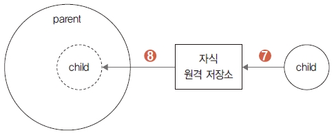

## 자식 저장소 갱신
지금까지 한 작업은 메인 저장소에 복제된 parent/child 저장소에서만 작업했습니다. 수정된
parent/child 저장소의 커밋들은 원격 저장소와 동기화했습니다.  

<br>
<hr>

### 자식 저장소
자식 저장소( gitstudy11_child)와 메인 저장소(parent/child)에 등록된 저장소는 서로 다른 영
역입니다. gitstudy11_child 저장소는 처음에 생성한 자식 저장소고, 메인 저장소에 등록된
parent/child 원격 저장소로 동기된 복제본입니다.  
 
그림 11-11 자식 저장소의 관계도  


따라서 서로 다른 두 저장소는 아직 동일한 커밋 정보를 가지고 있지 않습니다. 자식 저장소에 연
결된 원격 저장소를 이용하여 실제 자식 저장소( gitstudy11_child)를 최신 커밋 정보로 갱신해야
합니다.  

<br>
<hr>

### 자식 저장소 갱신
메인 저장소에 등록된 서브모듈(parent/child)의 커밋들은 자식의 원격 저장소로 푸시되었습니
다. 이제는 수정 반영된 커밋들을 실제의 자식 저장소( gitstudy11_child)로 가져와야 합니다.
실제 자식 저장소로 이동합니다.  

```
infoh@DESKTOP MINGW64 /e/gitstudy11_parent (master)
$ cd ../gitstudy11_child 

infoh@DESKTOP MINGW64 /e/gitstudy11_child (master)
```

실제 자식 저장소에서 child.htm 파일 내용을 확인합니다.  

``
infoh@DESKTOP MINGW64 /e/gitstudy11_child (master)
$ cat child.htm
<h1>자식 저장소</h1>
```

부모 저장소의 parent/child에서 수정된 내용을 실제 자식 저장소에는 반영하지 않았습니다. 자
식 저장소의 원격 저장소를 이용하여 갱신합니다.  

```
infoh@DESKTOP MINGW64 /e/gitstudy11_child (master)
$ git pull origin master 커밋 내려받기
From https://github.com/jinygit/gitstudy11_child
* branch master -> FETCH_HEAD
Updating 2573787..a7709f5
Fast-forward
child.htm | 3 ++-
1 file changed, 2 insertions(+), 1 deletion(-)
```

pull 명령어로 실제 자식 저장소를 최신 커밋 정보로 갱신했습니다.  

그림 11-12 자식 저장소의 갱신  


다시 child.htm 파일을 확인하면, 부모 저장소의 parent/child에서 수정한 작업들이 실제 자식
저장소에도 적용되었습니다.  

```
infoh@DESKTOP MINGW64 /e/gitstudy11_child (master)
$ cat child.htm 확인
<h1>자식 저장소</h1>
<h2>child는 서브모듈입니다.</h2>
```

<br>
<hr>

### 자식 저장소 작업
지금까지는 메인 저장소에서 복제한 자식 저장소(parent/child)에서 수정 작업을 했습니다. 그리
고 수정 내역의 커밋을 자식 저장소의 원격 저장소를 거쳐 실제 자식 저장소에 반영했습니다. 이
번에는 반대로 실제 자식 저장소에서 코드를 수정하고, 이를 자식 저장소의 원격 저장소를 거쳐
부모 저장소의 서브모듈(parent/child)로 적용하는 방법을 알아보겠습니다.
먼저 실제 자식 저장소에서 child.htm 파일을 수정하고 커밋합니다.  

```
infoh@DESKTOP MINGW64 /e/gitstudy11_child (master)
$ code child.htm 
```

child.htm
```html
<h1>자식 저장소</h1>
<h2>child는 서브모듈입니다.</h2>
<h2>엄마 100원 주세요.</h2>
```

```
infoh@DESKTOP MINGW64 /e/gitstudy11_child (master)
$ git commit -am "give me 100 wan" 
[master 8ecc866] give me 100 wan
1 file changed, 2 insertions(+), 1 deletion(-)
```

실제 자식 저장소의 코드를 수정했습니다. 수정된 코드를 자식 저장소의 원격 저장소로 전송합시다.  

```
infoh@DESKTOP MINGW64 /e/gitstudy11_child (master)
$ git push origin master 커밋 전송
Enumerating objects: 5, done.
Counting objects: 100% (5/5), done.
Delta compression using up to 8 threads
Compressing objects: 100% (2/2), done.
Writing objects: 100% (3/3), 336 bytes | 168.00 KiB/s, done.
Total 3 (delta 0), reused 0 (delta 0)
To https://github.com/jinygit/gitstudy11_child.git
a7709f5..8ecc866 master -> master
```

이제 자식 저장소의 원격 저장소에도 정보가 갱신되었습니다. 실제 자식의 로컬 저장소와 원격 저
장소는 변경된 최신 정보를 가지고 있습니다.  

<br>
<hr>

### 부모 저장소 적용
실제 자식 저장소에서 변경한 커밋을 메인 저장소의 서브모듈(parent/child)에 반영해 보겠습니
다. 로컬 저장소의 부모 저장소로 이동합니다.  
메인 저장소로 이동합니다.  

```
infoh@DESKTOP MINGW64 /e/gitstudy11_child (master)
$ cd ../gitstudy11_parent 
```

그리고 메인 저장소에서 서브모듈의 자식 폴더로 이동합니다.  
```
infoh@DESKTOP MINGW64 /e/gitstudy11_parent (master)
$ cd child/ 
```

서브모듈 저장소의 코드 내용을 확인합시다.  

```
infoh@DESKTOP MINGW64 /e/gitstudy11_parent/child (master)
$ cat child.htm 
<h1>자식 저장소</h1>
<h2>child는 서브모듈입니다.</h2>
```

파일 내용은 이전 작업 상태 그대로입니다. 자식 저장소의 원격 저장소에서 최신 정보를 갱신합니다.  

```
infoh@DESKTOP MINGW64 /e/gitstudy11_parent/child (master)
$ git pull origin master 
From https://github.com/jinygit/gitstudy11_child
* branch master -> FETCH_HEAD
Updating a7709f5..8ecc866
Fast-forward
child.htm | 3 ++-
1 file changed, 2 insertions(+), 1 deletion(-)
```

지금까지 과정을 그림으로 나타내면 다음과 같습니다.  

그림 11-13 서브모듈 저장소 갱신  



갱신된 커밋과 수정된 파일 내용을 확인합니다.  

```
infoh@DESKTOP MINGW64 /e/gitstudy11_parent/child (master)
$ cat child.htm 확인
<h1>자식 저장소</h1>
<h2>child는 서브모듈입니다.</h2>
<h2>엄마 100원 주세요.</h2>
```

<br>
<hr>

### 부모 저장소 갱신
자식 저장소의 원격 저장소를 이용하여 메인 저장소의 서브모듈을 갱신했습니다.  

```
infoh@DESKTOP MINGW64 /e/gitstudy11_parent/child (master)
$ git status 상태 확인
On branch master
Your branch is up to date with 'origin/master'.
nothing to commit, working tree clean
```

서브모듈을 갱신하면 메인 저장소는 자신의 서브 폴더가 변경된 것을 인식합니다.  
부모 폴더로 이동해서 상태를 확인해 보겠습니다.  

```
infoh@DESKTOP MINGW64 /e/gitstudy11_parent/child (master)
$ cd .. 

infoh@DESKTOP MINGW64 /e/gitstudy11_parent (master)
$ git status 
On branch master
Your branch is up to date with 'origin/master'.
Changes not staged for commit:
(use "git add <file>..." to update what will be committed)
(use "git checkout -- <file>..." to discard changes in working directory)
modified: child (new commits)
no changes added to commit (use "git add" and/or "git commit -a")
```

즉, 메인 저장소는 서브모듈의 변경 내용을 모니터링하고 있는 것입니다. 메인 저장소의 서브 폴더
자체를 변경했기 때문에 변경된 내용을 다시 메인 저장소로 커밋해야 합니다.  

```
infoh@DESKTOP MINGW64 /e/gitstudy11_parent (master)
$ git commit -am "update submodule" 등록 및 커밋
[master 6ebe93e] update submodule
1 file changed, 1 insertion(+), 1 deletion(-)
```

<br><br>
