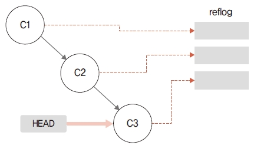

# reflog
---
깃은 안정적인 작업을 유지하려고 참조된 모든 refs를 기록합니다. 그리고 내부적으로 작업한 모
든 HEAD와 브랜치 포인터를 기록합니다. 이때 사용된 포인터들의 기록을 reflog라고 합니다.  

<br>
<a name="1"></a>

## 참조 기록
---
reflog 기록은 reflog 명령어를 사용하여 확인할 수 있습니다.

```
$ git reflog
```

reflog는 한 번이라도 사용했던 HEAD와 브랜치를 기록합니다. 하지만 모든 기록을 영구적으로
가지고 있지는 않습니다. reflog는 시스템에서 정의한 며칠 간의 기록만 보관합니다. 그 이전의 작업
들은 모두 삭제합니다.

그림 12-1 ref 기록  



지금까지 작업한 reflog 기록을 확인해 봅시다.  

```
infoh@DESKTOP MINGW64 /e/gitstudy12 (master)
$ git reflog reflog 기록
d0943cf (HEAD -> master, feature) HEAD@{0}: commit (initial): first
...
```

<br>
<a name="2"></a>

## 기록 확인
---
reflog의 기록들은 HEAD@{숫자} 형태입니다. 각 숫자는 작업을 수행한 해시 값을 가리킵니다.
따라서 reflog에 기록된 HEAD@{숫자} 포인터를 이용하여 커밋 정보를 확인할 수 있습니다.
마지막에 참조한 refs 로그의 해시 값 정보를 확인해 봅시다.  

```
infoh@DESKTOP MINGW64 /e/gitstudy12 (master)
$ git show HEAD@{0} 커밋 정보
commit d0943cfbc5e092668be3b96e98f32e363e05feb1 (HEAD -> master, feature)
Author: hojin <infohojin@gmail.com>
Date: Sat May 25 18:06:47 2019 +0900
first
diff --git a/index.htm b/index.htm
new file mode 100644
index 0000000..95d09f2
--- /dev/null
+++ b/index.htm
@@ -0,0 +1 @@
+hello world
\ No newline at end of file
```

<br>
<a name="3"></a>

## 기간 확인
---
커밋의 로그 기록이 많은 경우 필터링할 수 있습니다. 필터링은 특정한 날짜, 시간 등 기준을 적용
합니다. 다음 예처럼 어제 작업한 내역만 출력할 수 있습니다.

```
$ git show master@{yesterday}
```

깃에서 참조하는 refs의 로그는 reflog 명령어 또는 git log -g 옵션을 사용하여 확인할 수 있습
니다.  

```
infoh@DESKTOP MINGW64 /e/gitstudy12 (master)
$ git log -g 커밋 로그
commit d0943cfbc5e092668be3b96e98f32e363e05feb1 (HEAD -> master, feature)
Reflog: HEAD@{0} (hojin <infohojin@gmail.com>)
Reflog message: commit (initial): first
Author: hojin <infohojin@gmail.com>
Date: Sat May 25 18:06:47 2019 +0900
first
...
```

<br>
<a name="4"></a>

## 기록 유지
---
refs는 현재 로컬 저장소에서 작업한 모든 로그의 참조 기록입니다. 깃은 커밋, 브랜치 등 내부적
으로 사용한 모든 객체의 로그를 기록합니다. 하지만 refs는 로컬 저장소에만 기록하므로 원격 저
장소나 복제, 복사 등으로는 refs 기록을 옮길 수 없습니다.

<br><br>