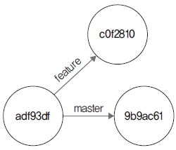
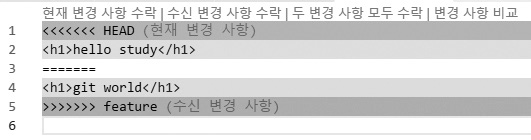

# rerere
---
불특정 다수의 사람과 협업하다 보면 여러 가지 문제가 발생합니다. 깃은 협업 작업을 할 때 발생
한 문제들을 충돌이라는 형태로 알려 줍니다.  

<br>

## 12.7.1 동일한 충돌
---
협업 중 발생하는 여러 문제 중에서 일부는 같은 유형의 문제입니다. 비슷한 충돌 패턴을 반복적
으로 수동으로 해결하곤 합니다. 깃은 이렇게 반복되는 같은 유형의 충돌 문제를 자동으로 해결할
수 없을까 하는 의문점에서 등장한 기능입니다.  

rerere는 reuse recorded resolution의 약어로, 어떤 문제로 충돌이 발생할 때 이를 기록합니다.
rerere 기능을 활성화하면, 깃은 충돌을 해결할 때마다 해결한 문제의 유형을 기록합니다. 기록한
유형의 문제와 비슷한 문제가 향후 다시 발생한다면, 미리 기록한 해결 정보를 바탕으로 자동으로
적용합니다.  

<br>

## 12.7.2 활성화
---
기본적으로 rerere 기능은 활성화되어 있지 않습니다. 이 기능을 사용하려면 다음 명령어로 활성
화해야 합니다.  

```
$ git config rerere.enabled true
```

로컬의 전체 저장소에 모두 적용하고자 한다면 --global 옵션을 같이 사용합니다. 단일 저장소에
서만 rerere 기능을 활성화할 때는 글로벌 옵션을 제외합니다. 환경 설정으로 활성화하면 저장소
에서 rerere 기능을 사용할 수 있습니다.  

<br>

## 12.7.3 실습 준비
---
rerere 기능을 활성화해 봅시다. 실습을 위해 저장소를 하나 생성합니다.  

```
$ cd 실습폴더
$ mkdir git-rerere 새 폴더 만들기
$ cd git-rerere
infoh@DESKTOP MINGW64 /e/git-rerere (master)
$ git init 저장소 초기화
Initialized empty Git repository in E:/git-rerere/.git/
```

환경 설정에서 rerere 기능을 활성화합니다.

```
infoh@DESKTOP MINGW64 /e/git-rerere (master)
$ git config rerere.enabled true rerere 활성화
```

전체 저장소가 아닌 현재의 로컬 저장소에서만 rerere 기능을 활성화했습니다. 설정된 정보는
.git/config에 저장합니다. 설정 정보를 확인해 봅시다.

```
infoh@DESKTOP MINGW64 /e/git-rerere (master)
$ cat .git/config 설정 확인
[core]
repositoryformatversion = 0
filemode = false
bare = false
logallrefupdates = true
symlinks = false
ignorecase = true
[rerere]
enabled = true
```

rerere 기능을 학습하기 위해 hello.htm 파일을 작성하고 저장한 후 커밋합니다.  

```
infoh@DESKTOP MINGW64 /e/git-rerere (master)
$ code hello.htm VS Code 실행
```

hello.htm
```html
<h1>hello world</h1>
```

```
infoh@DESKTOP MINGW64 /e/git-rerere (master)
$ git add hello.htm 등록
infoh@DESKTOP MINGW64 /e/git-rerere (master)
$ git commit -m "first" 커밋
[master (root-commit) adf93df] first
1 file changed, 1 insertion(+)
create mode 100644 hello.htm
```

충돌 문제를 발생하려고 새로운 브랜치를 생성합니다.  

```
infoh@DESKTOP MINGW64 /e/git-rerere (master)
$ git checkout -b feature 브랜치 생성
Switched to a new branch 'feature'
infoh@DESKTOP MINGW64 /e/git-rerere (feature)
```

생성한 브랜치에서 hello.htm 파일을 수정하여 인위적으로 충돌을 발생시킬 것입니다.  

```
infoh@DESKTOP MINGW64 /e/git-rerere (feature)
$ code hello.htm VS Code 실행
```

hello.htm
```
<h1>git world</h1>
```

feature 브랜치에 커밋합니다.  

```
infoh@DESKTOP MINGW64 /e/git-rerere (feature)
$ git commit -am "hello->git" 등록 및 커밋
[feature c0f2810] hello->git
1 file changed, 1 insertion(+), 1 deletion(-)
```

이제 다시 원본 master 브랜치로 이동합니다.  

```
infoh@DESKTOP-VAKLOFQ MINGW64 /e/jinygit/git-rerere (feature)
$ git checkout master 브랜치 이동
Switched to branch 'master'
infoh@DESKTOP MINGW64 /e/git-rerere (master)
```

충돌을 위해 hello.htm 파일에서 같은 위치의 코드를 수정합니다.  

```
infoh@DESKTOP-VAKLOFQ MINGW64 /e/jinygit/git-rerere (feature)
$ code hello.htm VS Code 실행
```

hello.htm
```
<h1>hello study</h1>
infoh@DESKTOP-VAKLOFQ MINGW64 /e/jinygit/git-rerere (master)
$ git commit -am "world->study" 등록 및 커밋
[master 9b9ac61] world->study
1 file changed, 1 insertion(+), 1 deletion(-)
```

<br>

## 12.7.4 충돌 및 기록
---
브랜치를 생성하고 동일한 위치의 코드를 수정했습니다.

그림 12-16 충돌이 예상되는 저장소  


생성한 두 브랜치를 병합합니다. 동일한 파일에서 동일한 위치를 수정했기 때문에 충돌이 발생합
니다.  

```
infoh@DESKTOP MINGW64 /e/git-rerere (master)
$ git merge feature 병합
Auto-merging hello.htm
CONFLICT (content): Merge conflict in hello.htm
Recorded preimage for 'hello.htm' 충돌
Automatic merge failed; fix conflicts and then commit the result.
```


충돌 메시지를 확인해 봅시다. rerere 기능을 활성화한 후 발생한 충돌은 추가 메시지 정보를 같
이 표시합니다. 메시지에서 “Recorded preimage for~”를 볼 수 있습니다. 앞으로 해결을 기록한
다는 의미입니다.  

이제 앞으로는 충돌이 발생하면 rerere status 명령어로 상태를 확인할 수 있습니다.  

```
$ git rerere status
```

어떤 파일들이 충돌했는지 확인해 볼까요?  

```
infoh@DESKTOP MINGW64 /e/git-rerere (master|MERGING) 충돌
$ git rerere status 상태 확인
hello.htm
```

기존 status 명령어는 깃 상태를 표시하지만, rerere status 명령어는 충돌 파일들의 정보를 출
력합니다. diff 명령어로도 충돌 차이점을 확인할 수 있습니다.  

```
infoh@DESKTOP MINGW64 /e/git-rerere (master|MERGING)
$ git rerere diff 커밋 비교
--- a/hello.htm
+++ b/hello.htm
@@ -1,5 +1,5 @@
-<<<<<<<
-<h1>git world</h1>
-=======
+<<<<<<< HEAD
<h1>hello study</h1>
->>>>>>>
+=======
+<h1>git world</h1>
+>>>>>>> feature
```

hello.htm 파일에서 충돌한 부분을 확인합니다.  

```
infoh@DESKTOP MINGW64 /e/git-rerere (master|MERGING)
$ code hello.htm VS Code 실행
```

그림 12-17 hello.htm  


코드에 충돌 메시지를 표시했습니다. 다음과 같이 코드를 수정하여 충돌 문제를 해결합니다.  

hello.htm
```html
<h1>git study</h1>
```

충돌을 해결한 후에는 커밋으로 병합을 완료합니다.  

```
infoh@DESKTOP MINGW64 /e/git-rerere (master|MERGING)
$ git commit -am "solve comflict" 등록 및 커밋
[master 6827ff0] solve comflict
infoh@DESKTOP MINGW64 /e/git-rerere (master) 충돌 해결
```

그림 12-18 충돌 해결 및 병합  


지금까지 충돌 문제를 rerere 기능이 활성화된 상태에서 해결했습니다. rerere 기능이 활성화된
상태에서 코드를 병합하고 충돌을 해결하면, rerere 기능은 우리가 작업한 해결 유형을 별도로 기록
합니다. 이렇게 기록한 충돌 해결 유형은 나중에 비슷한 유형이 또 발생했을 때 rerere 기록을 참
조하여 자동으로 반영합니다.  

<br>

## 12.7.5 자동 해결
---
이전의 충돌 해결 유형은 rerere 기능을 사용하여 기록했습니다. 방금 발생한 문제가 동일한 유형
으로 나타난다면, 깃은 기존에 기록한 rerere 정보를 참조하여 코드를 자동으로 수정할 것입니다.
충돌을 해결한 로그 기록을 확인합니다.  

```
infoh@DESKTOP MINGW64 /e/git-rerere (master)
$ git log --graph 커밋 기록
* commit eb528657153e566fd126d8ed2c02c82d47685093 (HEAD -> master)
|\ Merge: 240deb0 9a5faec
| | Author: hojin <infohojin@gmail.com>
| | Date: Wed Feb 20 16:16:35 2019 +0900
| | solve comflict
| |
...
```

rerere 기능을 실행하려고 이전의 병합 커밋을 강제로 삭제합니다.  

```
infoh@DESKTOP MINGW64 /e/git-rerere (master)
$ git reset --hard HEAD^ 커밋 삭제
HEAD is now at 9b9ac61 world->study
```

병합을 삭제했습니다. 이번에는 3-way 병합이 아닌 리베이스 방식으로 두 브랜치를 병합하겠습
니다.  

```
infoh@DESKTOP MINGW64 /e/git-rerere (feature)
$ git rebase master 병합
First, rewinding head to replay your work on top of it...
Applying: hello->git
Using index info to reconstruct a base tree...
M hello.htm
Falling back to patching base and 3-way merge...
Auto-merging hello.htm
CONFLICT (content): Merge conflict in hello.htm
Resolved 'hello.htm' using previous resolution.
error: Failed to merge in the changes.
hint: Use 'git am --show-current-patch' to see the failed patch
Patch failed at 0001 hello->git
Resolve all conflicts manually, mark them as resolved with
"git add/rm <conflicted_files>", then run "git rebase --continue".

You can instead skip this commit: run "git rebase --skip".
To abort and get back to the state before "git rebase", run "git rebase --abort".
```

리베이스를 이용한 병합도 이전의 3-way 병합과 동일한 충돌이 발생합니다. 코드 수정이 필요합
니다. 하지만 오류 메시지 없이 잘 병합했습니다. 리베이스 메시지를 확인하니 다음과 같이 새로
생긴 메시지가 있네요.  

Resolved 'hello.htm' using previous resolution.  

이전에 해결한 기록을 이용하여 코드를 수정했다는 의미입니다.  

소스 코드를 확인해 볼까요? 코드에 충돌 표시가 없습니다. 방금 전 충돌이 발생했을 때 해결한
코드와 같은 상태가 되었습니다.  

```
infoh@DESKTOP MINGW64 /e/git-rerere (feature)
$ code hello.htm VS Code 실행
```

hello.htm
```html
<h1>git study</h1>
```

rerere 기능은 이전 충돌 해결 작업들을 기억하고 있다가 유사한 문제가 발생하면 이를 다시 적용
합니다.  

이제 리베이스 처리를 완료합시다.  

```
infoh@DESKTOP MINGW64 /e/git-rerere (feature|REBASE 1/1)
$ git add hello.htm 등록
infoh@DESKTOP MINGW64 /e/git-rerere (feature|REBASE 1/1)
$ git rebase --continue 계속 처리
Applying: hello->git
infoh@DESKTOP MINGW64 /e/git-rerere (feature) 리베이스 완료
```

rerere 기능은 병합과 리베이스로 잦은 충돌이 발생하여 이를 좀 더 손쉽게 해결하고 싶을 때 매
우 유용합니다.  

<br><br>
