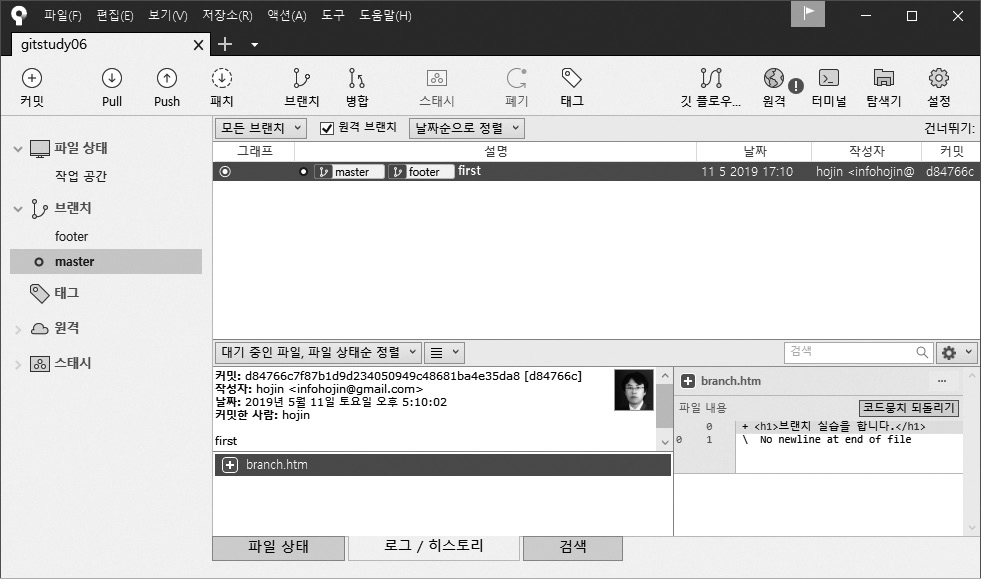

## 소스트리 브랜치
---
이번에는 소스트리로 새로운 브랜치를 하나 생성해 보겠습니다. 소스트리의 새 탭에서 Add 버튼을 클릭합니다. 탐색을 눌러 앞에서 만든 gitstudy06 폴더를 찾아 선택한 후 추가를 누릅니다. 그러면 gitstudy06 저장소와 연결됩니다.  

소스트리의 왼쪽에서 브랜치 탭을 확인할 수 있습니다. 브랜치에 모든 브랜치 목록이 같이 출력됩니다.  

그림 6-4] 소스트리에서 브랜치 확인  

소스트리에서 브랜치를 하나 추가하겠습니다. master 브랜치를 선택합니다. 커밋 목록에서 커밋을 하나 선택합니다. 마우스 오른쪽 버튼을 눌러 브랜치... 메뉴를 선택합니다. 
또는 위쪽 브랜치 생성 6-a.jpg 버튼을 클릭합니다.  

그림 6-5] 브랜치 메뉴 선택  

브랜치 생성 창이 열립니다. 소스트리에서 커밋을 선택하여 브랜치를 생성하는 것은 지정한 커밋을 기준으로 브랜치를 생성한다는 의미입니다. 커밋 목록에서 브랜치를 생성하면 명시된 커밋 부분에 브랜치가 체크되어 있는 것을 볼 수 있습니다. master의 최종 커밋(HEAD)을 기준으로 브랜치를 생성할 때는 작업 사본 부모1 항목을 선택합니다.  

그림 6-6] feature 브랜치 생성  

새로운 feature 브랜치를 하나 추가했습니다. 소스트리의 왼쪽에 추가한 브랜치가 있습니다.  

그림 6-7] 추가한 브랜치 확인  

브랜치가 생성되고, 생성된 브랜치 이름으로 ○ 마크가 이동한 것을 확인할 수 있습니다.  
브랜치가 총 3개 있습니다. 현재의 브랜치는 feature입니다.  

 