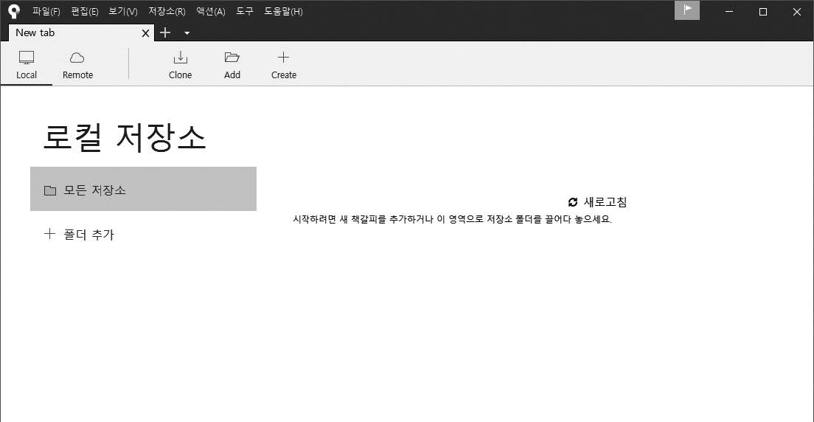
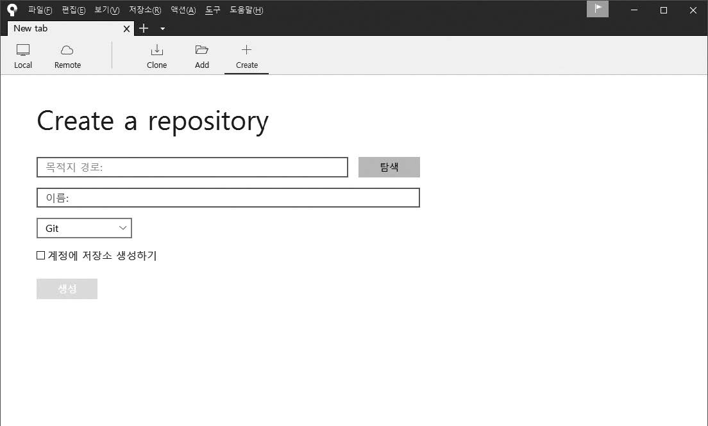
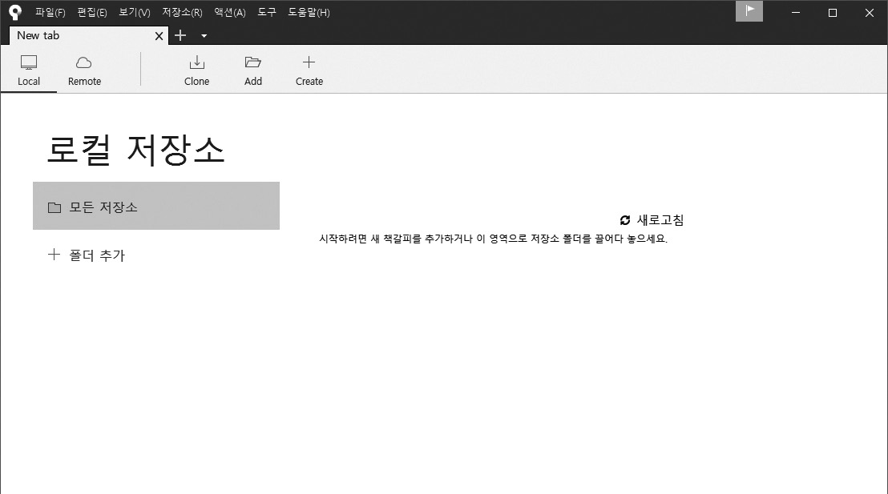

# 소스트리와 연결
---
로컬 컴퓨터에 생성된 깃 저장소를 `소스트리`와 `연동`하여 이력을 쉽게 관리할 수 있습니다.  
저장소를 소스트리와 연결해 보겠습니다.  
먼저 소스트리를 실행합니다.  

 

## 새 로컬 저장소를 생성하여 소스트리에 연결  
---
소스트리에 새 저장소를 생성하여 로컬 저장소와 연결해 보겠습니다.  
소스트리 메뉴 위쪽 `+ Create` 버튼을 클릭하여 새 저장소를 생성합니다.  
새 저장소 생성은 폴더 `생성` 및 `초기화` 명령어인 `git init`를 동시에 실행하는 것과 같습니다.  

그럼 새 저장소를 생성해 봅시다.  
소스트리 첫 화면에서 + `Create` 버튼을 클릭합니다.  

  

 
그러면 다음 화면이 나옵니다. 목적지 경로와 이름 항목이 보입니다.  

    

새 폴더를 만들 것이므로 첫 번째 입력란(목적지 경로)에 경로와 원하는 폴더 이름을 입력합니다.  
필자는 D:\문서\ 경로에 gitstudy 폴더를 만든다고 입력했습니다(예: D:\문서\ gitstudy).  
목적지 경로를 입력하면 `이름`은 자동으로 gitstudy로 지정됩니다.  

모두 입력했다면 `생성`을 누릅니다.  

 

깃 저장소가 생성되면 깃 상태를 확인할 수 있는 화면으로 전환됩니다.  

  

새로운 폴더를 만든 후 자동으로 깃 초기화 작업까지 처리했습니다.  

 

## 기존 저장소와 연결
---
기존에 사용하던 로컬 저장소를 소스트리와 연결할 수 있습니다.  
먼저 위쪽 `Add` 버튼을 클릭합니다.  

 

다음 화면이 나오면 탐색을 누릅니다.  

 

원하는 폴더를 선택한 후 폴더 선택을 누릅니다.  

 

그러면 다음과 같이 ‘작업 경로’에 경로를 입력하고, `이름` 항목은 자동으로 채웁니다.  
추가를 누릅니다.  

로컬 저장소를 선택한 상태  
 

기존에 만든 저장소 폴더를 선택하면 다음 메시지가 출력될 수 있습니다. 예를 눌러 다음으로 넘어갑니다.  

기존 깃 저장소 폴더를 선택할 때 알림 화면  
 

깃 저장소가 추가되면 깃 상태를 확인할 수 있는 화면으로 전환됩니다.  

깃 상태 확인  
 

이제 깃 저장소를 터미널과 소스트리를 모두 사용하여 동시에 관리할 수 있습니다.  
깃 명령어가 익숙하지 않다면 처음에는 소스트리를 사용하는 것이 편리합니다.  
깃 명령어에 익숙하다면 터미널이 좀 더 빠릅니다. 깃 터미널로 작업한 모든 결과 역시 소스트리로 확인할 수 있습니다.  

지금까지는 자신의 컴퓨터에 있는 로컬 저장소를 알아보았습니다.  
깃 저장소는 크게 로컬(local) 저장소와 원격(remote) 저장소로 구분할 수 있습니다.  
로컬 컴퓨터에서는 다수의 로컬 저장소를 생성 및 관리할 수 있으며, 하나의 저장소는 다수의 원격 저장소(또는 서버 저장소)와 연결하여 사용할 수 있습니다. 이렇게 수많은 저장소가 있는 것이 분산형 버전 관리 시스템의 특징입니다.  

이 개념은 나중에 좀 더 알아보겠습니다.  

  