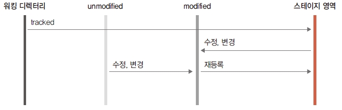

# 파일의 modified 상태와 unmodified 상태
---
코드를 변경한다는 것은 `워킹 디렉터리에서 파일을 수정`하는 것을 의미합니다.  

깃은 저장소에 변경된 기록을 워킹디렉터리에서 스테이지로 상태를 이동한 후에, 최종적으로 깃 저장소에 기록을 하게 됩니다. 
하지만, 수정으로 인하여 워킹 디렉터리에 파일 변경이 발생하게 되면, 스테이지는 최종 상태를 반영하지 못하게 되기 때문에 unstage 상태로 변경됩니다. 즉, 파일의 수정은 `워킹 디렉터리`와 `스테이지` 간 불일치 내용이 됩니다.  

깃은 수정으로 인하여 발생되는 스테이지의 파일상태를 `수정함(modified)`과 `수정하지 않음(unmodified)` 으로 구분합니다. 
파일 수정 작업은 스테이지 영역과 긴밀한 상관관계를 맺습니다.  

 

## modified 상태  
---
스테이지에 `등록`된 파일은 깃에 의해서 추적 관리합니다. 이는 실제로 깃이 기록한 파일이며, 사실상 `버전`을 의미합니다. 
파일 수정은 개발 과정에서 뗄 수 없는 작업입니다. 개발 작업에서 수많은 코드가 변경되고, 깃을 사용하면 이 변경 내역은 영구적으로 기록됩니다.  

앞에서 설명했듯이 깃은 `tracked 상태`인 파일만 수정 여부를 관리할 수 있습니다. 
tracked 상태인 파일이 수정되면 스테이지는 파일 상태를 `modified 상태`로 변경합니다.  

 

파일이 수정되면 깃은 수정된 파일을 잠시 스테이지에서 제외됩니다.  
깃은 수정 여부만 체크해 주기 때문에 modified 상태로 변경된 파일은 스테이지로 `재등록`해야 합니다.  
수정된 파일을 `스테이지 영역으로 다시 적용`하려면 `git add` 명령어로 재등록합니다.  

 

## unmodified 상태
---
unmodified 상태의 의미는 tracked 상태이면서 스테이지에서 `한 번도 수정하지 않은 원본 상태`를 의미합니다.  

스테이지에 등록한 후 어떤 수정도 하지 않았다면 unmodified 상태입니다. 이처럼 스테이지 영역에 등록한 후 수정하지 않은 파일들은 재등록하지 않아도 됩니다. 깃은 파일의 `수정 여부를 체크`하고, 스테이지 영역의 갱신 작업 여부를 `작업자에게 알려 줍니다`.  

지금까지 워킹 디렉터리와 스테이지 영역에서 배운 개념을 그림 하나로 정리하면 다음과 같습니다.  

 

워킹 디렉터리에서 등록 명령(git add 명령어)을 실행하면 스테이지에 등록됩니다.  
스테이지 영역에 등록이 되면 자동으로 파일의 상태는 tracked가 됩니다. 위킹디렉터리에서 파일을 수정하지 않으면 파일은 계속 stage 상태에 머무릅니다.  

이후 파일이 수정되면 modified 상태로 변경 되고, 변경된 파일은 다시 스테이지에서 떨어져 나와 unstage 상태가 됩니다. 깃은 unstage 상태의 파일을 다시 워킹 디렉터리 안에 잠시 담아 두게 됩니다. 이때 다시 등록 명령을 실행하면 stage 상태로 변경됩니다.  
  