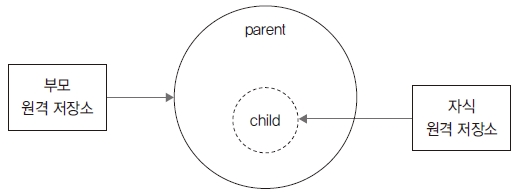

# 부모저장소 복제
---
서브모듈로 구성된 저장소는 부모/자식 관계를 맺습니다. 서브모듈의 저장소를 복제하거나 배포
할 때는 부모/자식 관계도 같이 복제해야 합니다.  

<br>
<a name="1"></a>

## 부모 저장소 복제
---
새로운 실습을 위해 clone 명령어를 실행하여 메인 저장소를 복제합니다.  

```
$ cd 실습폴더

$ git clone https://github.com/jinygit/gitstudy11_parent.git gitstudy11 
Cloning into 'gitstudy11'...
remote: Enumerating objects: 8, done.
remote: Counting objects: 100% (8/8), done.
remote: Compressing objects: 100% (6/6), done.
remote: Total 8 (delta 0), reused 8 (delta 0), pack-reused 0
Unpacking objects: 100% (8/8), done.
```

gitstudy11은 부모/자식 관계인 서브모듈 형태로 되어 있습니다. 현재는 메인 저장소만 복제했으
며, 그림으로 나타내면 다음과 같습니다.  

그림 11-14 서브모듈 복제  


메인 저장소를 잘 복제했는지 내용을 확인합시다.  

```
$ cd gitstudy11

infoh@DESKTOP MINGW64 /e/gitstudy11 (master)
$ ls -all 
total 50
drwxr-xr-x 1 infoh 197609 0 1월 24 19:07 ./
drwxr-xr-x 1 infoh 197609 0 1월 24 19:06 ../
drwxr-xr-x 1 infoh 197609 0 1월 24 19:09 .git/
-rw-r--r-- 1 infoh 197609 92 1월 24 19:07 .gitmodules
drwxr-xr-x 1 infoh 197609 0 1월 24 19:07 child/
-rw-r--r-- 1 infoh 197609 25 1월 24 19:07 parent.htm
```

서브모듈에 대한 .gitmodules 설정 파일을 확인할 수 있습니다. 그리고 서브모듈인 child 폴더로
이동합니다.  

```
infoh@DESKTOP MINGW64 /e/gitstudy11 (master)
$ cd child 

infoh@DESKTOP MINGW64 /e/gitstudy11/child (master)
$ ls -all 
total 4
drwxr-xr-x 1 infoh 197609 0 1월 24 19:07 ./
drwxr-xr-x 1 infoh 197609 0 1월 24 19:07 ../
```

서브모듈의 폴더 안에는 아무 내용도 없습니다.  

<br>
<a name="2"></a>

## 모듈 업데이트
---
메인 저장소를 복제할 때는 서브모듈 정보만 같이 복제할 뿐, 실제 하위 저장소는 같이 복제하지
않습니다. 서브모듈의 하위 저장소는 직접 명령어를 실행하여 가져와야 합니다. 하위 저장소의 내
용을 가져오려면 먼저 초기화와 갱신 작업을 해야 합니다.  

```
infoh@DESKTOP MINGW64 /e/gitstudy11/child (master)
$ cd .. 

infoh@DESKTOP MINGW64 /e/gitstudy11 (master)
$ git submodule init 
Submodule 'child' (https://github.com/jinygit/gitstudy11_child.git) registered for path
'child'

infoh@DESKTOP MINGW64 /e/gitstudy11 (master)
$ git submodule update 
Cloning into 'E:/gitstudy11/child'...
Submodule path 'child': checked out 'a7709f53d836b2abf6eb5c3d8e8064b5465458a8'
```

서브모듈 update 옵션으로 관련 하위 저장소를 복제합니다.  

그림 11-15 서브모듈 초기화 및 업데이트  


서브모듈 초기화와 업데이트를 진행했습니다. 다시 폴더 내용을 확인해 봅시다.  

```
infoh@DESKTOP MINGW64 /e/gitstudy11 (master)
$ cd child 

infoh@DESKTOP MINGW64 /e/gitstudy11/child ((a7709f5...))
$ ls -all 
total 6
drwxr-xr-x 1 infoh 197609 0 1월 24 19:13 ./
drwxr-xr-x 1 infoh 197609 0 1월 24 19:07 ../
-rw-r--r-- 1 infoh 197609 30 1월 24 19:13 .git
-rw-r--r-- 1 infoh 197609 68 1월 24 19:13 child.htm
```

서브모듈 child 폴더에 복제한 하위 저장소 내용이 추가되었습니다.
깃 배시에서 서브 저장소의 브랜치 이름을 주의 깊게 살펴보세요. 브랜치 이름이 master가 아닌
a7709f5...로 되어 있습니다. 서브모듈을 업데이트할 때는 메인 저장소의 비어 있는 서브모듈 커
밋 위치를 리모트 체크아웃합니다.  

<br><br>
