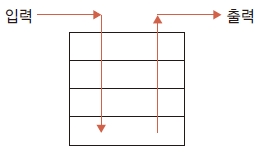

## 임시 저장 영역의 스택 목록
---
스태시의 저장 영역은 스택 구조입니다. 스택은 FILO(First Input Last Out) 구조로, 마지막에 입력한 자료가 제일 먼저 출력되는 데이터 저장 방식입니다.  

그림 7-2] 스택은 FILO 구조  


스태시에 저장된 스택은 list 옵션을 사용하여 확인할 수 있습니다.  

```
$ git stash list
```

깃은 스태시된 객체들을 .git/refs/stash에 저장합니다. 다음 예처럼 .git/refs/stash에 저장된 스태시 객체에서 cat 명령어로 내용을 확인할 수 있습니다.  

```
$ cat .git/refs/stash
c5be53ff322fbc8f0d06b800a2b3637aa385cb62
```

master 브랜치에서 git stash list 명령어를 실행하여 목록을 확인합시다.  

```
infoh@DESKTOP MINGW64 /e/gitstudy07 (master)
$ git stash list
stash@{0}: WIP on master: a43043e first commit
```

stash 명령어로 저장된 객체들의 목록이 출력됩니다. 스태시 이름은 stash@{번호} 형태로 순차적으로 부여됩니다. 목록 번호는 0부터 시작합니다.  

스태시를 실행한 후 방금 전의 스태시와 현재 워킹 디렉터리 간 차이를 확인해 보겠습니다.  

```
infoh@DESKTOP MINGW64 /e/gitstudy07 (master)
$ git stash show
 stash.htm | 3 ++-
 1 file changed, 2 insertions(+), 1 deletion(-)
```

현재 워킹 디렉터리 내용과 스태시된 내용 간 파일 변화를 간략하게 출력합니다. 삽입 2개와 수정 1개가 있습니다.  

-p 옵션을 추가하면 상세 차이점도 알 수 있습니다.  

```
infoh@DESKTOP MINGW64 /e/gitstudy07 (master)
$ git stash show -p stash@{0}
diff --git a/stash.htm b/stash.htm
index b5b0049..d9a15e5 100644
--- a/stash.htm
+++ b/stash.htm
@@ -1,2 +1,3 @@
 <h1>스태시를 실습합니다.</h1>
-<h2>새로운 기능을 시작합니다.</h2>
\ No newline at end of file
+<h2>새로운 기능을 시작합니다.</h2>
+새로운 기능이 너무 복잡하네요. 시간이 많이 걸릴 듯 합니다.
\ No newline at end of file
```

스태시와 현재 워킹 디렉터리 간 상세한 차이점을 출력합니다. diff 기능과 유사합니다.  

<br>